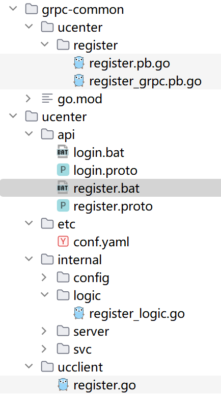
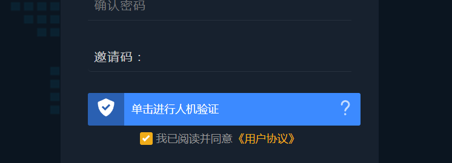
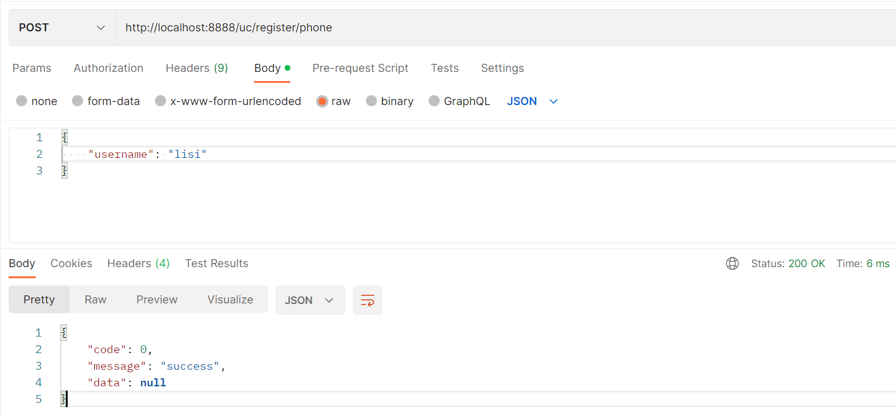
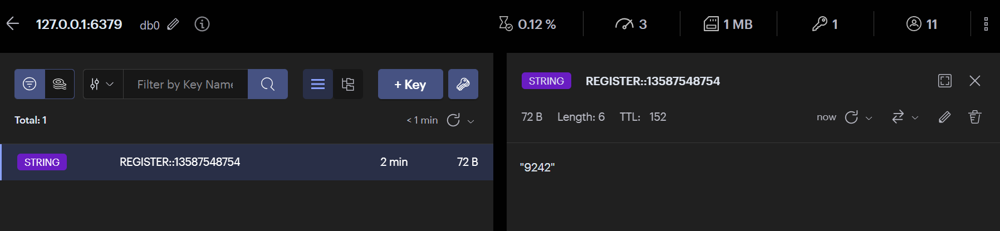
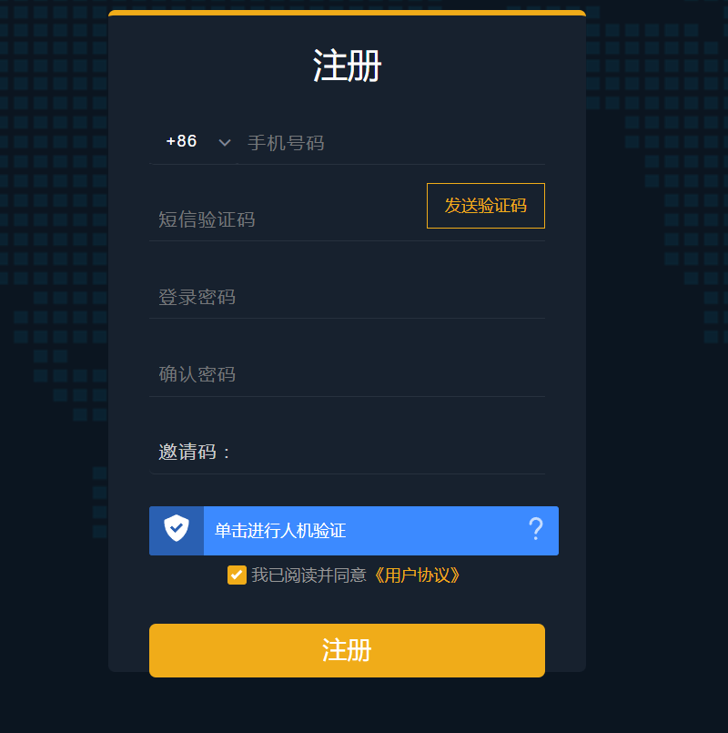

# 项目搭建

## 1. 搭建用户服务

~~~protobuf
syntax = "proto3";

package register;

// protoc-gen-go 版本大于1.4.0, proto文件需要加上go_package,否则无法生成
option go_package = "./register";

message RegReq {
  string username = 1;
  string password = 2;
  CaptchaReq captcha = 3;
  string phone = 4;
  string promotion = 5;
  string code = 6;
  string country = 7;
  string superPartner = 8;

}

message CaptchaReq {
  string server = 1;
  string token = 2;
}

message RegRes {}

service Register {
  rpc registerByPhone(RegReq) returns(RegRes);
}
~~~

~~~shell
goctl rpc protoc register.proto --go_out=./types --go-grpc_out=./types --zrpc_out=./register --style go_zero
~~~

执行脚本，生成初始化项目。

将生成的代码copy到根目录，然后执行

~~~shell
go mod tidy
~~~

初始结构。

## 2. 人机验证

在进行登录的时候，为了防止恶意登录注册，我们一般都会添加人机验证，登录或者注册的时候，用户必须先通过人机验证。

人机验证由于大部分都是企业付费，所以这里我们选用一个免费的，地址：https://www.vaptcha.com/document/install.html

注册登录后，获取VID和Key。

前端代码替换：

src/pages/uc/login.vue和src/pages/uc/register.vue

~~~js
 vaptcha().then((vaptcha) => {
		  vaptcha({
		        vid: '替换自己的vid',
		        mode: 'click',
		        scene: 1,
				container: '#VAPTCHAContainer',
		        area: 'auto',          
		        }).then(function (VAPTCHAObj) {
				VAPTCHAObj.render();
		        VAPTCHAObj.listen('pass', function () {
		            var data = {
		                server: VAPTCHAObj.server,
		                token: VAPTCHAObj.token,
		            };
		  			that.captchaObj = data;
		        })
		  		
		})
	  })
	  					     
    },
~~~

## 3. 生成用户api服务

如果要前端访问，那么暴露出来的接口是http rest api，虽然我们可以通过`grpc-gateway`的方式将http请求转为grpc，但方便性和灵活性没有那么强，所以我们还是构建用户的api服务，用于对外暴露接口。

~~~shell
goctl api new ucenterapi --style go_zero 
~~~

使用go-zero的命令生成模板后，进行修改即可。

### 3.1 封装路由

~~~go
package handler

import (
	"github.com/zeromicro/go-zero/rest"
	"net/http"
)

type Routers struct {
	server      *rest.Server
	middlewares []rest.Middleware
}

func NewRouters(server *rest.Server) *Routers {
	return &Routers{server: server}
}

func (r *Routers) Get(path string, handlerFunc http.HandlerFunc) {
	r.server.AddRoutes(
		rest.WithMiddlewares(
			r.middlewares,
			rest.Route{
				Method:  http.MethodGet,
				Path:    path,
				Handler: handlerFunc,
			},
		),
	)
}
func (r *Routers) Post(path string, handlerFunc http.HandlerFunc) {
	r.server.AddRoutes(
		rest.WithMiddlewares(
			r.middlewares,
			rest.Route{
				Method:  http.MethodPost,
				Path:    path,
				Handler: handlerFunc,
			},
		),
	)
}

func (r *Routers) Group() *Routers {
	return &Routers{server: r.server}
}

func (r *Routers) Use(middlewares ...rest.Middleware) {
	r.middlewares = middlewares
}

~~~

~~~go
package handler

import (
	"ucenterapi/internal/svc"
)

func RegisterHandlers(r *Routers, serverCtx *svc.ServiceContext) {
	register := NewRegisterHandler(serverCtx)
	registerGroup := r.Group()
	registerGroup.Post("/uc/register/phone", register.Register)
}

~~~

~~~go
package handler

import (
	"github.com/zeromicro/go-zero/rest/httpx"
	"net/http"
	"ucenterapi/internal/logic"
	"ucenterapi/internal/svc"
	"ucenterapi/internal/types"
)

type RegisterHandler struct {
	svcCtx *svc.ServiceContext
}

func NewRegisterHandler(svcCtx *svc.ServiceContext) *RegisterHandler {
	return &RegisterHandler{svcCtx}
}
func (h *RegisterHandler) Register(w http.ResponseWriter, r *http.Request) {
	var req types.Request
	if err := httpx.Parse(r, &req); err != nil {
		httpx.ErrorCtx(r.Context(), w, err)
		return
	}

	l := logic.NewRegisterLogic(r.Context(), h.svcCtx)
	resp, err := l.Register(&req)
	if err != nil {
		httpx.ErrorCtx(r.Context(), w, err)
	} else {
		httpx.OkJsonCtx(r.Context(), w, resp)
	}
}

~~~

~~~go
package logic

import (
	"context"
	"ucenterapi/internal/svc"
	"ucenterapi/internal/types"

	"github.com/zeromicro/go-zero/core/logx"
)

type Register struct {
	logx.Logger
	ctx    context.Context
	svcCtx *svc.ServiceContext
}

func NewRegisterLogic(ctx context.Context, svcCtx *svc.ServiceContext) *Register {
	return &Register{
		Logger: logx.WithContext(ctx),
		ctx:    ctx,
		svcCtx: svcCtx,
	}
}

func (l *Register) Register(req *types.Request) (resp *types.Response, err error) {

	return
}

~~~

### 3.2 添加etcd

docker-compose.yml

~~~yaml
version: '3'
services:
  mysql:
    container_name: mysql8
    image: mysql:${MYSQL_VERSION}
    restart: always
    ports:
      - 3309:3306
    environment:
      TZ: Asia/Shanghai
      MYSQL_ROOT_PASSWORD: root
      MYSQL_DATABASE: fufeng123456
    volumes:
      - ${MYSQL_DIR}/data:/var/lib/mysql
      - ${MYSQL_DIR}/conf:/etc/mysql/conf.d/
      - ${MYSQL_DIR}/logs:/logs
    command:
      --default-authentication-plugin=mysql_native_password
      --character-set-server=utf8mb4
      --collation-server=utf8mb4_general_ci
      --explicit_defaults_for_timestamp=true
      --lower_case_table_names=1
  Redis:
    container_name: redis6
    image: redis:${REDIS_VERSION}
    restart: always
    volumes:
      - ${REDIS_DIR}/data:/data
      - ${REDIS_DIR}/conf/redis.conf:/etc/redis/redis.conf
    ports:
      - ${REDIS_PORT}:6379
    command: redis-server /etc/redis/redis.conf
  Etcd:
    container_name: etcd3
    image: bitnami/etcd:${ETCD_VERSION}
    deploy:
      replicas: 1
      restart_policy:
        condition: on-failure
    environment:
      - ALLOW_NONE_AUTHENTICATION=yes
    privileged: true
    volumes:
      - ${ETCD_DIR}/data:/bitnami/etcd/data
    ports:
      - ${ETCD_PORT}:2379
      - 2380:2380
~~~

.env:

~~~shell
COMPOSE_PROJECT_NAME=gozero-demo-mall
ETCD_DIR=D:/go/project/microservice/docker/etcd
ETCD_VERSION=3.5.6
ETCD_PORT=2379
MYSQL_VERSION=8.0.20
MYSQL_DIR=D:/go/project/microservice/docker/mysql
MYSQL_PORT=3309
REDIS_VERSION=6.2.7
REDIS_PORT=6379
REDIS_DIR=D:/go/project/microservice/docker/redis
~~~

redis.conf

~~~yaml
# 任意ip可访问
bind 0.0.0.0
# 自定义启动端口
port 6379
# rdb或aof文件存储位置
dir /data
save 900 1
save 300 10
save 60 10000
appendonly yes
appendfilename "appendonly.aof"
~~~

~~~shell
docker-compose up -d
~~~

启动后，在ucenter服务添加etcd配置:

~~~yaml
Name: ucenter.rpc
ListenOn: 127.0.0.1:8080
Etcd:
  Hosts:
    - 127.0.0.1:2379
  Key: ucenter.rpc
Mysql:
  DataSource: root:root@tcp(127.0.0.1:3309)/ffcoin?charset=utf8mb4&parseTime=true&loc=Asia%2FShanghai
CacheRedis:
  - Host: 127.0.0.1:6379
    Type: node

~~~

~~~go
package config

import (
	"github.com/zeromicro/go-zero/core/stores/cache"
	"github.com/zeromicro/go-zero/zrpc"
)

type Config struct {
	zrpc.RpcServerConf
	Mysql      MysqlConfig
	CacheRedis cache.CacheConf
}

type MysqlConfig struct {
	DataSource string
}

~~~

### 3.3 api添加rpc调用

~~~yaml
Name: ucenter-api
Host: 127.0.0.1
Port: 8888
UCenterRpc:
  Etcd:
    Hosts:
      - 127.0.0.1:2379
    Key: ucenter.rpc
~~~

~~~go
package config

import (
	"github.com/zeromicro/go-zero/rest"
	"github.com/zeromicro/go-zero/zrpc"
)

type Config struct {
	rest.RestConf
	UCenterRpc zrpc.RpcClientConf
}

~~~

~~~go
package svc

import (
	"github.com/zeromicro/go-zero/zrpc"
	"ffcoin/grpc-common/ucenter/ucclient"
	"ucenterapi/internal/config"
)

type ServiceContext struct {
	Config       config.Config
	URegisterRpc ucclient.Register
}

func NewServiceContext(c config.Config) *ServiceContext {
	return &ServiceContext{
		Config:       c,
		URegisterRpc: ucclient.NewRegister(zrpc.MustNewClient(c.UCenterRpc)),
	}
}

~~~

api：

~~~go
func (l *Register) Register(req *types.Request) (resp *types.Response, err error) {
	ctx, cancel := context.WithTimeout(context.Background(), 5*time.Second)
	defer cancel()
	_, err = l.svcCtx.URegisterRpc.RegisterByPhone(ctx, &register.RegReq{})
	if err != nil {
		return nil, err
	}
	return
}
~~~

~~~go
// Code generated by goctl. DO NOT EDIT.
package types

type Request struct {
	Username     string      `json:"username"`
	Password     string      `json:"password,optional"`
	Captcha      *CaptchaReq `json:"captcha,optional"`
	Phone        string      `json:"phone,optional"`
	Promotion    string      `json:"promotion,optional"`
	Code         string      `json:"code,optional"`
	Country      string      `json:"country,optional"`
	SuperPartner string      `json:"superPartner,optional"`
    Ip string `json:"ip,optional"`
}

type CaptchaReq struct {
	Server string `json:"server"`
	Token string `json:"token"`
}

type Response struct {
	Message string `json:"message"`
}

~~~

ucenter服务：

~~~go
func (l *RegisterLogic) RegisterByPhone(in *register.RegReq) (*register.RegRes, error) {
	logx.Info("register by phone......")
	return &register.RegRes{}, nil
}
~~~

启动测试一下

postmain打开，输入：`http://localhost:8888/uc/register/phone` 进行测试

### 3.4 统一返回

一般不管是错误还是成功，我们都会返回类似以下的返回值：

~~~go
package common

type BizCode int

const SuccessCode BizCode = 0

type Result struct {
	Code    BizCode `json:"code"`
	Message string  `json:"message"`
	Data    any     `json:"data"`
}

func NewResult() *Result {
	return &Result{}
}

func (r *Result) Success(data any) {
	r.Code = SuccessCode
	r.Message = "success"
	r.Data = data
}
func (r *Result) Fail(code BizCode, msg string) {
	r.Code = code
	r.Message = msg
}

func (r *Result) Deal(data any, err error) *Result {
	if err != nil {
		r.Fail(-999, err.Error())
	} else {
		r.Success(data)
	}
	return r
}

~~~

## 4. 注册功能实现

### 4.1 发送验证码

~~~go
registerGroup.Post("/uc/mobile/code", register.SendCode)
~~~

验证码逻辑：

* 收到手机号和国家标识
* 生成验证码
* 根据对应的国家和手机号调用对应的短信平台发送验证码
* 将验证码存入redis，过期时间5分钟
* 返回成功

~~~go
syntax = "proto3";

package register;

// protoc-gen-go 版本大于1.4.0, proto文件需要加上go_package,否则无法生成
option go_package = "./register";

message RegReq {
  string username = 1;
  string password = 2;
  CaptchaReq captcha = 3;
  string phone = 4;
  string promotion = 5;
  string code = 6;
  string country = 7;
  string superPartner = 8;

}

message CaptchaReq {
  string server = 1;
  string token = 2;
}

message RegRes {}

message NoRes {}

message CodeReq {
  string phone = 1;
  string country = 2;
}
service Register {
  rpc registerByPhone(RegReq) returns(RegRes);
  rpc sendCode(CodeReq) returns(NoRes);
}
~~~

~~~go
//防止打印过多的日志
logx.MustSetup(logx.LogConf{Encoding: "plain", Stat: false})
~~~

~~~go

func (l *RegisterLogic) SendCode(in *register.CodeReq) (*register.NoRes, error) {
	code := tools.Rand4Num()
	logx.Infof("验证码为: %s", code)
	//通过短信平台发送验证码
	err := l.svcCtx.Cache.SetWithExpireCtx(context.Background(), RegisterRedisKey+in.Phone, code, 5*time.Minute)
	return &register.NoRes{}, err
}

~~~

~~~go

type ServiceContext struct {
	Config config.Config
	Cache  cache.Cache
}

func NewServiceContext(c config.Config) *ServiceContext {
	newRedis := c.CacheRedis[0].NewRedis()
	node := cache.NewNode(newRedis, nil, nil, nil)
	return &ServiceContext{
		Config: c,
		Cache:  node,
	}
}
~~~

api:

~~~go

func (h *RegisterHandler) SendCode(w http.ResponseWriter, r *http.Request) {
	var req types.CodeRequest
	if err := httpx.ParseJsonBody(r, &req); err != nil {
		httpx.ErrorCtx(r.Context(), w, err)
		return
	}

	l := logic.NewRegisterLogic(r.Context(), h.svcCtx)
	resp, err := l.SendCode(&req)
	result := common.NewResult().Deal(resp, err)
	httpx.OkJsonCtx(r.Context(), w, result)
}

~~~

~~~go

func (l *Register) SendCode(req *types.CodeRequest) (resp *types.Response, err error) {
	ctx, cancel := context.WithTimeout(context.Background(), 5*time.Second)
	defer cancel()
	_, err = l.svcCtx.URegisterRpc.SendCode(ctx, &register.CodeReq{
		Phone:   req.Phone,
		Country: req.Country,
	})
	if err != nil {
		return nil, err
	}
	return
}

~~~

### 4.2 注册

#### 4.2.1 前置工作

member表sql：

~~~sql
CREATE TABLE `member`  (
  `id` bigint(0) NOT NULL AUTO_INCREMENT,
  `ali_no` varchar(255) CHARACTER SET utf8 COLLATE utf8_general_ci NOT NULL,
  `qr_code_url` varchar(255) CHARACTER SET utf8 COLLATE utf8_general_ci NOT NULL,
  `appeal_success_times` int(0) NOT NULL,
  `appeal_times` int(0) NOT NULL,
  `application_time` bigint(0) NOT NULL,
  `avatar` varchar(255) CHARACTER SET utf8 COLLATE utf8_general_ci NOT NULL,
  `bank` varchar(255) CHARACTER SET utf8 COLLATE utf8_general_ci NOT NULL,
  `branch` varchar(255) CHARACTER SET utf8 COLLATE utf8_general_ci NOT NULL,
  `card_no` varchar(255) CHARACTER SET utf8 COLLATE utf8_general_ci NOT NULL,
  `certified_business_apply_time` bigint(0) NOT NULL,
  `certified_business_check_time` bigint(0) NOT NULL,
  `certified_business_status` int(0) NOT NULL,
  `channel_id` int(0) NOT NULL DEFAULT 0,
  `email` varchar(255) CHARACTER SET utf8 COLLATE utf8_general_ci NOT NULL,
  `first_level` int(0) NOT NULL,
  `google_date` bigint(0) NOT NULL,
  `google_key` varchar(255) CHARACTER SET utf8 COLLATE utf8_general_ci NOT NULL,
  `google_state` int(0) NOT NULL DEFAULT 0,
  `id_number` varchar(255) CHARACTER SET utf8 COLLATE utf8_general_ci NOT NULL,
  `inviter_id` bigint(0) NOT NULL,
  `is_channel` int(0) NOT NULL DEFAULT 0,
  `jy_password` varchar(255) CHARACTER SET utf8 COLLATE utf8_general_ci NOT NULL,
  `last_login_time` bigint(0) NOT NULL,
  `city` varchar(255) CHARACTER SET utf8 COLLATE utf8_general_ci NOT NULL,
  `country` varchar(255) CHARACTER SET utf8 COLLATE utf8_general_ci NOT NULL,
  `district` varchar(255) CHARACTER SET utf8 COLLATE utf8_general_ci NOT NULL,
  `province` varchar(255) CHARACTER SET utf8 COLLATE utf8_general_ci NOT NULL,
  `login_count` int(0) NOT NULL,
  `login_lock` int(0) NOT NULL,
  `margin` varchar(255) CHARACTER SET utf8 COLLATE utf8_general_ci NOT NULL,
  `member_level` int(0) NOT NULL,
  `mobile_phone` varchar(255) CHARACTER SET utf8 COLLATE utf8_general_ci NOT NULL,
  `password` varchar(255) CHARACTER SET utf8 COLLATE utf8_general_ci NOT NULL,
  `promotion_code` varchar(255) CHARACTER SET utf8 COLLATE utf8_general_ci NOT NULL,
  `publish_advertise` int(0) NOT NULL,
  `real_name` varchar(255) CHARACTER SET utf8 COLLATE utf8_general_ci NOT NULL,
  `real_name_status` int(0) NOT NULL,
  `registration_time` bigint(0) NOT NULL,
  `salt` varchar(255) CHARACTER SET utf8 COLLATE utf8_general_ci NOT NULL,
  `second_level` int(0) NOT NULL,
  `sign_in_ability` tinyint(4) NOT NULL DEFAULT b'1',
  `status` int(0) NOT NULL,
  `third_level` int(0) NOT NULL,
  `token` varchar(255) CHARACTER SET utf8 COLLATE utf8_general_ci NOT NULL,
  `token_expire_time` bigint(0) NOT NULL,
  `transaction_status` int(0) NOT NULL,
  `transaction_time` bigint(0) NOT NULL,
  `transactions` int(0) NOT NULL,
  `username` varchar(255) CHARACTER SET utf8 COLLATE utf8_general_ci NOT NULL,
  `qr_we_code_url` varchar(255) CHARACTER SET utf8 COLLATE utf8_general_ci NOT NULL,
  `wechat` varchar(255) CHARACTER SET utf8 COLLATE utf8_general_ci NOT NULL,
  `local` varchar(255) CHARACTER SET utf8 COLLATE utf8_general_ci NOT NULL,
  `integration` bigint(0) NOT NULL DEFAULT 0,
  `member_grade_id` bigint(0) NOT NULL DEFAULT 1 COMMENT '等级id',
  `kyc_status` int(0) NOT NULL DEFAULT 0 COMMENT 'kyc等级',
  `generalize_total` bigint(0) NOT NULL DEFAULT 0 COMMENT '注册赠送积分',
  `inviter_parent_id` bigint(0) NOT NULL DEFAULT 0,
  `super_partner` varchar(255) CHARACTER SET utf8 COLLATE utf8_general_ci NOT NULL,
  `kick_fee` decimal(19, 2) NOT NULL,
  `power` decimal(8, 4) NOT NULL DEFAULT 0.0000 COMMENT '个人矿机算力(每日维护)',
  `team_level` int(0) NOT NULL DEFAULT 0 COMMENT '团队人数(每日维护)',
  `team_power` decimal(8, 4) NOT NULL DEFAULT 0.0000 COMMENT '团队矿机算力(每日维护)',
  `member_level_id` bigint(0) NOT NULL,
  PRIMARY KEY (`id`) USING BTREE,
  UNIQUE INDEX `UK_gc3jmn7c2abyo3wf6syln5t2i`(`username`) USING BTREE,
  UNIQUE INDEX `UK_10ixebfiyeqolglpuye0qb49u`(`mobile_phone`) USING BTREE,
  INDEX `FKbt72vgf5myy3uhygc90xna65j`(`local`) USING BTREE,
  INDEX `FK8jlqfg5xqj5epm9fpke6iotfw`(`member_level_id`) USING BTREE
) ENGINE = InnoDB AUTO_INCREMENT = 1 CHARACTER SET = utf8mb4 COLLATE = utf8mb4_unicode_ci ROW_FORMAT = Dynamic;
~~~

数据库我们选择gorm

~~~shell
go get -u gorm.io/gorm
go get gorm.io/driver/mysql
~~~

~~~go
func ConnMysql(dsn string) *msdb.MsDB {
	var err error
	_db, err := gorm.Open(mysql.Open(dsn), &gorm.Config{
		Logger: logger.Default.LogMode(logger.Info),
	})
	if err != nil {
		panic("连接数据库失败, error=" + err.Error())
	}
	db, _ := _db.DB()
	//连接池配置
	db.SetMaxOpenConns(100)
	db.SetMaxIdleConns(10)
	return &msdb.MsDB{
		_db,
	}
}
~~~

~~~go
type MemberRepo interface {
	Save(ctx context.Context, mem *model.Member) error
	FindByPhone(ctx context.Context, phone string) (mem *model.Member, err error)
}
~~~

~~~go
type ServiceContext struct {
	Config config.Config
	Cache  cache.Cache
	Db     *msdb.MsDB
}
func NewServiceContext(c config.Config) *ServiceContext {
	newRedis := c.CacheRedis[0].NewRedis()
	node := cache.NewNode(newRedis, nil, nil, nil)
	db := database.ConnMysql(c.Mysql.DataSource)
	return &ServiceContext{
		Config: c,
		Cache:  node,
		Db:     db,
	}
}
~~~

~~~go
type RegisterLogic struct {
	ctx    context.Context
	svcCtx *svc.ServiceContext
	logx.Logger
	MemberDomain *domain.MemberDomain
}

func NewRegisterLogic(ctx context.Context, svcCtx *svc.ServiceContext) *RegisterLogic {
	return &RegisterLogic{
		ctx:          ctx,
		svcCtx:       svcCtx,
		Logger:       logx.WithContext(ctx),
		MemberDomain: domain.NewMemberDomain(svcCtx.Db),
	}
}
~~~

~~~go
package domain

import (
	"github.com/LCY2013/blockchain/exchange/ff-coin/ffcoin-common/msdb"
	"ffcoin/ucenter/internal/dao"
	"ffcoin/ucenter/internal/repo"
)

type MemberDomain struct {
	repo.MemberRepo
}

func NewMemberDomain(db *msdb.MsDB) *MemberDomain {
	return &MemberDomain{
		dao.NewMemberDao(db),
	}
}

~~~

#### 4.2.2 人机验证

~~~go
package tools

import (
	"encoding/json"
	"io"
	"net/http"
	"strings"
)

func Post(url string, params any) ([]byte, error) {
	marshal, _ := json.Marshal(params)
	s := string(marshal)
	reqBody := strings.NewReader(s)
	httpReq, err := http.NewRequest(http.MethodPost, url, reqBody)
	if err != nil {
		return nil, err
	}
	httpReq.Header.Add("Content-Type", "application/json")
	httpRsp, err := http.DefaultClient.Do(httpReq)
	if err != nil {
		return nil, err
	}
	defer httpRsp.Body.Close()
	rspBody, err := io.ReadAll(httpRsp.Body)
	if err != nil {
		return nil, err
	}
	return rspBody, nil
}

~~~

~~~go
package dao

import (
	"context"
	"github.com/LCY2013/blockchain/exchange/ff-coin/ffcoin-common/msdb"
	"github.com/LCY2013/blockchain/exchange/ff-coin/ffcoin-common/msdb/gorms"
	"ffcoin/ucenter/internal/model"
)

type MemberDao struct {
	conn *gorms.GormConn
}

func (m *MemberDao) Save(ctx context.Context, mem *model.Member) error {
	session := m.conn.Session(ctx)
	err := session.Save(mem).Error
	return err
}

func (m *MemberDao) FindByPhone(ctx context.Context, phone string) (mem *model.Member, err error) {
	session := m.conn.Session(ctx)
	err = session.
		Model(&model.Member{}).
		Where("mobile_phone=?", phone).
		Limit(1).
		Take(&mem).Error
	return
}

func NewMemberDao(db *msdb.MsDB) *MemberDao {
	return &MemberDao{
		conn: gorms.New(db.DB),
	}
}

~~~

获取ip：

~~~go
package tools

import (
	"net"
	"net/http"
)

func GetRemoteClientIp(r *http.Request) string {
	remoteIp := r.RemoteAddr

	if ip := r.Header.Get("X-Real-IP"); ip != "" {
		remoteIp = ip
	} else if ip = r.Header.Get("X-Forwarded-For"); ip != "" {
		remoteIp = ip
	} else {
		remoteIp, _, _ = net.SplitHostPort(remoteIp)
	}

	//本地ip
	if remoteIp == "::1" {
		remoteIp = "127.0.0.1"
	}

	return remoteIp
}

~~~

~~~shell
go get github.com/jinzhu/copier
~~~

~~~go
func (h *RegisterHandler) Register(w http.ResponseWriter, r *http.Request) {
	var req types.Request
	if err := httpx.ParseJsonBody(r, &req); err != nil {
		httpx.ErrorCtx(r.Context(), w, err)
		return
	}
	ip := tools.GetRemoteClientIp(r)
	req.Ip = ip
	l := logic.NewRegisterLogic(r.Context(), h.svcCtx)
	resp, err := l.Register(&req)
	result := common.NewResult().Deal(resp, err)
	httpx.OkJsonCtx(r.Context(), w, result)
}

func (l *Register) Register(req *types.Request) (resp *types.Response, err error) {
	ctx, cancel := context.WithTimeout(context.Background(), 5*time.Second)
	defer cancel()
	regReq := &register.RegReq{}
	if err := copier.Copy(regReq, req); err != nil {
		return nil, err
	}
	_, err = l.svcCtx.URegisterRpc.RegisterByPhone(ctx, regReq)
	if err != nil {
		return nil, err
	}
	return
}
~~~

~~~go

func (l *RegisterLogic) RegisterByPhone(in *register.RegReq) (*register.RegRes, error) {
	//1. 判断人机验证是否正确
	//2. 判断验证码是否正确
	//3. 判断手机号是否注册
	//4. 构建member，保存数据库 返回成功
	isVerify := l.CaptchaDomain.Verify(
		l.svcCtx.Config.Vaptcha,
		in.Captcha.Server,
		in.Captcha.Token,
		2,
		in.Ip)
	if !isVerify {
		return nil, errors.New("人机验证不通过")
	}
	logx.Info("人机验证通过")
	return &register.RegRes{}, nil
}
~~~

~~~go
package domain

import (
	"encoding/json"
	"github.com/zeromicro/go-zero/core/logx"
	"github.com/LCY2013/blockchain/exchange/ff-coin/ffcoin-common/tools"
	"ffcoin/ucenter/internal/config"
)

type CaptchaDomain struct {
}

type vaptchaReq struct {
	Id        string `json:"id"`
	Secretkey string `json:"secretkey"`
	Scene     int    `json:"scene"`
	Token     string `json:"token"`
	Ip        string `json:"ip"`
}
type vaptchaRsp struct {
	Success int    `json:"success"`
	Score   int    `json:"score"`
	Msg     string `json:"msg"`
}

func (d *CaptchaDomain) Verify(
	c config.VaptchaConfig,
	server string,
	token string,
	scene int,
	ip string) bool {
	req := &vaptchaReq{
		Id:        c.Vid,
		Secretkey: c.Key,
		Scene:     scene,
		Token:     token,
		Ip:        ip,
	}
	respBytes, err := tools.Post(server, req)
	if err != nil {
		logx.Errorf("CaptchaDomain Verify post err : %s", err.Error())
		return false
	}
	var vaptchaRsp *vaptchaRsp
	err = json.Unmarshal(respBytes, &vaptchaRsp)
	if err != nil {
		logx.Errorf("CaptchaDomain Verify Unmarshal respBytes err : %s", err.Error())
		return false
	}
	if vaptchaRsp != nil && vaptchaRsp.Success == 1 {
		logx.Info("CaptchaDomain Verify no success")
		return true
	}
	return false
}

func NewCaptchaDomain() *CaptchaDomain {
	return &CaptchaDomain{}
}

~~~

#### 4.2.3 nginx安装

我们需要在页面进行测试，安装一个nginx，进行一下配置

nginx.conf

~~~shell
server {
        listen       81;
        server_name  localhost;
 
    error_page   500 502 503 504  /50x.html;
        location = /50x.html {
            root   html;
        }

    location /uc {
        client_max_body_size    5m;
        proxy_pass http://localhost:8888;
        proxy_set_header Host $host;
        proxy_set_header X-Real-IP $remote_addr;
    }  
}
~~~

启动nginx

~~~shell
E:\develop\nginx-1.21.6\nginx-1.21.6>start nginx
//改配置重启
E:\develop\nginx-1.21.6\nginx-1.21.6>nginx -s reload
~~~

跨域配置：

~~~go
server := rest.MustNewServer(c.RestConf, rest.WithCustomCors(func(header http.Header) {
		header.Set("Access-Control-Allow-Headers", "DNT,X-Mx-ReqToken,Keep-Alive,User-Agent,X-Requested-With,If-Modified-Since,Cache-Control,Content-Type,Authorization,token,x-auth-token")
	}, func(writer http.ResponseWriter) {}, "http://localhost:8080"))
~~~

#### 4.2.4 人机服务器验证测试

#### 4.2.5 校验验证码

~~~go
redisCode := ""
	err := l.svcCtx.Cache.GetCtx(context.Background(), RegisterRedisKey+in.Phone, &redisCode)
	if err != nil {
		return nil, errors.New("验证码不可用或者验证码已过期")
	}
	if in.Code != redisCode {
		return nil, errors.New("验证码不正确")
	}
~~~

#### 4.2.6 注册

先生成模型

新建model目录，然后创建gen.sh脚本文件

~~~powershell
goctl model mysql datasource --url="root:root@tcp(127.0.0.1:3309)/ffcoin" --table="member" -c --dir .
~~~

~~~go
package model

type Member struct {
	Id                         int64   `gorm:"column:id"`
	AliNo                      string  `gorm:"column:ali_no"`
	QrCodeUrl                  string  `gorm:"column:qr_code_url"`
	AppealSuccessTimes         int64   `gorm:"column:appeal_success_times"`
	AppealTimes                int64   `gorm:"column:appeal_times"`
	ApplicationTime            int64   `gorm:"column:application_time"`
	Avatar                     string  `gorm:"column:avatar"`
	Bank                       string  `gorm:"column:bank"`
	Branch                     string  `gorm:"column:branch"`
	CardNo                     string  `gorm:"column:card_no"`
	CertifiedBusinessApplyTime int64   `gorm:"column:certified_business_apply_time"`
	CertifiedBusinessCheckTime int64   `gorm:"column:certified_business_check_time"`
	CertifiedBusinessStatus    int64   `gorm:"column:certified_business_status"`
	ChannelId                  int64   `gorm:"column:channel_id"`
	Email                      string  `gorm:"column:email"`
	FirstLevel                 int64   `gorm:"column:first_level"`
	GoogleDate                 int64   `gorm:"column:google_date"`
	GoogleKey                  string  `gorm:"column:google_key"`
	GoogleState                int64   `gorm:"column:google_state"`
	IdNumber                   string  `gorm:"column:id_number"`
	InviterId                  int64   `gorm:"column:inviter_id"`
	IsChannel                  int64   `gorm:"column:is_channel"`
	JyPassword                 string  `gorm:"column:jy_password"`
	LastLoginTime              int64   `gorm:"column:last_login_time"`
	City                       string  `gorm:"column:city"`
	Country                    string  `gorm:"column:country"`
	District                   string  `gorm:"column:district"`
	Province                   string  `gorm:"column:province"`
	LoginCount                 int64   `gorm:"column:login_count"`
	LoginLock                  int64   `gorm:"column:login_lock"`
	Margin                     string  `gorm:"column:margin"`
	MemberLevel                int64   `gorm:"column:member_level"`
	MobilePhone                string  `gorm:"column:mobile_phone"`
	Password                   string  `gorm:"column:password"`
	PromotionCode              string  `gorm:"column:promotion_code"`
	PublishAdvertise           int64   `gorm:"column:publish_advertise"`
	RealName                   string  `gorm:"column:real_name"`
	RealNameStatus             int64   `gorm:"column:real_name_status"`
	RegistrationTime           int64   `gorm:"column:registration_time"`
	Salt                       string  `gorm:"column:salt"`
	SecondLevel                int64   `gorm:"column:second_level"`
	SignInAbility              int     `gorm:"column:sign_in_ability"`
	Status                     int64   `gorm:"column:status"`
	ThirdLevel                 int64   `gorm:"column:third_level"`
	Token                      string  `gorm:"column:token"`
	TokenExpireTime            int64   `gorm:"column:token_expire_time"`
	TransactionStatus          int64   `gorm:"column:transaction_status"`
	TransactionTime            int64   `gorm:"column:transaction_time"`
	Transactions               int64   `gorm:"column:transactions"`
	Username                   string  `gorm:"column:username"`
	QrWeCodeUrl                string  `gorm:"column:qr_we_code_url"`
	Wechat                     string  `gorm:"column:wechat"`
	Local                      string  `gorm:"column:local"`
	Integration                int64   `gorm:"column:integration"`
	MemberGradeId              int64   `gorm:"column:member_grade_id"`  // 等级id
	KycStatus                  int64   `gorm:"column:kyc_status"`       // kyc等级
	GeneralizeTotal            int64   `gorm:"column:generalize_total"` // 注册赠送积分
	InviterParentId            int64   `gorm:"column:inviter_parent_id"`
	SuperPartner               string  `gorm:"column:super_partner"`
	KickFee                    float64 `gorm:"column:kick_fee"`
	Power                      float64 `gorm:"column:power"`      // 个人矿机算力(每日维护)
	TeamLevel                  int64   `gorm:"column:team_level"` // 团队人数(每日维护)
	TeamPower                  float64 `gorm:"column:team_power"` // 团队矿机算力(每日维护)
	MemberLevelId              int64   `gorm:"column:member_level_id"`
}

func (*Member) TableName() string {
	return "member"
}

const (
	GENERAL = iota
	REALNAME
	IDENTIFICATION
)
const (
	NORMALPARTER = "0"
	SUPERPARTER  = "1"
	PSUPERPARTER = "2"
)
const (
	NORMAL = iota
	ILLEGAL
)

func (m *Member) FillSuperPartner(partner string) {
	if partner == "" {
		m.SuperPartner = NORMALPARTER
		m.Status = NORMAL
	} else {
		if partner != NORMALPARTER {
			m.SuperPartner = partner
			m.Status = ILLEGAL
		}
	}
}
func (m *Member) MemberLevelStr() string {
	if m.MemberLevel == GENERAL {
		return "普通会员"
	}
	if m.MemberLevel == REALNAME {
		return "实名"
	}
	if m.MemberLevel == IDENTIFICATION {
		return "认证商家"
	}
	return ""
}

func NewMember() *Member {
	return &Member{}
}

~~~

~~~go
func (l *RegisterLogic) RegisterByPhone(in *register.RegReq) (*register.RegRes, error) {
	//1. 判断人机验证是否正确
	//2. 判断验证码是否正确
	//3. 判断手机号是否注册
	//4. 构建member，保存数据库 返回成功
	isVerify := l.CaptchaDomain.Verify(
		l.svcCtx.Config.Vaptcha,
		in.Captcha.Server,
		in.Captcha.Token,
		2,
		in.Ip)
	if !isVerify {
		return nil, errors.New("人机验证不通过")
	}
	//验证码
	redisCode := ""
	ctx := context.Background()
	err := l.svcCtx.Cache.GetCtx(ctx, RegisterRedisKey+in.Phone, &redisCode)
	if err != nil {
		return nil, errors.New("验证码不可用或者验证码已过期")
	}
	if in.Code != redisCode {
		return nil, errors.New("验证码不正确")
	}
	//检查手机号是否注册
	mem := l.MemberDomain.FindMemberByPhone(ctx, in.Phone)
	if mem != nil {
		return nil, errors.New("手机号已经被注册")
	}
	err = l.MemberDomain.Register(
		ctx,
		in.Username,
		in.Phone,
		in.Password,
		in.Country,
		in.Promotion,
		in.SuperPartner,
	)
	if err != nil {
		return nil, errors.New("注册失败")
	}
	return &register.RegRes{}, nil
}
~~~

密码salt值

~~~go
package tools

import (
	"crypto/rand"
	"crypto/sha512"
	"encoding/hex"
	"hash"

	"golang.org/x/crypto/pbkdf2"
)

const (
	defaultSaltLen    = 64
	defaultIterations = 10000
	defaultKeyLen     = 128
)

var defaultHashFunction = sha512.New

// Options is a struct for custom values of salt length, number of iterations, the encoded key's length,
// and the hash function being used. If set to `nil`, default options are used:
// &Options{ 64, 10000, 128, "sha512" }
// SaltLen：用户生成的长度，默认64
// Iterations： PBKDF2函数中的迭代次数，默认10000
// KeyLen：BKDF2函数中编码密钥的长度，默认128
// HashFunction： 使用的哈希算法，默认sha512
type Options struct {
	SaltLen      int
	Iterations   int
	KeyLen       int
	HashFunction func() hash.Hash
}

func generateSalt(length int) []byte {
	const alphanum = "0123456789ABCDEFGHIJKLMNOPQRSTUVWXYZabcdefghijklmnopqrstuvwxyz"
	salt := make([]byte, length)
	rand.Read(salt)
	for key, val := range salt {
		salt[key] = alphanum[val%byte(len(alphanum))]
	}
	return salt
}

// Encode takes two arguments, a raw password, and a pointer to an Options struct.
// In order to use default options, pass `nil` as the second argument.
// It returns the generated salt and encoded key for the user.
func Encode(rawPwd string, options *Options) (string, string) {
	if options == nil {
		salt := generateSalt(defaultSaltLen)
		encodedPwd := pbkdf2.Key([]byte(rawPwd), salt, defaultIterations, defaultKeyLen, defaultHashFunction)
		return string(salt), hex.EncodeToString(encodedPwd)
	}
	salt := generateSalt(options.SaltLen)
	encodedPwd := pbkdf2.Key([]byte(rawPwd), salt, options.Iterations, options.KeyLen, options.HashFunction)
	return string(salt), hex.EncodeToString(encodedPwd)
}

// Verify takes four arguments, the raw password, its generated salt, the encoded password,
// and a pointer to the Options struct, and returns a boolean value determining whether the password is the correct one or not.
// Passing `nil` as the last argument resorts to default options.
func Verify(rawPwd string, salt string, encodedPwd string, options *Options) bool {
	if options == nil {
		return encodedPwd == hex.EncodeToString(pbkdf2.Key([]byte(rawPwd), []byte(salt), defaultIterations, defaultKeyLen, defaultHashFunction))
	}
	return encodedPwd == hex.EncodeToString(pbkdf2.Key([]byte(rawPwd), []byte(salt), options.Iterations, options.KeyLen, options.HashFunction))
}

~~~

##### 生成默认值

~~~go
package tools

import (
	"errors"
	"reflect"
)

func Default(data any) error {
	typeOf := reflect.TypeOf(data)
	valueOf := reflect.ValueOf(data)
	if typeOf.Kind() != reflect.Pointer {
		return errors.New("must be pointer")
	}
	ele := typeOf.Elem()
	valueEle := valueOf.Elem()
	for i := 0; i < ele.NumField(); i++ {
		field := ele.Field(i)
		value := valueEle.Field(i)
		kind := field.Type.Kind()
		if kind == reflect.Int {
			value.Set(defaultInt())
		}
		if kind == reflect.Int32 {
			value.Set(defaultInt32())
		}
		if kind == reflect.Int64 {
			value.Set(defaultInt64())
		}
		if kind == reflect.String {
			value.Set(defaultString())
		}
		if kind == reflect.Float64 {
			value.Set(defaultFloat64())
		}
		if kind == reflect.Float32 {
			value.Set(defaultFloat32())
		}
	}
	return nil
}

func defaultString() reflect.Value {
	var i = ""
	return reflect.ValueOf(i)
}

func defaultInt() reflect.Value {
	var i int = -1
	return reflect.ValueOf(i)
}

func defaultInt32() reflect.Value {
	var i int32 = -1
	return reflect.ValueOf(i)
}
func defaultInt64() reflect.Value {
	var i int64 = -1
	return reflect.ValueOf(i)
}

func defaultFloat64() reflect.Value {
	var i float64 = -1
	return reflect.ValueOf(i)
}
func defaultFloat32() reflect.Value {
	var i float32 = -1
	return reflect.ValueOf(i)
}

~~~

##### 实现

~~~go
package dao

import (
	"context"
	"gorm.io/gorm"
	"github.com/LCY2013/blockchain/exchange/ff-coin/ffcoin-common/msdb"
	"github.com/LCY2013/blockchain/exchange/ff-coin/ffcoin-common/msdb/gorms"
	"ffcoin/ucenter/internal/model"
)

type MemberDao struct {
	conn *gorms.GormConn
}

func (m *MemberDao) UpdateLoginCount(ctx context.Context, id int64, incr int) error {
	session := m.conn.Session(ctx)
	err := session.Exec("update member set login_count=login_count+? where id = ?", incr, id).Error
	return err
}

func (m *MemberDao) Save(ctx context.Context, mem *model.Member) error {
	session := m.conn.Session(ctx)
	err := session.Save(mem).Error
	return err
}

func (m *MemberDao) FindByPhone(ctx context.Context, phone string) (mem *model.Member, err error) {
	session := m.conn.Session(ctx)
	err = session.
		Model(&model.Member{}).
		Where("mobile_phone=?", phone).
		Limit(1).
		Take(&mem).Error
	if err == gorm.ErrRecordNotFound {
		return nil, nil
	}
	return
}

func NewMemberDao(db *msdb.MsDB) *MemberDao {
	return &MemberDao{
		conn: gorms.New(db.DB),
	}
}

~~~

~~~go
package domain

import (
	"context"
	"github.com/zeromicro/go-zero/core/logx"
	"github.com/LCY2013/blockchain/exchange/ff-coin/ffcoin-common/msdb"
	"github.com/LCY2013/blockchain/exchange/ff-coin/ffcoin-common/tools"
	"ffcoin/ucenter/internal/dao"
	"ffcoin/ucenter/internal/model"
	"ffcoin/ucenter/internal/repo"
)

type MemberDomain struct {
	repo.MemberRepo
}

func (d *MemberDomain) FindMemberByPhone(ctx context.Context, phone string) *model.Member {
	mem, err := d.FindByPhone(ctx, phone)
	if err != nil {
		logx.Errorf("MemberDomain MemberDomain err: %s", err.Error())
		return nil
	}
	return mem
}

func (d *MemberDomain) Register(
	ctx context.Context,
	username string,
	phone string,
	password string,
	country string,
	promotion string,
	partner string) error {
	mem := model.NewMember()
	tools.Default(mem)
    mem.Id = 0
	//首先处理密码 密码要md5加密，但是md5不安全，所以我们给加上一个salt值
	pwd, salt := tools.Encode(password, nil)
	mem.Salt = salt
	mem.Password = pwd
	mem.MobilePhone = phone
	mem.Username = username
	mem.Country = country
	mem.PromotionCode = promotion
	mem.FillSuperPartner(partner)
	mem.MemberLevel = model.GENERAL
	mem.Avatar = "https://mszlu.oss-cn-beijing.aliyuncs.com/ffcoin/defaultavatar.png"
	err := d.Save(ctx, mem)
	return err
}

func NewMemberDomain(db *msdb.MsDB) *MemberDomain {
	return &MemberDomain{
		dao.NewMemberDao(db),
	}
}

~~~

#### 4.2.7 测试

## 5. 登录实现

登录逻辑：

* 输入账号和密码
* 校验人机
* 根据账户查询用户的salt等值
* 密码进行匹配
* 匹配成功，使用jwt生成token
* 返回登录所用信息

~~~go
type LoginReq struct {
	Username     string      `json:"username"`
	Password     string      `json:"password"`
	Captcha      *CaptchaReq `json:"captcha,optional"`
}

type LoginRes struct {
	Username     string      `json:"username"`
	Token string `json:"token"`
	MemberLevel string `json:"memberLevel"`
	RealName string `json:"realName"`
	Country string `json:"country"`
	Avatar string `json:"avatar"`
	PromotionCode string `json:"promotionCode"`
	Id int64 `json:"id"`
	LoginCount int `json:"loginCount"`
	SuperPartner string `json:"superPartner"`
    MemberRate int `json:"memberRate"`
}
~~~

~~~go
package handler

import (
	"github.com/zeromicro/go-zero/rest/httpx"
	common "github.com/LCY2013/blockchain/exchange/ff-coin/ffcoin-common"
	"github.com/LCY2013/blockchain/exchange/ff-coin/ffcoin-common/tools"
	"net/http"
	"ucenterapi/internal/logic"
	"ucenterapi/internal/svc"
	"ucenterapi/internal/types"
)

type LoginHandler struct {
	svcCtx *svc.ServiceContext
}

func (h *LoginHandler) Login(w http.ResponseWriter, r *http.Request) {
	var req types.LoginReq
	if err := httpx.ParseJsonBody(r, &req); err != nil {
		httpx.ErrorCtx(r.Context(), w, err)
		return
	}
	ip := tools.GetRemoteClientIp(r)
	req.Ip = ip
	l := logic.NewLoginLogic(r.Context(), h.svcCtx)
	resp, err := l.Login(&req)
	result := common.NewResult().Deal(resp, err)
	httpx.OkJsonCtx(r.Context(), w, result)
}

func NewLoginHandler(svcCtx *svc.ServiceContext) *LoginHandler {
	return &LoginHandler{svcCtx}
}

~~~

~~~go
login := NewLoginHandler(serverCtx)
	loginGroup := r.Group()
	loginGroup.Post("/uc/login", login.Login)
~~~

~~~go
package logic

import (
	"context"
	"github.com/jinzhu/copier"
	"ffcoin/grpc-common/ucenter/login"
	"time"
	"ucenterapi/internal/svc"
	"ucenterapi/internal/types"

	"github.com/zeromicro/go-zero/core/logx"
)

type Login struct {
	logx.Logger
	ctx    context.Context
	svcCtx *svc.ServiceContext
}

func NewLoginLogic(ctx context.Context, svcCtx *svc.ServiceContext) *Login {
	return &Login{
		Logger: logx.WithContext(ctx),
		ctx:    ctx,
		svcCtx: svcCtx,
	}
}

func (l *Login) Login(req *types.LoginReq) (resp *types.LoginRes, err error) {
	ctx, cancel := context.WithTimeout(context.Background(), 5*time.Second)
	defer cancel()
	loginReq := &login.LoginReq{}
	if err := copier.Copy(loginReq, req); err != nil {
		return nil, err
	}
	loginRes, err := l.svcCtx.ULoginRpc.Login(ctx, loginReq)
	if err != nil {
		return nil, err
	}
	resp = &types.LoginRes{}
	if err := copier.Copy(resp, loginRes); err != nil {
		return nil, err
	}
	return
}

~~~

### 5.1 rpc

~~~go
login.RegisterLoginServer(grpcServer, server.NewLoginServer(ctx))
~~~

~~~protobuf
syntax = "proto3";

package login;

// protoc-gen-go 版本大于1.4.0, proto文件需要加上go_package,否则无法生成
option go_package = "./login";

message LoginReq {
  string username = 1;
  string password = 2;
  CaptchaReq captcha = 3;
  string ip = 4;
}

message CaptchaReq {
  string server = 1;
  string token = 2;
}
message LoginRes {
  string username = 1;
  string token = 2;
  string memberLevel = 3;
  string realName = 4;
  string country = 5;
  string avatar = 6;
  string promotionCode = 7;
  int64 id = 8;
  int32 loginCount = 9;
  string superPartner = 10;
  int32 memberRate = 11;
}

service Login {
  rpc login(LoginReq) returns(LoginRes);
}
~~~

jwt:

~~~yaml
JWT:
  AccessSecret: "!@#$ffcoin"
  AccessExpire: 604800
~~~

~~~go
func (l *LoginLogic) getJwtToken(secretKey string, iat, seconds, userId int64) (string, error) {
	claims := make(jwt.MapClaims)
	claims["exp"] = iat + seconds
	claims["iat"] = iat
	claims["userId"] = userId
	token := jwt.New(jwt.SigningMethodHS256)
	token.Claims = claims
	return token.SignedString([]byte(secretKey))
}
~~~

~~~go
func (m *Member) MemberRate() int32 {
	if m.SuperPartner == NORMALPARTER {
		return 0
	}
	if m.SuperPartner == SUPERPARTER {
		return 1
	}
	if m.SuperPartner == PSUPERPARTER {
		return 2
	}
	return 0
}
~~~

~~~go
package logic

import (
	"context"
	"errors"
	"github.com/golang-jwt/jwt/v4"
	"github.com/zeromicro/go-zero/core/logx"
	"github.com/LCY2013/blockchain/exchange/ff-coin/ffcoin-common/tools"
	"ffcoin/grpc-common/ucenter/login"
	"ffcoin/ucenter/internal/domain"
	"ffcoin/ucenter/internal/svc"
	"time"
)

type LoginLogic struct {
	ctx    context.Context
	svcCtx *svc.ServiceContext
	logx.Logger
	MemberDomain  *domain.MemberDomain
	CaptchaDomain *domain.CaptchaDomain
}

func NewLoginLogic(ctx context.Context, svcCtx *svc.ServiceContext) *LoginLogic {
	return &LoginLogic{
		ctx:           ctx,
		svcCtx:        svcCtx,
		Logger:        logx.WithContext(ctx),
		MemberDomain:  domain.NewMemberDomain(svcCtx.Db),
		CaptchaDomain: domain.NewCaptchaDomain(),
	}
}

func (l *LoginLogic) Login(in *login.LoginReq) (*login.LoginRes, error) {
	//校验人机
	isVerify := l.CaptchaDomain.Verify(
		l.svcCtx.Config.Vaptcha,
		in.Captcha.Server,
		in.Captcha.Token,
		2,
		in.Ip)
	if !isVerify {
		return nil, errors.New("人机验证不通过")
	}
	//查询salt
	ctx := context.Background()
	mem := l.MemberDomain.FindMemberByPhone(ctx, in.Username)
	if mem == nil {
		return nil, errors.New("用户不存在")
	}
	salt := mem.Salt
	verify := tools.Verify(in.Password, salt, mem.Password, nil)
	if !verify {
		return nil, errors.New("账号密码不正确")
	}
	accessExpire := l.svcCtx.Config.JWT.AccessExpire
	accessSecret := l.svcCtx.Config.JWT.AccessSecret
	token, err := l.getJwtToken(accessSecret, time.Now().Unix(), accessExpire, mem.Id)
	if err != nil {
		return nil, errors.New("未知错误，请联系管理员")
	}
	loginCount := mem.LoginCount + 1
	go func() {
		l.MemberDomain.UpdateLoginCount(mem.Id, 1)
	}()
	return &login.LoginRes{
		Token:         token,
		Id:            mem.Id,
		Username:      mem.Username,
		MemberLevel:   mem.MemberLevelStr(),
		MemberRate:    mem.MemberRate(),
		RealName:      mem.RealName,
		Country:       mem.Country,
		Avatar:        mem.Avatar,
		PromotionCode: mem.PromotionCode,
		SuperPartner:  mem.SuperPartner,
		LoginCount:    int32(loginCount),
	}, nil
}

func (l *LoginLogic) getJwtToken(secretKey string, iat, seconds, userId int64) (string, error) {
	claims := make(jwt.MapClaims)
	claims["exp"] = iat + seconds
	claims["iat"] = iat
	claims["userId"] = userId
	token := jwt.New(jwt.SigningMethodHS256)
	token.Claims = claims
	return token.SignedString([]byte(secretKey))
}

~~~

~~~go
func (d *MemberDomain) UpdateLoginCount(id int64, incr int) {
	err := d.memberRepo.UpdateLoginCount(context.Background(), id, incr)
	if err != nil {
		logx.Error(err)
	}
}
~~~

~~~go
func (m *MemberDao) UpdateLoginCount(ctx context.Context, id int64, incr int) error {
	session := m.conn.Session(ctx)
	err := session.Exec("update member set login_count=login_count+? where id = ?", incr, id).Error
	return err
}
~~~

### 5.2 测试

## 6. 检测登录状态

登录完成后，我们需要提供一个接口，用于前端验证用户的登录状态

~~~go
package tools

import (
	"errors"
	"fmt"
	"github.com/golang-jwt/jwt/v4"
	"time"
)

func ParseToken(tokenString string, secret string) (int64, error) {
	token, err := jwt.Parse(tokenString, func(token *jwt.Token) (interface{}, error) {
		// Don't forget to validate the alg is what you expect:
		if _, ok := token.Method.(*jwt.SigningMethodHMAC); !ok {
			return nil, fmt.Errorf("Unexpected signing method: %v", token.Header["alg"])
		}
		// hmacSampleSecret is a []byte containing your secret, e.g. []byte("my_secret_key")
		return []byte(secret), nil
	})
	if err != nil {
		return 0, err
	}
	if claims, ok := token.Claims.(jwt.MapClaims); ok && token.Valid {
		val := claims["userId"].(float64)
		exp := int64(claims["exp"].(float64))
		if exp <= time.Now().Unix() {
			return 0, errors.New("token过期了")
		}
		return int64(val), nil
	} else {
		return 0, err
	}
}

~~~

~~~go
loginGroup.Post("/uc/check/login", login.CheckLogin)
~~~

~~~go
func (l *Login) CheckLogin(token string) bool {
	_, err := tools.ParseToken(token, l.svcCtx.Config.JWT.AccessSecret)
	if err != nil {
		return false
	}
	return true
}
~~~

~~~go
func (h *LoginHandler) CheckLogin(w http.ResponseWriter, r *http.Request) {
	token := r.Header.Get("x-auth-token")
	l := logic.NewLoginLogic(r.Context(), h.svcCtx)
	resp := l.CheckLogin(token)
	result := common.NewResult().Deal(resp, nil)
	httpx.OkJsonCtx(r.Context(), w, result)
}
~~~

