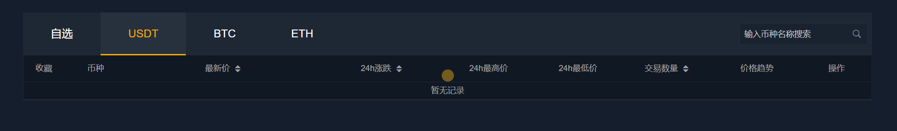

# 行情数据

要做交易，我们首先要获取到交易产品的数据，比如开盘价格，最高价格，成交量等等的。

## 1. 定时获取交易K线

我们选取一个提供api接口的服务商，这里我们选择欧易。

这是文档地址：https://www.okx.com/docs-v5/zh/#rest-api-market-data-get-candlesticks

**获取交易产品K线数据**

获取K线数据。K线数据按请求的粒度分组返回，K线数据每个粒度最多可获取最近1,440条。

限速： 40次/2s

限速规则：IP

HTTP请求

```
GET /api/v5/market/candles
```

> 请求示例

```
GET /api/v5/market/candles?instId=BTC-USD-190927-5000-C
```

请求参数

| 参数名 | 类型   | 是否必须 | 描述                                                         |
| :----- | :----- | :------- | :----------------------------------------------------------- |
| instId | String | 是       | 产品ID，如`BTC-USD-190927-5000-C`                            |
| bar    | String | 否       | 时间粒度，默认值`1m` 如 [1m/3m/5m/15m/30m/1H/2H/4H] 香港时间开盘价k线：[6H/12H/1D/2D/3D/1W/1M/3M] UTC时间开盘价k线：[/6Hutc/12Hutc/1Dutc/2Dutc/3Dutc/1Wutc/1Mutc/3Mutc] |
| after  | String | 否       | 请求此时间戳之前（更旧的数据）的分页内容，传的值为对应接口的`ts` |
| before | String | 否       | 请求此时间戳之后（更新的数据）的分页内容，传的值为对应接口的`ts` |
| limit  | String | 否       | 分页返回的结果集数量，最大为300，不填默认返回100条           |

> 返回结果

```
{
    "code":"0",
    "msg":"",
    "data":[
     [
        "1597026383085",
        "3.721",
        "3.743",
        "3.677",
        "3.708",
        "8422410",
        "22698348.04828491",
        "12698348.04828491",
        "0"
    ],
    [
        "1597026383085",
        "3.731",
        "3.799",
        "3.494",
        "3.72",
        "24912403",
        "67632347.24399722",
        "37632347.24399722",
        "1"
    ]
    ]
}
```

返回参数

| **参数名**  | **类型** | **描述**                                                     |
| :---------- | :------- | :----------------------------------------------------------- |
| ts          | String   | 开始时间，Unix时间戳的毫秒数格式，如 `1597026383085`         |
| o           | String   | 开盘价格                                                     |
| h           | String   | 最高价格                                                     |
| l           | String   | 最低价格                                                     |
| c           | String   | 收盘价格                                                     |
| vol         | String   | 交易量，以`张`为单位 如果是`衍生品`合约，数值为合约的张数。 如果是`币币/币币杠杆`，数值为交易货币的数量。 |
| volCcy      | String   | 交易量，以`币`为单位 如果是`衍生品`合约，数值为交易货币的数量。 如果是`币币/币币杠杆`，数值为计价货币的数量。 |
| volCcyQuote | String   | 交易量，以计价货币为单位 如：BTC-USDT 和 BTC-USDT-SWAP, 单位均是 USDT； BTC-USD-SWAP 单位是 USD |
| confirm     | String   | K线状态 `0` 代表 K 线未完结，`1` 代表 K 线已完结。           |

### 1.1 定时任务

~~~go
go get github.com/go-co-op/gocron
~~~

~~~go
package main

import (
	"fmt"
	"github.com/go-co-op/gocron"
	"time"
)

func main() {
	s := gocron.NewScheduler(time.UTC)
	s.Every(5).Seconds().Do(func() {
		fmt.Println(time.Now().String())
	})
	s.StartBlocking()
}

~~~

### 1.2 定时获取K线数据

sha256加密：

~~~go
func ComputeHmacSha256(message string, secret string) string {
	key := []byte(secret)
	h := hmac.New(sha256.New, key)
	h.Write([]byte(message))
	sha := hex.EncodeToString(h.Sum(nil))
	return base64.StdEncoding.EncodeToString([]byte(sha))
}

~~~

iso格式时间：

~~~go
func ISO(t time.Time) string {
	return t.UTC().Format(time.RFC3339)
}
~~~

带代理和header的http get请求工具类：

~~~go

func GetWithHeader(path string, m map[string]string, proxy string) ([]byte, error) {
	ctx, cancelFunc := context.WithTimeout(context.Background(), 20*time.Second)
	defer cancelFunc()
	httpReq, err := http.NewRequestWithContext(ctx, http.MethodGet, path, nil)
	if err != nil {
		return nil, err
	}
	if m != nil {
		for k, v := range m {
			httpReq.Header.Set(k, v)
		}
	}
	client := http.DefaultClient
	if proxy != "" {
		proxyAddress, _ := url.Parse(proxy)
		client = &http.Client{
			Transport: &http.Transport{
				Proxy: http.ProxyURL(proxyAddress),
			},
		}
	}
	httpRsp, err := client.Do(httpReq)
	if err != nil {
		return nil, err
	}
	defer httpRsp.Body.Close()
	rspBody, err := io.ReadAll(httpRsp.Body)
	if err != nil {
		return nil, err
	}
	return rspBody, nil
}

~~~


实现：

~~~go
package market

import (
	"encoding/base64"
	"encoding/json"
	"jobcenter/internal/database"
	"jobcenter/internal/domain"
	"jobcenter/internal/model"
	"log"
	"ffcoin-common/tools"
	"sync"
	"time"
)

var secretKey = "004148A48D9335E147963C6F5B9C4E63"

type Kline struct {
	wg          sync.WaitGroup
	klineDomain *domain.KlineDomain
}

func NewKline(cli *database.MongoClient) *Kline {
	return &Kline{
		wg:          sync.WaitGroup{},
		klineDomain: domain.NewKlineDomain(cli),
	}
}
func (k *Kline) Do(period string) {
	log.Println("============启动k线数据拉取==============")
	k.wg.Add(2)
	go k.syncToMongo("BTC-USDT", "BTC/USDT", period)
	go k.syncToMongo("ETH-USDT", "ETH/USDT", period)
	k.wg.Wait()
	log.Println("===============k线数据拉取结束===============")
}

func (k *Kline) syncToMongo(instId string, symbol, period string) {
	api := "GET/api/v5/market/candles?instId=" + instId + "&bar=" + period
	timestamp := tools.ISO(time.Now())
	sha256 := tools.ComputeHmacSha256(timestamp+api, secretKey)
	sign := base64.StdEncoding.EncodeToString([]byte(sha256))
	header := make(map[string]string)
	header["OK-ACCESS-KEY"] = "d5a748c6-214d-4fae-bef3-d32368ecbbe8"
	header["OK-ACCESS-SIGN"] = sign
	header["OK-ACCESS-TIMESTAMP"] = timestamp
	header["OK-ACCESS-PASSPHRASE"] = "Mszlu!@#$56789"
	respBody, err := tools.GetWithHeader(
		"https://www.okx.com/api/v5/market/candles?instId="+instId+"&bar="+period,
		header,
		"http://127.0.0.1:10809")
	if err != nil {
		log.Println(err)
	} else {
		log.Println(instId, string(respBody))
		resp := &model.OkxKlineRes{}
		err := json.Unmarshal(respBody, resp)
		if err != nil {
			log.Println(err)
		} else {
			if resp.Code == "0" {
				//代表成功
				k.klineDomain.Save(resp.Data, symbol, period)
			}
		}
	}
	k.wg.Done()

}

~~~

### 1.3 存入mongo

我们定时获取到数据后，我们将其存入mongo中。

mongo其具有分布式特性，查询速度快，存储数量量大，便于查询是我们选择的理由。

安装mongo：

~~~yaml
  mongo:
    image: mongo:4.2.1
    restart: always
    container_name: mongo
    ports:
      - 27018:27017
    volumes:
      - ${MONGO_DIR}/db:/data/db # 挂载数据目录
      - ${MONGO_DIR}/log:/var/log/mongodb  # 挂载日志目录
    privileged: true  # 设置容器的权限为root
    environment:
      MONGO_INITDB_ROOT_USERNAME: root  # 账号
      MONGO_INITDB_ROOT_PASSWORD: root123456
~~~

地址：https://github.com/mongodb/mongo-go-driver

model:

~~~go
package model

import (
	"ffcoin-common/tools"
)

type Kline struct {
	Period       string  `bson:"period,omitempty"`
	OpenPrice    float64 `bson:"openPrice,omitempty"`
	HighestPrice float64 `bson:"highestPrice,omitempty"`
	LowestPrice  float64 `bson:"lowestPrice,omitempty"`
	ClosePrice   float64 `bson:"closePrice,omitempty"`
	Time         int64   `bson:"time,omitempty"`
	Count        float64 `bson:"count,omitempty"`    //成交笔数
	Volume       float64 `bson:"volume,omitempty"`   //成交量
	Turnover     float64 `bson:"turnover,omitempty"` //成交额
	TimeStr      string  `bson:"timeStr,omitempty"`
}

func (*Kline) Table(symbol, period string) string {
	return "exchange_kline_" + symbol + "_" + period
}

func NewKline(data []string, period string) *Kline {
	toInt64 := tools.ToInt64(data[0])
	return &Kline{
		Time:         toInt64,
		Period:       period,
		OpenPrice:    tools.ToFloat64(data[1]),
		HighestPrice: tools.ToFloat64(data[2]),
		LowestPrice:  tools.ToFloat64(data[3]),
		ClosePrice:   tools.ToFloat64(data[4]),
		Count:        tools.ToFloat64(data[5]),
		Volume:       tools.ToFloat64(data[6]),
		Turnover:     tools.ToFloat64(data[7]),
		TimeStr:      tools.ToTimeString(toInt64),
	}
}

type OkxKlineRes struct {
	Code string     `json:"code"`
	Msg  string     `json:"msg"`
	Data [][]string `json:"data"`
}

~~~

mongo连接：

~~~go
package database

import (
	"context"
	"go.mongodb.org/mongo-driver/mongo"
	"go.mongodb.org/mongo-driver/mongo/options"
	"jobcenter/internal/config"
	"log"
	"time"
)

type MongoClient struct {
	cli *mongo.Client
	Db  *mongo.Database
}

func ConnectMongo(c config.Config) *MongoClient {
	ctx, cancel := context.WithTimeout(context.Background(), 10*time.Second)
	defer cancel()
	credential := options.Credential{
		Username: c.Mongo.Username,
		Password: c.Mongo.Password,
	}
	client, err := mongo.Connect(ctx, options.Client().
		ApplyURI("mongodb://localhost:27018").
		SetAuth(credential))
	if err != nil {
		panic(err)
	}
	err = client.Ping(ctx, nil)
	if err != nil {
		panic(err)
	}
	database := client.Database("ffcoin")
	return &MongoClient{cli: client, Db: database}
}

func (c *MongoClient) Disconnect() {
	ctx, cancel := context.WithTimeout(context.Background(), 10*time.Second)
	defer cancel()
	err := c.cli.Disconnect(ctx)
	if err != nil {
		log.Println(err)
	}
	log.Println("关闭连接..")
}

~~~

启动类：

~~~go
package main

import (
	"flag"
	"github.com/go-co-op/gocron"
	"github.com/zeromicro/go-zero/core/conf"
	"jobcenter/internal/config"
	"jobcenter/internal/database"
	"jobcenter/internal/market"
	"log"
	"os"
	"os/signal"
	"syscall"
	"time"
)

var configFile = flag.String("f", "etc/conf.yaml", "the config file")

func main() {
	flag.Parse()
	var c config.Config
	conf.MustLoad(*configFile, &c)
	client := database.ConnectMongo(c)
	s := gocron.NewScheduler(time.UTC)
	s.Every(60).Seconds().Do(func() {
		market.NewKline(client).Do()
	})
	go func() {
		exit := make(chan os.Signal)
		signal.Notify(exit, syscall.SIGINT, syscall.SIGTERM)
		select {
		case <-exit:
			log.Println("监听到中断信号，终止程序")
			client.Disconnect()
			s.Stop()
		}
	}()
	s.StartBlocking()
}

~~~

实现：

~~~go
package market

import (
	"encoding/base64"
	"encoding/json"
	"jobcenter/internal/database"
	"jobcenter/internal/domain"
	"jobcenter/internal/model"
	"log"
	"ffcoin-common/tools"
	"sync"
	"time"
)

var secretKey = "004148A48D9335E147963C6F5B9C4E63"

type Kline struct {
	wg          sync.WaitGroup
	klineDomain *domain.KlineDomain
}

func NewKline(cli *database.MongoClient) *Kline {
	return &Kline{
		wg:          sync.WaitGroup{},
		klineDomain: domain.NewKlineDomain(cli),
	}
}
func (k *Kline) Do(period string) {
	log.Println("============启动k线数据拉取==============")
	k.wg.Add(2)
	go k.syncToMongo("BTC-USDT", "BTC/USDT", period)
	go k.syncToMongo("ETH-USDT", "ETH/USDT", period)
	k.wg.Wait()
	log.Println("===============k线数据拉取结束===============")
}

func (k *Kline) syncToMongo(instId string, symbol, period string) {
	api := "GET/api/v5/market/candles?instId=" + instId + "&bar=" + period
	timestamp := tools.ISO(time.Now())
	sha256 := tools.ComputeHmacSha256(timestamp+api, secretKey)
	sign := base64.StdEncoding.EncodeToString([]byte(sha256))
	header := make(map[string]string)
	header["OK-ACCESS-KEY"] = "d5a748c6-214d-4fae-bef3-d32368ecbbe8"
	header["OK-ACCESS-SIGN"] = sign
	header["OK-ACCESS-TIMESTAMP"] = timestamp
	header["OK-ACCESS-PASSPHRASE"] = "Mszlu!@#$56789"
	respBody, err := tools.GetWithHeader(
		"https://www.okx.com/api/v5/market/candles?instId=BTC-USDT&bar="+period,
		header,
		"http://127.0.0.1:10809")
	if err != nil {
		log.Println(err)
	} else {
		log.Println(instId, string(respBody))
		resp := &model.OkxKlineRes{}
		err := json.Unmarshal(respBody, resp)
		if err != nil {
			log.Println(err)
		} else {
			if resp.Code == "0" {
				//代表成功
				k.klineDomain.Save(resp.Data, symbol, period)
			}
		}
	}
	k.wg.Done()

}

~~~

~~~go
package domain

import (
	"context"
	"jobcenter/internal/dao"
	"jobcenter/internal/database"
	"jobcenter/internal/model"
	"jobcenter/internal/repo"
	"log"
)

type KlineDomain struct {
	klineRepo repo.KlineRepo
}

func (d *KlineDomain) Save(data [][]string, symbol, period string) {
	klines := make([]*model.Kline, len(data))
	for i, v := range data {
		kline := model.NewKline(v, period)
		klines[i] = kline
	}
	//拿到获取的最后时间的数据，然后将大于此时间的数据删除
	kline := klines[len(klines)-1]
	dataTime := kline.Time
	err := d.klineRepo.DeleteGtTime(context.Background(), dataTime, symbol, period)
	if err != nil {
		log.Println(err)
		return
	}
	err = d.klineRepo.SaveBatch(context.Background(), klines, symbol, period)
	if err != nil {
		log.Println(err)
	}
}

func NewKlineDomain(cli *database.MongoClient) *KlineDomain {
	return &KlineDomain{
		klineRepo: dao.NewKlineDao(cli.Db),
	}
}

~~~

~~~go
package dao

import (
	"context"
	"go.mongodb.org/mongo-driver/bson"
	"go.mongodb.org/mongo-driver/mongo"
	"jobcenter/internal/model"
	"log"
)

type KlineDao struct {
	db *mongo.Database
}

func (d *KlineDao) DeleteGtTime(ctx context.Context, time int64, symbol string, period string) error {
	collection := d.db.Collection("exchange_kline_" + symbol + "_" + period)
	deleteResult, err := collection.DeleteMany(ctx, bson.D{{"time", bson.D{{"$gte", time}}}})
	log.Printf("删除表%s，数量为：%d \n", "exchange_kline_"+symbol+"_"+period, deleteResult.DeletedCount)
	return err
}

func NewKlineDao(db *mongo.Database) *KlineDao {
	return &KlineDao{
		db: db,
	}
}
func (d *KlineDao) SaveBatch(ctx context.Context, data []*model.Kline, symbol, period string) error {
	collection := d.db.Collection("exchange_kline_" + symbol + "_" + period)
	ds := make([]interface{}, len(data))
	for i, v := range data {
		ds[i] = v
	}
	_, err := collection.InsertMany(ctx, ds)
	return err
}

~~~

~~~go
package repo

import (
	"context"
	"jobcenter/internal/model"
)

type KlineRepo interface {
	SaveBatch(ctx context.Context, data []*model.Kline, symbol, period string) error
	DeleteGtTime(background context.Context, time int64, symbol string, period string) error
}

~~~


## 2. 交易货币

我们设计一张表，用于存储交易货币，我们这里主要交易BTC和ETH。


~~~sql
CREATE TABLE exchange_coin  (
  `id` bigint(0) NOT NULL AUTO_INCREMENT,
  `symbol` varchar(255) CHARACTER SET utf8mb3 COLLATE utf8mb3_general_ci NOT NULL COMMENT '交易币种名称，格式：BTC/USDT',
  `base_coin_scale` int(0) NOT NULL COMMENT '基币小数精度',
  `base_symbol` varchar(255) CHARACTER SET utf8mb3 COLLATE utf8mb3_general_ci NOT NULL COMMENT '结算币种符号，如USDT',
  `coin_scale` int(0) NOT NULL COMMENT '交易币小数精度',
  `coin_symbol` varchar(255) CHARACTER SET utf8mb3 COLLATE utf8mb3_general_ci NOT NULL COMMENT '交易币种符号',
  `enable` int(0) NOT NULL COMMENT '状态，1：启用，2：禁止',
  `fee` decimal(8, 4) NOT NULL COMMENT '交易手续费',
  `sort` int(0) NOT NULL COMMENT '排序，从小到大',
  `enable_market_buy` int(0) NOT NULL DEFAULT 1 COMMENT '是否启用市价买',
  `enable_market_sell` int(0) NOT NULL DEFAULT 1 COMMENT '是否启用市价卖',
  `min_sell_price` decimal(18, 8) NOT NULL DEFAULT 0.00000000 COMMENT '最低挂单卖价',
  `flag` int(0) NOT NULL DEFAULT 0 COMMENT '标签位，用于推荐，排序等,默认为0，1表示推荐',
  `max_trading_order` int(0) NOT NULL DEFAULT 0 COMMENT '最大允许同时交易的订单数，0表示不限制',
  `max_trading_time` int(0) NOT NULL DEFAULT 0 COMMENT '委托超时自动下架时间，单位为秒，0表示不过期',
  `min_turnover` decimal(18, 8) NOT NULL DEFAULT 0.00000000 COMMENT '最小挂单成交额',
  `clear_time` bigint(0) NOT NULL DEFAULT 0 COMMENT '清盘时间',
  `end_time` bigint(0) NOT NULL DEFAULT 0 COMMENT '结束时间',
  `exchangeable` int(0) NOT NULL DEFAULT 1 COMMENT ' 是否可交易',
  `max_buy_price` decimal(18, 8) NOT NULL DEFAULT 0.00000000 COMMENT '最高买单价',
  `max_volume` decimal(18, 8) NOT NULL DEFAULT 0.00000000 COMMENT '最大下单量',
  `min_volume` decimal(18, 8) NOT NULL DEFAULT 0.00000000 COMMENT '最小下单量',
  `publish_amount` decimal(18, 8) NOT NULL DEFAULT 0.00000000 COMMENT ' 活动发行数量',
  `publish_price` decimal(18, 8) NOT NULL DEFAULT 0.00000000 COMMENT ' 分摊发行价格',
  `publish_type` int(0) NOT NULL DEFAULT 1 COMMENT '发行活动类型 1:无活动,2:抢购发行,3:分摊发行',
  `robot_type` int(0) NOT NULL DEFAULT 0 COMMENT '机器人类型',
  `start_time` bigint(0) NOT NULL DEFAULT 0 COMMENT '开始时间',
  `visible` int(0) NOT NULL DEFAULT 1 COMMENT ' 前台可见状态',
  `zone` int(0) NOT NULL DEFAULT 0 COMMENT '交易区域',
  PRIMARY KEY (`id`) USING BTREE
) ENGINE = InnoDB CHARACTER SET = utf8mb3 COLLATE = utf8mb3_general_ci ROW_FORMAT = DYNAMIC;
~~~

插入数据：

~~~sql
INSERT INTO exchange_coin(`symbol`, `base_coin_scale`, `base_symbol`, `coin_scale`, `coin_symbol`, `enable`, `fee`, `sort`, `enable_market_buy`, `enable_market_sell`, `min_sell_price`, `flag`, `max_trading_order`, `max_trading_time`,`min_turnover`, `clear_time`, `end_time`, `exchangeable`, `max_buy_price`, `max_volume`, `min_volume`, `publish_amount`, `publish_price`, `publish_type`, `robot_type`, `start_time`, `visible`, `zone`) VALUES ('BTC/USDT', 2, 'USDT', 2, 'BTC', 1, 0.0010, 1, 1, 1, 0.00000000, 1, 0, 0, 0.00000000, 1640998800000, 1640998800000, 1, 0.00000000, 0.00000000, 0.00000000, 0.00000000, 0.00000000, 1, 0, 1640998800000, 1, 0);
INSERT INTO exchange_coin(`symbol`, `base_coin_scale`, `base_symbol`, `coin_scale`, `coin_symbol`, `enable`, `fee`, `sort`, `enable_market_buy`, `enable_market_sell`, `min_sell_price`, `flag`, `max_trading_order`, `max_trading_time`, `min_turnover`, `clear_time`, `end_time`, `exchangeable`, `max_buy_price`, `max_volume`, `min_volume`, `publish_amount`, `publish_price`, `publish_type`, `robot_type`, `start_time`, `visible`, `zone`) VALUES ('ETH/USDT', 2, 'USDT', 2, 'ETH', 1, 0.0010, 3, 1, 1, 0.00000000, 0, 0, 0,  0.00000000, 1640998800000, 1640998800000, 1, 0.00000000, 0.00000000, 0.00000000, 0.00000000, 0.00000000, 1, 0, 1640998800000, 1, 0);

~~~

写一个查询的domain用于后续处理。

~~~go
package model

type ExchangeCoin struct {
	Id               int64   `gorm:"column:id"`
	Symbol           string  `gorm:"column:symbol"`             // 交易币种名称，格式：BTC/USDT
	BaseCoinScale    int64   `gorm:"column:base_coin_scale"`    // 基币小数精度
	BaseSymbol       string  `gorm:"column:base_symbol"`        // 结算币种符号，如USDT
	CoinScale        int64   `gorm:"column:coin_scale"`         // 交易币小数精度
	CoinSymbol       string  `gorm:"column:coin_symbol"`        // 交易币种符号
	Enable           int64   `gorm:"column:enable"`             // 状态，1：启用，2：禁止
	Fee              float64 `gorm:"column:fee"`                // 交易手续费
	Sort             int64   `gorm:"column:sort"`               // 排序，从小到大
	EnableMarketBuy  int64   `gorm:"column:enable_market_buy"`  // 是否启用市价买
	EnableMarketSell int64   `gorm:"column:enable_market_sell"` // 是否启用市价卖
	MinSellPrice     float64 `gorm:"column:min_sell_price"`     // 最低挂单卖价
	Flag             int64   `gorm:"column:flag"`               // 标签位，用于推荐，排序等,默认为0，1表示推荐
	MaxTradingOrder  int64   `gorm:"column:max_trading_order"`  // 最大允许同时交易的订单数，0表示不限制
	MaxTradingTime   int64   `gorm:"column:max_trading_time"`   // 委托超时自动下架时间，单位为秒，0表示不过期
	MinTurnover      float64 `gorm:"column:min_turnover"`       // 最小挂单成交额
	ClearTime        int64   `gorm:"column:clear_time"`         // 清盘时间
	EndTime          int64   `gorm:"column:end_time"`           // 结束时间
	Exchangeable     int64   `gorm:"column:exchangeable"`       //  是否可交易
	MaxBuyPrice      float64 `gorm:"column:max_buy_price"`      // 最高买单价
	MaxVolume        float64 `gorm:"column:max_volume"`         // 最大下单量
	MinVolume        float64 `gorm:"column:min_volume"`         // 最小下单量
	PublishAmount    float64 `gorm:"column:publish_amount"`     //  活动发行数量
	PublishPrice     float64 `gorm:"column:publish_price"`      //  分摊发行价格
	PublishType      int64   `gorm:"column:publish_type"`       // 发行活动类型 1:无活动,2:抢购发行,3:分摊发行
	RobotType        int64   `gorm:"column:robot_type"`         // 机器人类型
	StartTime        int64   `gorm:"column:start_time"`         // 开始时间
	Visible          int64   `gorm:"column:visible"`            //  前台可见状态
	Zone             int64   `gorm:"column:zone"`               // 交易区域
}


~~~

~~~go
package dao

import (
	"context"
	"ffcoin-common/msdb"
	"ffcoin-common/msdb/gorms"
	"ffcoin/ucenter/internal/model"
)

type ExchangeCoinDao struct {
	conn *gorms.GormConn
}

func (d *ExchangeCoinDao) FindVisible(ctx context.Context) (list []*model.ExchangeCoin, err error) {
	session := d.conn.Session(ctx)
	err = session.Model(&model.ExchangeCoin{}).Where("visible=?", 1).Find(&list).Error
	return
}

func NewExchangeCoinDao(db *msdb.MsDB) *ExchangeCoinDao {
	return &ExchangeCoinDao{
		conn: gorms.New(db.DB),
	}
}

~~~

~~~go
package domain

import (
	"context"
	"github.com/zeromicro/go-zero/core/logx"
	"ffcoin-common/msdb"
	"ffcoin/ucenter/internal/dao"
	"ffcoin/ucenter/internal/model"
	"ffcoin/ucenter/internal/repo"
)

type ExchangeCoinDomain struct {
	ExchangeCoinRepo repo.ExchangeCoinRepo
}

func NewExchangeCoinDomain(db *msdb.MsDB) *ExchangeCoinDomain {
	return &ExchangeCoinDomain{
		ExchangeCoinRepo: dao.NewExchangeCoinDao(db),
	}
}

func (d *ExchangeCoinDomain) FindVisible(ctx context.Context) []*model.ExchangeCoin {
	list, err := d.ExchangeCoinRepo.FindVisible(ctx)
	if err != nil {
		logx.Error(err)
		return []*model.ExchangeCoin{}
	}
	return list
}

~~~

~~~go
package repo

import (
	"context"
	"ffcoin/ucenter/internal/model"
)

type ExchangeCoinRepo interface {
	FindVisible(ctx context.Context) (list []*model.ExchangeCoin, err error)
}

~~~

## 3. 货币汇率

关于货币这块的业务，我们发现很明显不属于用户体系，属于market市场体系，所以我们需要做一个market-rpc服务和market-api服务。

将ucenter和ucenter-api复制一份改一下即可。

~~~go
package domain

import "strings"

const CNY = "CNY"
const JPY = "JPY"
const HKD = "HKD"

type ExchangeRateDomain struct {
}

func (d *ExchangeRateDomain) GetUsdRate(unit string) float64 {
	upper := strings.ToUpper(unit)
	if upper == CNY {
		return 7.00
	} else if upper == JPY {
		return 110.02
	} else if upper == HKD {
		return 7.8497
	}
	return 0
}

func NewExchangeRateDomain() *ExchangeRateDomain {
	return &ExchangeRateDomain{}
}

~~~


~~~go
package logic

import (
	"context"
	"github.com/zeromicro/go-zero/core/logx"
	"ffcoin/grpc-common/market/rate"
	"ffcoin/market/internal/domain"
	"ffcoin/market/internal/svc"
)

type ExchangeRateLogic struct {
	ctx    context.Context
	svcCtx *svc.ServiceContext
	logx.Logger
	exchangeRateDomain *domain.ExchangeRateDomain
}

func NewExchangeRateLogic(ctx context.Context, svcCtx *svc.ServiceContext) *ExchangeRateLogic {
	return &ExchangeRateLogic{
		ctx:                ctx,
		svcCtx:             svcCtx,
		Logger:             logx.WithContext(ctx),
		exchangeRateDomain: domain.NewExchangeRateDomain(),
	}
}

func (l *ExchangeRateLogic) UsdRate(in *rate.RateReq) (*rate.RateRes, error) {
	usdtRate := l.exchangeRateDomain.GetUsdRate(in.GetUnit())
	return &rate.RateRes{
		Rate: usdtRate,
	}, nil
}

~~~

~~~protobuf
syntax = "proto3";

package rate;

// protoc-gen-go 版本大于1.4.0, proto文件需要加上go_package,否则无法生成
option go_package = "./rate";

message RateReq {
  string unit = 1;
  string ip = 2;
}

message RateRes{
  double rate = 1;
}

service ExchangeRate {
  rpc usdRate(RateReq) returns(RateRes);
}
~~~

### 3.1 api

~~~go
package handler

import (
	"market-api/internal/svc"
)

func RegisterHandlers(r *Routers, serverCtx *svc.ServiceContext) {
	rate := NewExchangeRateHandler(serverCtx)
	rateGroup := r.Group()
	rateGroup.Post("/market/exchange-rate/usd/:unit", rate.GetUsdRate)
}

~~~

~~~go
package handler

import (
	"github.com/zeromicro/go-zero/rest/httpx"
	"market-api/internal/logic"
	"market-api/internal/svc"
	"market-api/internal/types"
	common "ffcoin-common"
	"ffcoin-common/tools"
	"net/http"
)

type ExchangeRateHandler struct {
	svcCtx *svc.ServiceContext
}

func (h *ExchangeRateHandler) GetUsdRate(w http.ResponseWriter, r *http.Request) {
	var req types.RateRequest
	if err := httpx.ParsePath(r, &req); err != nil {
		httpx.ErrorCtx(r.Context(), w, err)
		return
	}
	ip := tools.GetRemoteClientIp(r)
	req.Ip = ip
	l := logic.NewExchangeRateLogic(r.Context(), h.svcCtx)
	resp, err := l.GetUsdCnyRate(&req)
	result := common.NewResult().Deal(resp.Rate, err)
	httpx.OkJsonCtx(r.Context(), w, result)
}

func NewExchangeRateHandler(svcCtx *svc.ServiceContext) *ExchangeRateHandler {
	return &ExchangeRateHandler{svcCtx}
}

~~~

~~~go
// Code generated by goctl. DO NOT EDIT.
package types

type RateRequest struct {
	Unit     string      `path:"unit" json:"unit"`
	Ip string `json:"ip,optional"`
}

type RateResponse struct {
	Rate float64 `json:"rate"`
}
~~~

~~~go
package logic

import (
	"context"
	"github.com/zeromicro/go-zero/core/logx"
	"market-api/internal/svc"
	"market-api/internal/types"
	"ffcoin/grpc-common/market/rate"
	"time"
)

type ExchangeRate struct {
	logx.Logger
	ctx    context.Context
	svcCtx *svc.ServiceContext
}

func NewExchangeRateLogic(ctx context.Context, svcCtx *svc.ServiceContext) *ExchangeRate {
	return &ExchangeRate{
		Logger: logx.WithContext(ctx),
		ctx:    ctx,
		svcCtx: svcCtx,
	}
}

func (l *ExchangeRate) GetUsdRate(req *types.RateRequest) (resp *types.RateResponse, err error) {
	ctx, cancel := context.WithTimeout(context.Background(), 5*time.Second)
	defer cancel()
	usdRate, err := l.svcCtx.ExchangeRateRpc.UsdRate(ctx, &rate.RateReq{
		Unit: req.Unit,
	})
	if err != nil {
		return nil, err
	}
	resp = &types.RateResponse{
		Rate: usdRate.Rate,
	}
	return
}

~~~

~~~yaml
Name: market-api
Host: 127.0.0.1
Port: 8889
MarketRpc:
  Etcd:
    Hosts:
      - 127.0.0.1:2379
    Key: market.rpc
CacheRedis:
  - Host: 127.0.0.1:6379
    Type: node
~~~

## 4. 获取币种行情



首页这里需要显示币种的行情，我们将定时任务获取的行情数据按照最新的数据展示在这里。

### 4.1 测试数据

在做之前，我们先使用测试数据将信息展示出来，然后在去用真实的数据区填充。

~~~go
market := NewMarketHandler(serverCtx)
	marketGroup := r.Group()
	marketGroup.Post("/market/symbol-thumb-trend", market.SymbolThumbTrend)
~~~

~~~go
package handler

import (
	"github.com/zeromicro/go-zero/rest/httpx"
	"market-api/internal/logic"
	"market-api/internal/svc"
	"market-api/internal/types"
	common "ffcoin-common"
	"ffcoin-common/tools"
	"net/http"
)

type MarketHandler struct {
	svcCtx *svc.ServiceContext
}

func (h *MarketHandler) SymbolThumb(w http.ResponseWriter, r *http.Request) {
	var req types.MarketReq
	ip := tools.GetRemoteClientIp(r)
	req.Ip = ip
	l := logic.NewMarketLogic(r.Context(), h.svcCtx)
	resp, err := l.SymbolThumb(&req)
	result := common.NewResult().Deal(resp, err)
	httpx.OkJsonCtx(r.Context(), w, result)
}

func (h *MarketHandler) SymbolThumbTrend(w http.ResponseWriter, r *http.Request) {
	var req types.MarketReq
	ip := tools.GetRemoteClientIp(r)
	req.Ip = ip
	l := logic.NewMarketLogic(r.Context(), h.svcCtx)
	resp, err := l.SymbolThumbTrend(&req)
	result := common.NewResult().Deal(resp, err)
	httpx.OkJsonCtx(r.Context(), w, result)
}

func NewMarketHandler(svcCtx *svc.ServiceContext) *MarketHandler {
	return &MarketHandler{svcCtx}
}

~~~

~~~go

type MarketReq struct {
	Ip string `json:"ip,optional"`
}
type CoinThumbResp struct {
	Symbol string `json:"symbol"`
	Open float64 `json:"open"`
	High float64 `json:"high"`
	Low float64 `json:"low"`
	Close float64 `json:"close"`
	Chg float64 `json:"chg"` //变化百分比
	Change float64 `json:"change"` // 变化金额
	Volume float64 `json:"volume"`
	Turnover float64 `json:"turnover"`
	LastDayClose float64 `json:"lastDayClose"`
	UsdRate float64 `json:"usdRate"` // USDT汇率
	BaseUsdRate float64 `json:"baseUsdRate"` // 基础USDT汇率
	Zone int `json:"zone"` // 交易区
	Trend []float64 `json:"trend,optional"` //价格趋势
}
~~~

~~~go

func (l *Market) SymbolThumbTrend(req *types.MarketReq) (resp []*types.CoinThumbResp, err error) {
	ctx, cancel := context.WithTimeout(context.Background(), 5*time.Second)
	defer cancel()
	thumbResp, err := l.svcCtx.MarketRpc.FindSymbolThumbTrend(ctx, &market.MarketReq{
		Ip: req.Ip,
	})
	if err != nil {
		return nil, err
	}
	if err := copier.Copy(&resp, thumbResp.List); err != nil {
		return nil, errors.New("数据格式有误")
	}
	for _, v := range resp {
		if v.Trend == nil {
			v.Trend = []float64{}
		}
	}
	return
}

~~~

rpc模块：

~~~protobuf
syntax = "proto3";

package market;

// protoc-gen-go 版本大于1.4.0, proto文件需要加上go_package,否则无法生成
option go_package = "./market";

message MarketReq {
  string ip = 1;
  string symbol = 2;
}
message SymbolThumbRes{
  repeated CoinThumb list = 1;
}
message CoinThumb {
  string symbol = 1;
  double open = 2;
  double high= 3;
  double low = 4;
  double close = 5;
  double chg = 6;
  double change = 7;
  double volume = 8;
  double turnover = 9;
  double lastDayClose = 10;
  double usdRate = 11;
  double baseUsdRate = 12;
  double zone = 13;
  repeated double trend = 14;
}

service Market {
  rpc FindSymbolThumbTrend(MarketReq) returns(SymbolThumbRes);
}
~~~

~~~go

func (l *MarketLogic) FindSymbolThumbTrend(in *market.MarketReq) (*market.SymbolThumbRes, error) {
	ctx, cancel := context.WithTimeout(context.Background(), 5*time.Second)
	defer cancel()
	exchangeCoins := l.exchangeCoinDomain.FindVisible(ctx)
	coinThumbs := make([]*market.CoinThumb, len(exchangeCoins))
	for i, v := range exchangeCoins {
		trend := make([]float64, 0)
		for p := 0; p <= 100; p++ {
			trend = append(trend, rand.Float64())
		}
		ct := &market.CoinThumb{}
		ct.Symbol = v.Symbol
		ct.Trend = trend
		coinThumbs[i] = ct
	}
	return &market.SymbolThumbRes{
		List: coinThumbs,
	}, nil
}
~~~

### 4.2 真实数据

配置mongo，根据币种将k线数据查出来

~~~yaml
Mongo:
  Url: "mongodb://localhost:27018"
  Username: root
  Password: root123456
~~~

~~~go
package config

import (
	"github.com/zeromicro/go-zero/core/stores/cache"
	"github.com/zeromicro/go-zero/zrpc"
)

type Config struct {
	zrpc.RpcServerConf
	Mysql      MysqlConfig
	CacheRedis cache.CacheConf
	Mongo      MongoConfig
}

type MongoConfig struct {
	Url      string
	Username string
	Password string
}

type MysqlConfig struct {
	DataSource string
}

~~~

model

~~~go
package model

import (
	"ffcoin-common/op"
	"ffcoin-common/tools"
	"ffcoin/grpc-common/market/market"
)

type Kline struct {
	Period       string  `bson:"period,omitempty"`
	OpenPrice    float64 `bson:"openPrice,omitempty"`
	HighestPrice float64 `bson:"highestPrice,omitempty"`
	LowestPrice  float64 `bson:"lowestPrice,omitempty"`
	ClosePrice   float64 `bson:"closePrice,omitempty"`
	Time         int64   `bson:"time,omitempty"`
	Count        float64 `bson:"count,omitempty"`    //成交笔数
	Volume       float64 `bson:"volume,omitempty"`   //成交量
	Turnover     float64 `bson:"turnover,omitempty"` //成交额
}

func (*Kline) Table(symbol, period string) string {
	return "exchange_kline_" + symbol + "_" + period
}

func (k *Kline) ToCoinThumb(symbol string, end *Kline) *market.CoinThumb {
	ct := &market.CoinThumb{}
	ct.Symbol = symbol
	ct.Close = k.ClosePrice
	ct.Open = k.OpenPrice
	ct.Zone = 0
	ct.Change = k.ClosePrice - end.ClosePrice
	ct.Chg = op.DivN(ct.Change, end.LowestPrice, 5)
	ct.UsdRate = k.ClosePrice
	ct.BaseUsdRate = 1
	return ct
}


~~~

~~~go
package repo

import (
	"context"
	"ffcoin/market/internal/model"
)

type KlineRepo interface {
	FindBySymbol(ctx context.Context, symbol, period string, count int64) ([]*model.Kline, error)
	FindBySymbolTime(ctx context.Context, symbol, period string, from, end int64) ([]*model.Kline, error)
}

~~~

~~~go
package dao

import (
	"context"
	"go.mongodb.org/mongo-driver/bson"
	"go.mongodb.org/mongo-driver/mongo"
	"go.mongodb.org/mongo-driver/mongo/options"
	"ffcoin/market/internal/model"
)

type KlineDao struct {
	db *mongo.Database
}

func (d *KlineDao) FindBySymbolTime(ctx context.Context, symbol, period string, from, to int64) (list []*model.Kline, err error) {
	collection := d.db.Collection("exchange_kline_" + symbol + "_" + period)
	//1是升序 -1 是降序
	cur, err := collection.Find(ctx, bson.D{{Key: "time", Value: bson.D{{"$gte", from}, {"$lte", to}}}}, &options.FindOptions{
		Sort: bson.D{{"time", -1}},
	})
	if err != nil {
		return
	}
	defer cur.Close(ctx)
	err = cur.All(ctx, &list)
	if err != nil {
		return
	}
	return
}

func NewKlineDao(db *mongo.Database) *KlineDao {
	return &KlineDao{
		db: db,
	}
}

func (d *KlineDao) FindBySymbol(ctx context.Context, symbol, period string, count int64) (list []*model.Kline, err error) {
	collection := d.db.Collection("exchange_kline_" + symbol + "_" + period)
	//1是升序 -1 是降序
	cur, err := collection.Find(ctx, bson.D{{}}, &options.FindOptions{
		Limit: &count,
		Sort:  bson.D{{"time", -1}},
	})
	if err != nil {
		return
	}
	defer cur.Close(ctx)
	err = cur.All(ctx, &list)
	if err != nil {
		return
	}
	return
}

~~~

~~~go
package domain

import (
	"context"
	"github.com/zeromicro/go-zero/core/logx"
	"ffcoin-common/tools"
	"ffcoin/grpc-common/market/market"
	"ffcoin/market/internal/dao"
	"ffcoin/market/internal/database"
	"ffcoin/market/internal/model"
	"ffcoin/market/internal/repo"
	"time"
)

type MarketDomain struct {
	klineRepo repo.KlineRepo
}

func (d *MarketDomain) SymbolThumbTrend(coins []*model.ExchangeCoin) []*market.CoinThumb {
	ctx, cancel := context.WithTimeout(context.Background(), 10*time.Second)
	defer cancel()
	list := make([]*market.CoinThumb, len(coins))
	to := time.Now().UnixMilli()
	from := tools.ZeroTime()
	for i, v := range coins {
		klines, err := d.klineRepo.FindBySymbolTime(ctx, v.Symbol, "1H", from, to)
		if err != nil {
			logx.Error(err)
			continue
		}
		if len(klines) <= 0 {
			list[i] = &market.CoinThumb{
				Symbol: v.Symbol,
			}
			continue
		}
		trend := make([]float64, len(klines))
		var high float64 = 0
		var low float64 = 0
		var volumes float64 = 0
		var turnover float64 = 0
		for i, v := range klines {
			trend[i] = v.ClosePrice
			if v.HighestPrice > high {
				high = v.HighestPrice
			}
			if v.LowestPrice > low {
				low = v.LowestPrice
			}
			volumes += v.Volume
			turnover += v.Turnover
		}
		kline := klines[0]
		end := klines[len(klines)-1]
		ct := kline.ToCoinThumb(v.Symbol, end)
		ct.High = high
		ct.Low = low
		ct.Volume = volumes
		ct.Turnover = turnover
		ct.Trend = trend
		list[i] = ct
	}
	return list
}

func NewMarketDomain(cli *database.MongoClient) *MarketDomain {
	return &MarketDomain{
		klineRepo: dao.NewKlineDao(cli.Db),
	}
}

~~~

~~~go
package logic

import (
	"context"
	"github.com/zeromicro/go-zero/core/logx"
	"ffcoin/grpc-common/market/market"
	"ffcoin/market/internal/domain"
	"ffcoin/market/internal/svc"
	"time"
)

type MarketLogic struct {
	ctx    context.Context
	svcCtx *svc.ServiceContext
	logx.Logger
	marketDomain       *domain.MarketDomain
	exchangeCoinDomain *domain.ExchangeCoinDomain
}

func NewMarketLogic(ctx context.Context, svcCtx *svc.ServiceContext) *MarketLogic {
	return &MarketLogic{
		ctx:                ctx,
		svcCtx:             svcCtx,
		Logger:             logx.WithContext(ctx),
		marketDomain:       domain.NewMarketDomain(svcCtx.MongoClient),
		exchangeCoinDomain: domain.NewExchangeCoinDomain(svcCtx.Db),
	}
}

func (l *MarketLogic) FindSymbolThumb(in *market.MarketReq) (*market.SymbolThumbRes, error) {
	ctx, cancel := context.WithTimeout(context.Background(), 5*time.Second)
	defer cancel()
	exchangeCoins := l.exchangeCoinDomain.FindVisible(ctx)
	coinThumbs := make([]*market.CoinThumb, len(exchangeCoins))
	for i, v := range exchangeCoins {
		ct := &market.CoinThumb{}
		ct.Symbol = v.Symbol
		coinThumbs[i] = ct
	}
	return &market.SymbolThumbRes{
		List: coinThumbs,
	}, nil
}

func (l *MarketLogic) FindSymbolThumbTrend(in *market.MarketReq) (*market.SymbolThumbRes, error) {
	ctx, cancel := context.WithTimeout(context.Background(), 5*time.Second)
	defer cancel()
	exchangeCoins := l.exchangeCoinDomain.FindVisible(ctx)
	coinThumbs := l.marketDomain.SymbolThumbTrend(exchangeCoins)
	return &market.SymbolThumbRes{
		List: coinThumbs,
	}, nil
}

~~~

涉及到的工具类：

~~~go
func ISO(t time.Time) string {
	return t.UTC().Format(time.RFC3339)
}
func ToMill(t string) int64 {
	//2000-01-01 01:00:00
	parse, err := time.Parse("2006-01-02 15:04:05", t)
	if err != nil {
		log.Println(err)
		return 0
	}
	return parse.UnixMilli()
}
func ToTimeString(mill int64) string {
	milli := time.UnixMilli(mill)
	return milli.Format("2006-01-02 15:04:05")
}

func ZeroTime() int64 {
	now := time.Now()
	date := time.Date(now.Year(), now.Month(), now.Day(), 0, 0, 0, 0, now.Location())
	return date.UnixMilli()
}
~~~

~~~go
package op

import (
	"fmt"
	"strconv"
	"strings"
)

func MulN(x float64, y float64, n int) float64 {
	//n小数点位数
	sprintf := fmt.Sprintf("%d", n)
	value, _ := strconv.ParseFloat(fmt.Sprintf("%."+sprintf+"f", x*y), 64)
	return value
}

func Mul(x float64, y float64) float64 {
	s1 := fmt.Sprintf("%v", x)
	n := 0
	_, after, found := strings.Cut(s1, ".")
	if found {
		n = n + len(after)
	}
	s2 := fmt.Sprintf("%v", y)
	_, after, found = strings.Cut(s2, ".")
	if found {
		n = n + len(after)
	}
	//n小数点位数
	sprintf := fmt.Sprintf("%d", n)
	value, _ := strconv.ParseFloat(fmt.Sprintf("%."+sprintf+"f", x*y), 64)
	return value
}

func DivN(x float64, y float64, n int) float64 {
	//n小数点位数
	sprintf := fmt.Sprintf("%d", n)
	value, _ := strconv.ParseFloat(fmt.Sprintf("%."+sprintf+"f", x/y), 64)
	return value
}

~~~

~~~go
package tools

import (
	"log"
	"strconv"
)

func ToInt64(str string) int64 {
	t, err := strconv.ParseInt(str, 10, 64)
	if err != nil {
		log.Println(str, "ToInt64 err:", err)
	}
	return t
}

func ToFloat64(str string) float64 {
	t, err := strconv.ParseFloat(str, 64)
	if err != nil {
		log.Println(str, "ToFloat64 err:", err)
	}
	return t
}

~~~

## 5. 订阅最新数据

上述我们使用的是查询数据库的数据，当数据库数据变化，重新刷新页面获得最新数据。

这种方式会有一些问题：

* 数据变化不及时
* 会导致大量的请求

我们可以通过websocket方式，将最新的数据实时显示出来，这样来避免大量查询数据。

> 正常情况下，我们应该以交易数据为准，当有交易发生时，我们在触发K线数据的变化，从而展示最新的价格和波动，这里，我们将触发K线数据变化的来源设为当定时任务从okx获取最新的K线数据时

### 5.1 引入kafka发送订阅数据

当定时任务触发获取新的K线数据后，通过Kafka发送数据，然后我们的market服务就可以消费消息，然后通过websocket服务，通知页面刷新数据。

安装:

docker-compose.yml

~~~yaml
  kafdrop:
    container_name: kafdrop
    image: obsidiandynamics/kafdrop
    restart: "no"
    ports:
      - "9000:9000"
    environment:
      KAFKA_BROKERCONNECT: "kafka:29092"
      JVM_OPTS: "-Xms16M -Xmx48M -Xss180K -XX:-TieredCompilation -XX:+UseStringDeduplication -noverify"
    depends_on:
      - "kafka"
  kafka:
    container_name: kafka
    image: obsidiandynamics/kafka
    restart: "no"
    ports:
      - "2181:2181"
      - "9092:9092"
    environment:
      KAFKA_LISTENERS: "INTERNAL://:29092,EXTERNAL://:9092"
      KAFKA_ADVERTISED_LISTENERS: "INTERNAL://kafka:29092,EXTERNAL://localhost:9092"
      KAFKA_LISTENER_SECURITY_PROTOCOL_MAP: "INTERNAL:PLAINTEXT,EXTERNAL:PLAINTEXT"
      KAFKA_INTER_BROKER_LISTENER_NAME: "INTERNAL"
      KAFKA_ZOOKEEPER_SESSION_TIMEOUT: "6000"
      KAFKA_RESTART_ATTEMPTS: "10"
      KAFKA_RESTART_DELAY: "5"
      ZOOKEEPER_AUTOPURGE_PURGE_INTERVAL: "0"
~~~

~~~go
go get github.com/segmentio/kafka-go
~~~

kafka的简单封装：

配置：

~~~go
Mongo:
  Url: mongodb://localhost:27018
  Username: root
  Password: root123456
Kafka:
  Addr: localhost:9092
  WriteCap: 100
  ReadCap: 100
~~~

~~~go
type Config struct {
	Mongo database.MongoConfig
	Kafka database.KafkaConfig
}

~~~

~~~go
package database

import (
	"context"
	"errors"
	"github.com/segmentio/kafka-go"
	"github.com/zeromicro/go-zero/core/logx"
	"log"
	"sync"
	"time"
)

type KafkaConfig struct {
	Addr     string
	WriteCap int
	ReadCap  int
	Group    string `json:"group,optional"`
}
type KafkaData struct {
	Topic string
	Key   []byte
	Data  []byte
}
type KafkaClient struct {
	w         *kafka.Writer
	r         *kafka.Reader
	rDataChan chan KafkaData
	data      chan KafkaData
	c         KafkaConfig
	closed    bool
	mutex     sync.Mutex
}

func NewKafkaClient(c KafkaConfig) *KafkaClient {
	return &KafkaClient{
		c: c,
	}
}

func (k *KafkaClient) StartWrite() {
	w := &kafka.Writer{
		Addr:     kafka.TCP(k.c.Addr),
		Balancer: &kafka.LeastBytes{},
	}
	k.w = w
	k.data = make(chan KafkaData, k.c.WriteCap)
	go k.sendKafka()
}

func (w *KafkaClient) Send(data KafkaData) {
	defer func() {
		if err := recover(); err != nil {
			w.closed = true
		}
	}()
	w.data <- data
	w.closed = false
}

func (w *KafkaClient) Close() {
	if w.w != nil {
		w.w.Close()
		w.mutex.Lock()
		defer w.mutex.Unlock()
		if !w.closed {
			close(w.data)
			w.closed = true
		}
	}
	if w.r != nil {
		w.r.Close()
	}
}

func (w *KafkaClient) sendKafka() {
	for {
		select {
		case data := <-w.data:
			messages := []kafka.Message{
				{
					Topic: data.Topic,
					Key:   data.Key,
					Value: data.Data,
				},
			}
			var err error
			const retries = 3
			ctx, cancel := context.WithTimeout(context.Background(), 10*time.Second)
			defer cancel()
			success := false
			for i := 0; i < retries; i++ {
				// attempt to create topic prior to publishing the message
				err = w.w.WriteMessages(ctx, messages...)
				if err == nil {
					success = true
					break
				}
				if errors.Is(err, kafka.LeaderNotAvailable) || errors.Is(err, context.DeadlineExceeded) {
					time.Sleep(time.Millisecond * 250)
					success = false
					continue
				}
				if err != nil {
					success = false
					log.Printf("kafka send writemessage err %s \n", err.Error())
				}
			}
			if !success {
				//重新放进去等待消费
				w.Send(data)
			}
		}
	}

}

func (k *KafkaClient) StartRead() {
	r := kafka.NewReader(kafka.ReaderConfig{
		Brokers:  []string{k.c.Addr},
		GroupID:  k.c.Group,
		MinBytes: 10e3, // 10KB
		MaxBytes: 10e6, // 10MB
	})
	k.r = r
	k.rDataChan = make(chan KafkaData, k.c.ReadCap)
	go k.readMsg()
}

func (k *KafkaClient) readMsg() {
	for {
		m, err := k.r.ReadMessage(context.Background())
		if err != nil {
			logx.Error(err)
			continue
		}
		data := KafkaData{
			Key:  m.Key,
			Data: m.Value,
		}
		k.rDataChan <- data
	}
}

~~~

~~~go
func (k *Kline) Send(data []string, symbol, period string) {
	if "1m" == period {
		//只有1m间隔的数据 才向kafka发送数据
		k.queueDomain.Sync1mKline(data, symbol, period)
	}
}
~~~

~~~go
package domain

import (
	"encoding/json"
	"jobcenter/internal/database"
	"jobcenter/internal/model"
)

const KLINE1M = "kline_1m"

type QueueDomain struct {
	cli *database.KafkaClient
}

func (d *QueueDomain) Sync1mKline(data []string, symbol string, period string) {
	kline := model.NewKline(data, period)
	bytes, _ := json.Marshal(kline)
	sendData := database.KafkaData{
		Topic: KLINE1M,
		Key:   []byte(symbol),
		Data:  bytes,
	}
	d.cli.Send(sendData)
}

func NewQueueDomain(cli *database.KafkaClient) *QueueDomain {
	return &QueueDomain{
		cli: cli,
	}
}

~~~

### 5.2 接收订阅信息

在market-api中定义一个处理器去处理。

~~~go
package processor

import (
	"encoding/json"
	"market-api/internal/database"
	"market-api/internal/model"
	"ffcoin/grpc-common/market/market"
)

const KLINE1M = "kline_1m"
const KLINE = "kline"
const TRADE = "trade"

type ProcessData struct {
	Type string //trade 交易 kline k线
	Key  []byte
	Data []byte
}
type MarketHandler interface {
	HandlerTrade(symbol string, data []byte)
	HandlerKLine(symbol string, kline *model.Kline, thumbMap map[string]*market.CoinThumb)
}
type Processor interface {
	PutThumb(any)
	GetThumb() any
	Process(data *ProcessData)
	AddHandler(h MarketHandler)
}

type DefaultProcessor struct {
	kafkaCli *database.KafkaClient
	handlers []MarketHandler
	thumbMap map[string]*market.CoinThumb
}

func (p *DefaultProcessor) PutThumb(data any) {
	switch data.(type) {
	case []*market.CoinThumb:
		list := data.([]*market.CoinThumb)
		for _, v := range list {
			p.thumbMap[v.Symbol] = v
		}
	}
}

func (p *DefaultProcessor) GetThumb() any {
	return p.thumbMap
}

func NewDefaultProcessor(kafkaCli *database.KafkaClient) *DefaultProcessor {
	return &DefaultProcessor{
		kafkaCli: kafkaCli,
		handlers: make([]MarketHandler, 0),
		thumbMap: make(map[string]*market.CoinThumb),
	}
}

func (p *DefaultProcessor) Init(wh *WebsocketHandler) {
	p.AddHandler(wh)
	//接收kline 1m的同步数据
	p.startReadFromKafka(KLINE1M)
}

func (p *DefaultProcessor) Process(data *ProcessData) {
	if data.Type == KLINE {
		kline := &model.Kline{}
		json.Unmarshal(data.Data, kline)
		for _, v := range p.handlers {
			v.HandlerKLine(string(data.Key), kline, p.thumbMap)
		}
	}
}
func (p *DefaultProcessor) AddHandler(h MarketHandler) {
	p.handlers = append(p.handlers, h)
}

func (p *DefaultProcessor) startReadFromKafka(topic string) {
	cli := p.kafkaCli.StartRead(topic)
	go p.dealQueueData(cli)
}

func (p *DefaultProcessor) dealQueueData(cli *database.KafkaClient) {
	for {
		kafkaData, _ := cli.Read()
		pd := &ProcessData{
			Type: KLINE,
			Key:  kafkaData.Key,
			Data: kafkaData.Data,
		}
		p.Process(pd)
	}
}

~~~

~~~go
package processor

import (
	"encoding/json"
	"github.com/zeromicro/go-zero/core/logx"
	"ffcoin/market/internal/model"
)

type WebsocketHandler struct {
}

func (w *WebsocketHandler) HandlerTrade(symbol string, data []byte) {
	//TODO implement me
	panic("implement me")
}

func (w *WebsocketHandler) HandlerKLine(symbol string, kline *model.Kline) {
	logx.Info("======接收到数据,symbol=", symbol)
	marshal, _ := json.Marshal(kline)
	logx.Info("=======接收到数据,kline=", string(marshal))
}

func NewWebsocketHandler() *WebsocketHandler {
	return &WebsocketHandler{}
}

~~~

## 6. ws实时同步数据

~~~go
github.com/googollee/go-socket.io
~~~

我们这里使用socket.io来实现，需要先和go-zero做个集成。

~~~go
package ws

import (
	socketio "github.com/googollee/go-socket.io"
	"github.com/googollee/go-socket.io/engineio"
	"github.com/googollee/go-socket.io/engineio/transport"
	"github.com/googollee/go-socket.io/engineio/transport/polling"
	"github.com/googollee/go-socket.io/engineio/transport/websocket"
	"github.com/zeromicro/go-zero/core/logx"
	"github.com/zeromicro/go-zero/rest/httpx"
	"net/http"
	"strings"
)

const ROOM = "market"

type WebSocketHandler func(s socketio.Conn) error

type WebSocketServer struct {
	wsServer   *socketio.Server
	pathRouter httpx.Router
	path       string
}

func (w *WebSocketServer) Start() {
	logx.Info("============socketIO启动================")
	w.wsServer.Serve()
}

var allowOriginFunc = func(r *http.Request) bool {
	return true
}

func NewWebSocketServer(r httpx.Router, path string) *WebSocketServer {
	server := socketio.NewServer(&engineio.Options{
		Transports: []transport.Transport{
			&polling.Transport{
				CheckOrigin: allowOriginFunc,
			},
			&websocket.Transport{
				CheckOrigin: allowOriginFunc,
			},
		},
	})
	w := &WebSocketServer{
		pathRouter: r,
		wsServer:   server,
		path:       path,
	}
	w.OnConnect("/", func(s socketio.Conn) error {
		s.SetContext("")
		s.Join(ROOM)
		return nil
	})
	return w
}
func (w *WebSocketServer) Stop() {
	logx.Info("============socketIO关闭================")
	w.wsServer.Close()
}

func (w *WebSocketServer) OnConnect(path string, handler WebSocketHandler) {
	w.wsServer.OnConnect(path, handler)
}
func (w *WebSocketServer) BroadcastToNamespace(path string, event string, data any) {
	go func() {
		w.wsServer.BroadcastToRoom(path, ROOM, event, data)
	}()
}

func (ws *WebSocketServer) ServerHandler(next http.Handler) http.Handler {

	return http.HandlerFunc(func(w http.ResponseWriter, r *http.Request) {
		logx.Info("=============", r.URL.Path)
		if strings.HasPrefix(r.URL.Path, ws.path) {
			ws.wsServer.ServeHTTP(w, r)
		} else {
			next.ServeHTTP(w, r)
		}
	})
}

~~~


~~~go
func RegisterWsHandlers(r *Routers, ctx *svc.ServiceContext) {
	group := r.Group()
	group.GetNoPrefix("/socket.io/", nil)
	group.Post("/socket.io/", nil)
}
~~~

~~~go
func main() {
	flag.Parse()
	logx.MustSetup(logx.LogConf{Encoding: "plain", Stat: false})
	var c config.Config
	conf.MustLoad(*configFile, &c)
	wsServer := ws.NewWebSocketServer(router.NewRouter(), "/socket.io")
	server := rest.MustNewServer(
		c.RestConf,
		rest.WithChain(chain.New(wsServer.ServerHandler)),
		//rest.WithRouter(wsServer),
		rest.WithCustomCors(func(header http.Header) {
			header.Set("Access-Control-Allow-Headers", "DNT,X-Mx-ReqToken,Keep-Alive,User-Agent,X-Requested-With,If-Modified-Since,Cache-Control,Content-Type,Authorization,token,x-auth-token")
		}, func(writer http.ResponseWriter) {}, "http://localhost:8080"),
	)
	defer server.Stop()

	ctx := svc.NewServiceContext(c, wsServer)
	r := handler.NewRouters(server, c.Prefix)
	handler.RegisterHandlers(r, ctx)

	handler.RegisterWsHandlers(r, ctx)
	fmt.Printf("Starting server at %s:%d...\n", c.Host, c.Port)
	group := service.NewServiceGroup()
	group.Add(server)
	group.Add(wsServer)
	group.Start()
}
~~~

~~~go
package processor

import (
	"encoding/json"
	"fmt"
	socketio "github.com/googollee/go-socket.io"
	"github.com/zeromicro/go-zero/core/logx"
	"market-api/internal/model"
	"market-api/internal/ws"
	"ffcoin/grpc-common/market/market"
)

type WebsocketHandler struct {
	server *ws.WebSocketServer
}

func (w *WebsocketHandler) HandlerTrade(symbol string, data []byte) {
	//TODO implement me
	panic("implement me")
}

func (w *WebsocketHandler) HandlerKLine(symbol string, kline *model.Kline, thumbMap map[string]*market.CoinThumb) {
	logx.Info("======接收到数据,symbol=", symbol)
	coinThumb := thumbMap[symbol]
	var thumb *market.CoinThumb
	if coinThumb == nil {
		thumb = kline.InitCoinThumb(symbol)
	} else {
		thumb = kline.ToCoinThumb(symbol, coinThumb)
	}
	marshal, _ := json.Marshal(thumb)
	w.server.BroadcastToNamespace("/", "/topic/market/thumb", string(marshal))
}

func (w *WebsocketHandler) OnConnect(s socketio.Conn) error {
	s.SetContext("")
	fmt.Println("connected:", s.ID())
	return nil
}

func NewWebsocketHandler(server *ws.WebSocketServer) *WebsocketHandler {
	return &WebsocketHandler{
		server: server,
	}
}

~~~

~~~go

func (l *Market) SymbolThumbTrend(req *types.MarketReq) (resp []*types.CoinThumbResp, err error) {
	processor := l.svcCtx.Processor
	thumb := processor.GetThumb()
	var list []*market.CoinThumb
	isCache := false
	if thumb != nil {
		m := thumb.(map[string]*market.CoinThumb)
		if len(m) > 0 {
			list = make([]*market.CoinThumb, len(m))
			i := 0
			for _, v := range m {
				list[i] = v
				i++
			}
			isCache = true
		}
	}
	if !isCache {
		ctx, cancel := context.WithTimeout(context.Background(), 5*time.Second)
		defer cancel()
		thumbResp, err := l.svcCtx.MarketRpc.FindSymbolThumbTrend(ctx, &market.MarketReq{
			Ip: req.Ip,
		})
		if err != nil {
			return nil, err
		}
		list = thumbResp.List
		processor.PutThumb(list)
	}
	if err := copier.Copy(&resp, list); err != nil {
		return nil, errors.New("数据格式有误")
	}
	for _, v := range resp {
		if v.Trend == nil {
			v.Trend = []float64{}
		}
	}
	return
}
~~~

模型：

~~~go
package model

import (
	"ffcoin-common/op"
	"ffcoin/grpc-common/market/market"
)

type Kline struct {
	Period       string  `bson:"period,omitempty"`
	OpenPrice    float64 `bson:"openPrice,omitempty"`
	HighestPrice float64 `bson:"highestPrice,omitempty"`
	LowestPrice  float64 `bson:"lowestPrice,omitempty"`
	ClosePrice   float64 `bson:"closePrice,omitempty"`
	Time         int64   `bson:"time,omitempty"`
	Count        float64 `bson:"count,omitempty"`    //成交笔数
	Volume       float64 `bson:"volume,omitempty"`   //成交量
	Turnover     float64 `bson:"turnover,omitempty"` //成交额
}

func (k *Kline) ToCoinThumb(symbol string, ct *market.CoinThumb) *market.CoinThumb {
	isSame := false
	if ct.Close == k.ClosePrice &&
		ct.Open == k.OpenPrice &&
		ct.High == k.HighestPrice &&
		ct.Low == k.LowestPrice {
		isSame = true
	}
	if !isSame {
		ct.Close = k.ClosePrice
		ct.Open = k.OpenPrice
		if ct.High < k.HighestPrice {
			ct.High = k.HighestPrice
		}
		ct.Low = k.LowestPrice
		if ct.Low > k.LowestPrice {
			ct.Low = k.LowestPrice
		}
		ct.Zone = 0
		ct.Volume = op.AddN(k.Volume, ct.Volume, 8)
		ct.Turnover = op.AddN(k.Turnover, ct.Turnover, 8)
		ct.Change = k.LowestPrice - ct.Close
		ct.Chg = op.MulN(op.DivN(ct.Change, ct.Close, 5), 100, 3)
		ct.UsdRate = k.ClosePrice
		ct.BaseUsdRate = 1
		ct.Trend = append(ct.Trend, k.ClosePrice)
	}
	return ct
}

func (k *Kline) InitCoinThumb(symbol string) *market.CoinThumb {
	ct := &market.CoinThumb{}
	ct.Symbol = symbol
	ct.Close = k.ClosePrice
	ct.Open = k.OpenPrice
	ct.High = k.HighestPrice
	ct.Volume = k.Volume
	ct.Turnover = k.Turnover
	ct.Low = k.LowestPrice
	ct.Zone = 0
	ct.Change = 0
	ct.Chg = 0.0
	ct.UsdRate = k.ClosePrice
	ct.BaseUsdRate = 1
	ct.Trend = make([]float64, 0)
	return ct
}

~~~

工具：

~~~go
package op

import (
	"fmt"
	"strconv"
	"strings"
)

func AddN(x float64, y float64, n int) float64 {
	//n小数点位数
	sprintf := fmt.Sprintf("%d", n)
	value, _ := strconv.ParseFloat(fmt.Sprintf("%."+sprintf+"f", x+y), 64)
	return value
}

func MulN(x float64, y float64, n int) float64 {
	//n小数点位数
	sprintf := fmt.Sprintf("%d", n)
	value, _ := strconv.ParseFloat(fmt.Sprintf("%."+sprintf+"f", x*y), 64)
	return value
}

func Mul(x float64, y float64) float64 {
	s1 := fmt.Sprintf("%v", x)
	n := 0
	_, after, found := strings.Cut(s1, ".")
	if found {
		n = n + len(after)
	}
	s2 := fmt.Sprintf("%v", y)
	_, after, found = strings.Cut(s2, ".")
	if found {
		n = n + len(after)
	}
	//n小数点位数
	sprintf := fmt.Sprintf("%d", n)
	value, _ := strconv.ParseFloat(fmt.Sprintf("%."+sprintf+"f", x*y), 64)
	return value
}

func DivN(x float64, y float64, n int) float64 {
	//n小数点位数
	sprintf := fmt.Sprintf("%d", n)
	value, _ := strconv.ParseFloat(fmt.Sprintf("%."+sprintf+"f", x/y), 64)
	return value
}

~~~

