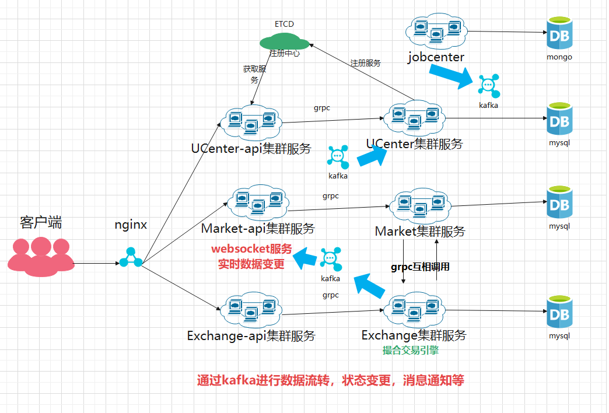

# 币币交易-4

## 1. 交易完成订单处理

前面在交易完成之后，我们应该将交易完成订单进行一个统一的处理

* 更新订单表
* 更新钱包

### 1.1 更新订单表

~~~go

func (t *CoinTrade) onCompleteHandle(orders []*model.ExchangeOrder) {
	if len(orders) <= 0 {
		return
	}
	marshal, _ := json.Marshal(orders)
	kafkaData := database.KafkaData{
		Topic: "exchange-order-completed",
		Key:   []byte(t.symbol),
		Data:  marshal,
	}
	for {
		//保证一定发成功
		sendSync := t.kafkaClient.SendSync(kafkaData)
		if !sendSync {
			time.Sleep(250 * time.Millisecond)
			continue
		}
	}
}
~~~

~~~go

func (k *KafkaConsumer) readOrderComplete(client *database.KafkaClient) {
	for {
		kafkaData, _ := client.Read()
		var order *model.ExchangeOrder
		json.Unmarshal(kafkaData.Data, &order)
		//更新订单
		err := k.orderDomain.UpdateOrderComplete(context.Background(), order)
		if err != nil {
			logx.Error(err)
			//如果失败重新放入  再次进行更新
			client.RPut(kafkaData)
			time.Sleep(200 * time.Millisecond)
			continue
		}
		//继续放入MQ中 通知钱包服务更新
		for {
			kafkaData.Topic = "exchange_order_complete_update_success"
			sync := client.SendSync(*kafkaData)
			if !sync {
				//确保一定发送成功
				time.Sleep(250 * time.Millisecond)
				continue
			}
		}
	}
}
~~~

~~~go
func (d *ExchangeOrderDomain) UpdateOrderComplete(ctx context.Context, order *model.ExchangeOrder) error {
	return d.exchangeOrderRepo.UpdateOrderComplete(ctx, order.OrderId, order.TradedAmount, order.Turnover, order.Status)
}
~~~

~~~go
func (e *ExchangeOrderDao) UpdateOrderComplete(
	ctx context.Context,
	orderId string,
	tradedAmount float64,
	turnover float64,
	status int) error {
	session := e.conn.Session(ctx)
	updateSql := "update exchange_order set traded_amount=?,turnover=?,status=? where order_id=? and status=?"
	err := session.Model(&model.ExchangeOrder{}).Exec(updateSql, tradedAmount, turnover, status, orderId, model.Trading).Error
	return err
}
~~~

### 1.2 更新钱包表

~~~go

func ExchangeOrderComplete(redisCli *redis.Redis, cli *database.KafkaClient, db *msdb.MsDB) {
	//先接收消息
	for {
		kafkaData := cli.Read()
		var order *ExchangeOrder
		json.Unmarshal(kafkaData.Data, &order)
		if order == nil {
			continue
		}
		if order.Status != Completed {
			continue
		}
		logx.Info("收到exchange_order_complete_update_success 消息成功:" + order.OrderId)
		walletDomain := domain.NewMemberWalletDomain(db)
		lock := redis.NewRedisLock(redisCli, fmt.Sprintf("order_complete_update_wallet::%d", order.MemberId))
		acquire, err := lock.Acquire()
		if err != nil {
			logx.Error(err)
			logx.Info("有进程已经拿到锁进行处理了")
			continue
		}
		if acquire {
			// BTC/USDT
			ctx := context.Background()
			if order.Direction == BUY {
				baseWallet, err := walletDomain.FindWalletByMemIdAndCoin(ctx, order.MemberId, order.BaseSymbol)
				if err != nil {
					logx.Error(err)
					cli.Rput(kafkaData)
					time.Sleep(250 * time.Millisecond)
					lock.Release()
					continue
				}
				coinWallet, err := walletDomain.FindWalletByMemIdAndCoin(ctx, order.MemberId, order.CoinSymbol)
				if err != nil {
					logx.Error(err)
					cli.Rput(kafkaData)
					time.Sleep(250 * time.Millisecond)
					lock.Release()
					continue
				}
				if order.Type == MarketPrice {
					//市价买 amount USDT 冻结的钱  order.turnover扣的钱 还回去的钱 amount-order.turnover
					baseWallet.FrozenBalance = op.SubFloor(baseWallet.FrozenBalance, order.Amount, 8)
					baseWallet.Balance = op.AddFloor(baseWallet.Balance, op.SubFloor(order.Amount, order.Turnover, 8), 8)
					coinWallet.Balance = op.AddFloor(coinWallet.Balance, order.TradedAmount, 8)
				} else {
					//限价买 冻结的钱是 order.price*amount  成交了turnover 还回去的钱 order.price*amount-order.turnover
					floor := op.MulFloor(order.Price, order.Amount, 8)
					baseWallet.FrozenBalance = op.SubFloor(baseWallet.FrozenBalance, floor, 8)
					baseWallet.Balance = op.AddFloor(baseWallet.Balance, op.SubFloor(floor, order.Turnover, 8), 8)
					coinWallet.Balance = op.AddFloor(coinWallet.Balance, order.TradedAmount, 8)
				}
				err = walletDomain.UpdateWalletCoinAndBase(ctx, baseWallet, coinWallet)
				if err != nil {
					logx.Error(err)
					cli.Rput(kafkaData)
					time.Sleep(250 * time.Millisecond)
					lock.Release()
					continue
				}
			} else {
				//卖 不管是市价还是限价 都是卖的 BTC  解冻amount 得到的钱是 order.turnover
				coinWallet, err := walletDomain.FindWalletByMemIdAndCoin(ctx, order.MemberId, order.CoinSymbol)
				if err != nil {
					logx.Error(err)
					cli.Rput(kafkaData)
					time.Sleep(250 * time.Millisecond)
					lock.Release()
					continue
				}
				baseWallet, err := walletDomain.FindWalletByMemIdAndCoin(ctx, order.MemberId, order.BaseSymbol)
				if err != nil {
					logx.Error(err)
					cli.Rput(kafkaData)
					time.Sleep(250 * time.Millisecond)
					lock.Release()
					continue
				}

				coinWallet.FrozenBalance = op.SubFloor(coinWallet.FrozenBalance, order.Amount, 8)
				baseWallet.Balance = op.AddFloor(baseWallet.Balance, order.Turnover, 8)
				err = walletDomain.UpdateWalletCoinAndBase(ctx, baseWallet, coinWallet)
				if err != nil {
					logx.Error(err)
					cli.Rput(kafkaData)
					time.Sleep(250 * time.Millisecond)
					lock.Release()
					continue
				}
			}
			logx.Info("更新钱包成功:" + order.OrderId)
			lock.Release()
		}

	}
}
~~~

~~~go

func (d *MemberWalletDomain) UpdateWalletCoinAndBase(ctx context.Context, baseWallet *model.MemberWallet, coinWallet *model.MemberWallet) error {
	return d.transaction.Action(func(conn msdb.DbConn) error {
		err := d.memberWalletRepo.UpdateWallet(ctx, conn, baseWallet.Id, baseWallet.Balance, baseWallet.FrozenBalance)
		if err != nil {
			return err
		}
		err = d.memberWalletRepo.UpdateWallet(ctx, conn, coinWallet.Id, coinWallet.Balance, coinWallet.FrozenBalance)
		if err != nil {
			return err
		}
		return nil
	})
}
~~~

~~~go

func (m *MemberWalletDao) UpdateWallet(ctx context.Context, conn msdb.DbConn, id int64, balance float64, frozenBalance float64) error {
	gormConn := conn.(*gorms.GormConn)
	tx := gormConn.Tx(ctx)
	//Update
	updateSql := "update member_wallet set balance=?,frozen_balance=? where id=?"
	err := tx.Model(&model.MemberWallet{}).Exec(updateSql, balance, frozenBalance, id).Error
	return err
}
~~~

~~~go
func (d *MemberWalletDomain) FindWalletByMemIdAndCoinName(ctx context.Context, memberId int64, coinName string) (*model.MemberWallet, error) {
	mw, err := d.memberWalletRepo.FindByIdAndCoinName(ctx, memberId, coinName)
	if err != nil {
		return nil, err
	}
	return mw, nil
}
~~~

~~~go

type ExchangeOrder struct {
	Id            int64   `gorm:"column:id" json:"id"`
	OrderId       string  `gorm:"column:order_id" json:"orderId"`
	Amount        float64 `gorm:"column:amount" json:"amount"`
	BaseSymbol    string  `gorm:"column:base_symbol" json:"baseSymbol"`
	CanceledTime  int64   `gorm:"column:canceled_time" json:"canceledTime"`
	CoinSymbol    string  `gorm:"column:coin_symbol" json:"coinSymbol"`
	CompletedTime int64   `gorm:"column:completed_time" json:"completedTime"`
	Direction     int     `gorm:"column:direction" json:"direction"`
	MemberId      int64   `gorm:"column:member_id" json:"memberId"`
	Price         float64 `gorm:"column:price" json:"price"`
	Status        int     `gorm:"column:status" json:"status"`
	Symbol        string  `gorm:"column:symbol" json:"symbol"`
	Time          int64   `gorm:"column:time" json:"time"`
	TradedAmount  float64 `gorm:"column:traded_amount" json:"tradedAmount"`
	Turnover      float64 `gorm:"column:turnover" json:"turnover"`
	Type          int     `gorm:"column:type" json:"type"`
	UseDiscount   string  `gorm:"column:use_discount" json:"useDiscount"`
}

// status
const (
	Trading = iota
	Completed
	Canceled
	OverTimed
	Init
)

var StatusMap = enums.Enum{
	Trading:   "TRADING",
	Completed: "COMPLETED",
	Canceled:  "CANCELED",
	OverTimed: "OVERTIMED",
}

// direction
const (
	BUY = iota
	SELL
)

var DirectionMap = enums.Enum{
	BUY:  "BUY",
	SELL: "SELL",
}

// type
const (
	MarketPrice = iota
	LimitPrice
)

var TypeMap = enums.Enum{
	MarketPrice: "MARKET_PRICE",
	LimitPrice:  "LIMIT_PRICE",
}
~~~

## 2. 架构梳理

## 3. 思考

> 如何确保钱流转的正确性？即如何对账？
