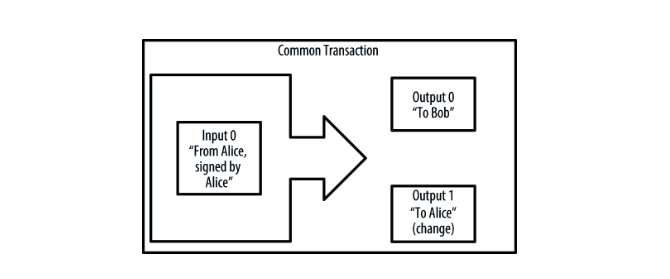
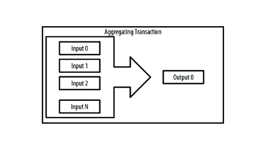
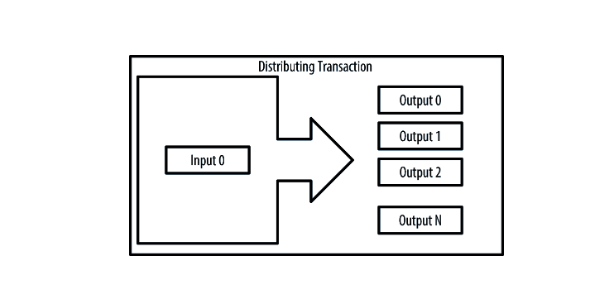
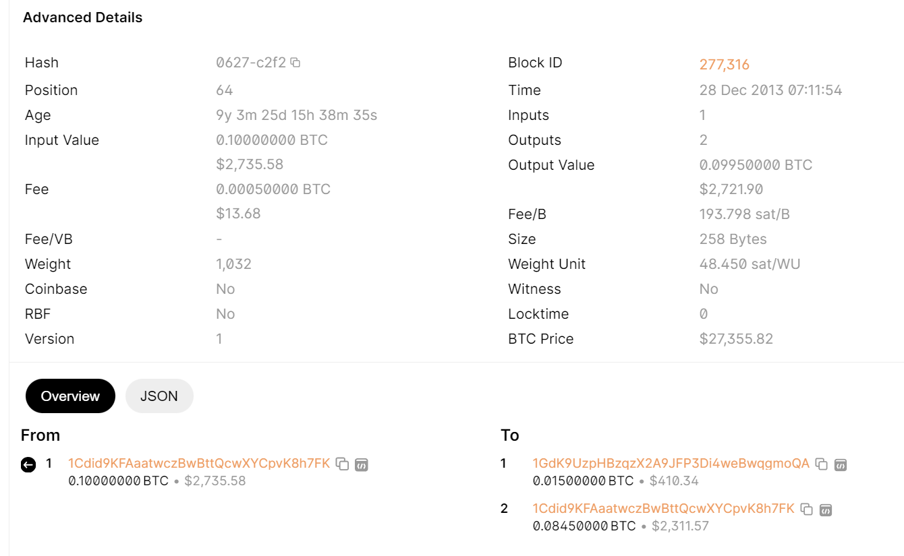
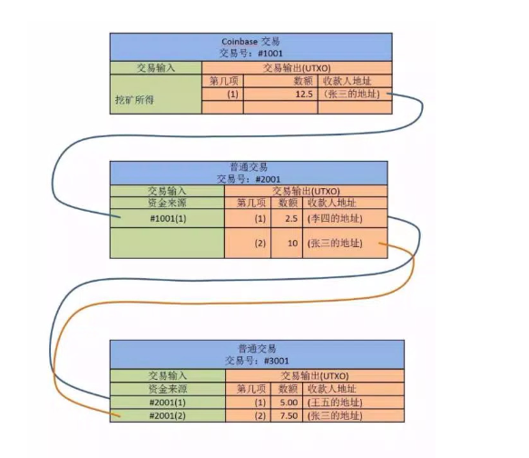
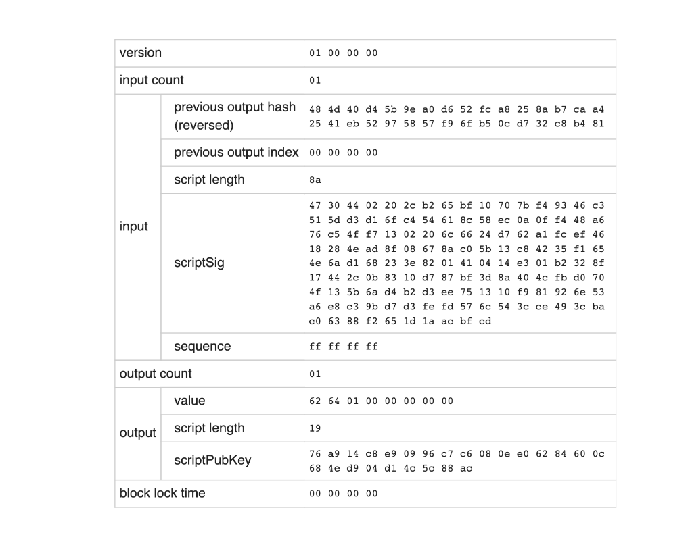

#  BTC知识

## 1. 区块链

区块链是一个分布式数据库，用于维护不断增长的记录列表，称为块。每个块包含一个时间戳和一个指向先前块的链接。

区块链的最著名应用是比特币结算系统。

比特币结算系统是分散地建立在网络上的（称为 P2P 网络），它是一个去中心化的结算数据库，个别数据节点被破坏或者被人为篡改不会影响整个比特币结算网络。

区块链的设计使得它天然具有较高的 `Byzantine fault tolerance `（拜占庭容错）

### 1.1 区块链原理

区块链这个的概念是由 [Satoshi Nakamoto](https://en.wikipedia.org/wiki/Satoshi_Nakamoto) 于 2008 年提出的。

其思想是由 `Stuart Haber `和 `W. Scott Stornetta `于 1991 年在其论文“`How to time-stamp a digital document`”中提出。

Stuart Haber 和 W. Scott Stornetta 的论文主要解决问题：

 **如何证明电子文档的创建时间和最后的修改时间？**

 这个问题有很多应用场景，比如两个人 A 和 B 都声明自己先发明了微积分，A拿出一个文档说我于 x 年就把这个想法记录下来了，B拿出一个文档说我于 y 年就把这个想法记录下来了，如果年份都是可信的，那么法官简单比较下哪个年份更早就可裁决出谁先发明了微积分了

### 1.2 解决方案

方案介绍：系统中引入一个可信的 Time-Stamping Service（TSS）。用户每次对电子文档有修改（包括创建）就把文档提交给 TSS，TSS 记录下收到文档的时间（即当前文档的最后修改时间），而且要保存文档的一个复本。要证明文档的最后修改时间就很简单了。由于 TSS 是可信的，那么直接拿着文档去找 TSS，TSS 在其内部数据库中查找，发现这个文档的确存在，而且是 X 年 X 月 X 日提交的。

这种方案可行，但存在很多问题：

1. 隐私性不好。如果文档是机密信息，用户不仅要确保自己不泄露，还要确保 TSS 不泄漏。
2. 带宽和存储要求。如果文档很大，则会带来很大的带宽压力和 TSS 存储压力。
3. TSS 本身的能力限制。万一 TSS 的硬盘坏了，那就什么都没有了。
4. TSS 本身的可信度。这是最关键的问题，怎么保证 TSS 是公平的？上面方案中并没有相关方案用于防止 TSS 和用户 A 串谋起来欺骗用户 B（如 TSS 造假说用户 A 于 X 年 X 月 X 日提交了某个文档，但实际上用户 A 并没有提交，用户 B 也无从验证 TSS 是否在造假）。

改进：

* Hash

  不发送文档本身给 TSS，而是发送文档的 Hash 值给 TSS。这样第 1 个和第 2 个缺点基本得到解决。

* 数字签名

  TSS 把文档 Hash 值再加上收到文档的时间作为整体进行数字签名后返回给用户。

  TSS存储很少的数据，能解决第3个缺点

* linking：

  我们把“上一次”用户提交文档的 Hash 值和提交时间作为“这一次”数字签名的一部分输入，这样所有的数字签名过程是有序的（组成一个链），这样 TSS 无法伪造签名了（TSS 无法在链中悄无声息地插入一个节点，因为这会使得新插入节点后面结点的签名信息不一致，很容易查找出来）

  解决第4个缺点

> 这就是区块链的基本原理

## 2. 比特币

比特币是基于区块链技术实现的`去中心化的`，`点对点(P2P)`的加密货币。

比特币（Bitcoin）的概念最初由中本聪在2008年11月1日提出，并于2009年1月3日正式诞生。

比特币全网约平均每 10 分钟（这是故意设计的行为）产生一个区块，每一个区块都链接到上一个区块，依次相连形成“区块链（Blockchain）”。

区块就是将一段时间的内的交易进行打包。

从网站 `https://blockchain.info/` 上可以看到所有 Block 的信息

### 2.1 挖矿

为了确保有节点愿意打包比特币交易，比特币定义了奖励机制，具体酬劳可分为两个部分：

* 第一部分：最开始（2009 年 1 月开始）是每打包一个区块奖励 50 个比特币，之后每经过 21 万个区块（约 4 年时间）奖励将减半一次（2012 年 11 月开始变为奖励 25 个，2016 年 7 月开始变为奖励 12.5 个，依此类推直到 2140 年左右区块奖励不足 1 聪（1比特币等于 1 亿聪）为止，此时区块奖励总和约为 2100 万比特币，这就是比特币 2100 万总量的来源。
* 第二部分：交易创建者支付的交易手续费（Transaction Fees）。

`注：2140 年后的打包奖励将只来源于交易创建者支付的交易手续费（即上面提到的第二部分奖励）`

#### 2.1.1 争夺区块打包权

由于有打包奖励的存在，使得有大量节点想打包比特币交易。

那到底应该选择哪个节点来打包呢？比特币网络采用的方式是： **出一个数学难题，谁先解出这个难题就要谁打包，它就可以获取相应的打包奖励。**

在介绍这个数学难题前，我们先介绍一下 sha256 哈希算法，它可以把任意长度的输入变为 256 bits 的摘要。

~~~go
func TestSha256(t *testing.T) {
	text := "I am Satoshi Nakamoto"
	all := 20
	for nonce := 0; nonce <= all; nonce++ {
		input := text + fmt.Sprintf("%d", nonce)
		sum256 := sha256.Sum256([]byte(input))
		fmt.Printf("%s -> %x \n", input, sum256)
	}
}
~~~

~~~shell
I am Satoshi Nakamoto0 -> a80a81401765c8eddee25df36728d732acb6d135bcdee6c2f87a3784279cfaed 
I am Satoshi Nakamoto1 -> f7bc9a6304a4647bb41241a677b5345fe3cd30db882c8281cf24fbb7645b6240 
I am Satoshi Nakamoto2 -> ea758a8134b115298a1583ffb80ae62939a2d086273ef5a7b14fbfe7fb8a799e 
I am Satoshi Nakamoto3 -> bfa9779618ff072c903d773de30c99bd6e2fd70bb8f2cbb929400e0976a5c6f4 
I am Satoshi Nakamoto4 -> bce8564de9a83c18c31944a66bde992ff1a77513f888e91c185bd08ab9c831d5 
I am Satoshi Nakamoto5 -> eb362c3cf3479be0a97a20163589038e4dbead49f915e96e8f983f99efa3ef0a 
I am Satoshi Nakamoto6 -> 4a2fd48e3be420d0d28e202360cfbaba410beddeebb8ec07a669cd8928a8ba0e 
I am Satoshi Nakamoto7 -> 790b5a1349a5f2b909bf74d0d166b17a333c7fd80c0f0eeabf29c4564ada8351 
I am Satoshi Nakamoto8 -> 702c45e5b15aa54b625d68dd947f1597b1fa571d00ac6c3dedfa499f425e7369 
I am Satoshi Nakamoto9 -> 7007cf7dd40f5e933cd89fff5b791ff0614d9c6017fbe831d63d392583564f74 
I am Satoshi Nakamoto10 -> c2f38c81992f4614206a21537bd634af717896430ff1de6fc1ee44a949737705 
I am Satoshi Nakamoto11 -> 7045da6ed8a914690f087690e1e8d662cf9e56f76b445d9dc99c68354c83c102 
I am Satoshi Nakamoto12 -> 60f01db30c1a0d4cbce2b4b22e88b9b93f58f10555a8f0f4f5da97c3926981c0 
I am Satoshi Nakamoto13 -> 0ebc56d59a34f5082aaef3d66b37a661696c2b618e62432727216ba9531041a5 
I am Satoshi Nakamoto14 -> 27ead1ca85da66981fd9da01a8c6816f54cfa0d4834e68a3e2a5477e865164c4 
I am Satoshi Nakamoto15 -> 394809fb809c5f83ce97ab554a2812cd901d3b164ae93492d5718e15006b1db2 
I am Satoshi Nakamoto16 -> 8fa4992219df33f50834465d30474298a7d5ec7c7418e642ba6eae6a7b3785b7 
I am Satoshi Nakamoto17 -> dca9b8b4f8d8e1521fa4eaa46f4f0cdf9ae0e6939477e1c6d89442b121b8a58e 
I am Satoshi Nakamoto18 -> 9989a401b2a3a318b01e9ca9a22b0f39d82e48bb51e0d324aaa44ecaba836252 
I am Satoshi Nakamoto19 -> cda56022ecb5b67b2bc93a2d764e75fc6ec6e6e79ff6c39e21d03b45aa5b303a 
I am Satoshi Nakamoto20 -> 063dfa8201be30fcd257be61c64a4de6305fa937e80b037fe4e126fe03e85a5c
~~~

在上面例子中，输入为“I am Satoshi Nakamoto”后接某个数字，这个数字是变化的，我们称为个变化的数字为“`nonce`”值。

> 现在我们可以这样定义一个数学难题：请找一个 nonce 值，使得相应的 sha256 哈希值的 16 进制形式“前面是 1 个 0”。

这个“难题”比较简单，从上面输出中可知 nonce=13 符合要求。会有很多节点在很短的时间内就可以找到一个解，还是很难区分谁先解决了一个难题。

这时，我们可以增加数学难题的难度，比如：请找一个 nonce 值，使得相应的 sha256 哈希值的 16 进制形式“`前面是连续 6 个 0`”。

显然，求解这个难题要消费更多的计算机资源，通过从 0 开始遍历可以求出 `nonce=133148` 符合要求。

~~~shell
I am Satoshi Nakamoto133148 -> 000000ae24f88d4559acb111099879aec1f193507e4dca700adb4fa807697c2e 
~~~

我们换一种表述来描述前面提到的两个数学难题。

* `sha256 哈希值的 16 进制形式前面是 1 个 0`相当于：
  `sha256 哈希值小于0x1000000000000000000000000000000000000000000000000000000000000000`。

* `sha256 哈希值的 16 进制形式前面是 6 个 0`相当于：
  `sha256 哈希值小于 0x0000010000000000000000000000000000000000000000000000000000000000`。

**难题可更简单地描述为：请找一个 nonce 值，使得 sha256("I am Satoshi Nakamoto" + nonce)小于某个阈值。** 

这个阈值称为 `target`。

显然当 target 减小时，求解 nonce 的难度会加大。

我们可以通过调整 target 值来动态地调整题目的难度。

**寻找合适的 nonce，使得 sha256("I am Satoshi Nakamoto" + nonce)小于某个指定的 target，这就是“比特币挖矿的基本原理”。** 

当然，真正的比特币挖矿并不是计算 sha256("I am Satoshi Nakamoto" + nonce)，但原理是一样的。

一旦有某个节点解决了这个数学难题，它就可以完成当前区块的打包，并把打包结果（当然包含有 nonce 值和新哈希值）广播出去，其它节点收到并验证无误后，就会停止抢这一区块的打包权，转而争抢下一个区块的打包权。

#### 2.1.2 target 的表达形式

前面介绍过，target 越小，区块哈希值的连续前置 0 就越多，挖矿难度越大。

我们一般用`target bits`（或简称为`bits`）来表达 target。

`bits`为 4 字节大小，前 1 字节为 `exponent`，后 3 字节为 `coefficient`。

target 的计算公式为：

假设 `bits=0x1d00ffff` ，则 `exponent=0x1d, coefficient=0x00ffff` ，从而 target 为：

~~~shell
target = 0x00ffff * 2^(8*(0x1d - 3)) = 0x00000000 FFFF0000 00000000 00000000 00000000 00000000 00000000 00000000
~~~

~~~go
//go程序
func TestComputeTarget(t *testing.T) {
	coefficient, _ := new(big.Int).SetString("0xffff", 0)
	fmt.Println(coefficient)
	exponent, _ := new(big.Int).SetString("0x1d", 0)
	fmt.Println(exponent)
	result := new(big.Int).Exp(big.NewInt(2), new(big.Int).Mul(big.NewInt(8), new(big.Int).Sub(exponent, big.NewInt(3))), nil)
	mul := new(big.Int).Mul(coefficient, result)
	fmt.Printf("0x%x, \n", mul)
}
~~~

也就是说，如果设定 `bits=0x1d00ffff` ，你需要找到的哈希值前面必须有 8 个连续 0（这样哈希值才会小于 target）。

#### 2.1.3 挖矿过程（寻找合适 nonce 值的过程）

我们来看真实的BTC挖矿。

Block 中有 6 个域参与 Block 哈希值的计算。

| Field               | Size     | Description                                                  |
| :------------------ | :------- | :----------------------------------------------------------- |
| Version             | 4 bytes  | A version number to track software/protocol upgrades         |
| Previous Block Hash | 32 bytes | Hash A reference to the hash of the previous (parent) block in the chain |
| Merkle Root Hash    | 32 bytes | A hash of the root of the merkle tree of this block’s transactions |
| Timestamp           | 4 bytes  | The approximate creation time of this block (seconds from Unix Epoch) |
| Target (bits)       | 4 bytes  | The Proof-of-Work algorithm target for this block            |
| Nonce               | 4 bytes  | A counter used for the Proof-of-Work algorithm               |

> 在这 6 个域中，`nonce `值是需要经过计算来寻找的，其它 5 个域则可看作是已知的。

把这 6 个域组合在一起，对其进行两次 sha256 哈希计算：

~~~shell
Block Hash = sha256(sha256(Version + Previous Block + Merkle Root + Timestamp + Bits + Nonce))
~~~

如果哈希值小于 target，则挖矿成功，可以打包当前块，获得相应奖励。

* 寻找合适 nonce 值没有取巧的方法，只能从 0 开始遍历寻找。
* Timestamp 仅仅是一个打包 Block（挖矿成功）的近似时间。不用担心在挖矿前设置了 Timestamp，而成功挖矿时 Timestamp 对不上的问题。

##### 2.1.3.1 验证 Block 哈希值正确性

如何验证 Block 正确性呢？

可分为两个过程：

* 一是验证它的哈希值小于 target
* 二是它的哈希值确实是组合了 6 个域后，经过两次 sha256 哈希计算现来的。

比如：block#3 ， 地址： `https://www.blockchain.com/explorer/blocks/btc/0000000082b5015589a3fdf2d4baff403e6f0be035a5d9742c1cae6295464449`

~~~json
{
  "hash": "0000000082b5015589a3fdf2d4baff403e6f0be035a5d9742c1cae6295464449",
  "confirmations": 470914,
  "height": 3,
  "version": 1,
  "merkleroot": "999e1c837c76a1b7fbb7e57baf87b309960f5ffefbf2a9b95dd890602272f644",
  "time": 1231470173,
  "mediantime": 1231469744,
  "nonce": 1844305925,
  "bits": "1d00ffff",
  "difficulty": 1,
  "chainwork": "0000000000000000000000000000000000000000000000000000000400040004",
  "previousblockhash": "000000006a625f06636b8bb6ac7b960a8d03705d1ace08b1a19da3fdcc99ddbd",
  "nextblockhash": "000000004ebadb55ee9096c9a2f8880e09da59c0d68b1c228da88e48844a1485"
}
~~~

我们也可以通过免费的查询接口`https://mempool.space/api/block/0000000082b5015589a3fdf2d4baff403e6f0be035a5d9742c1cae6295464449`进行查询

**验证**

首先，我们验证它的哈希值小于 target。

由于 `bits=1d00ffff`

~~~shell
target=0x00000000FFFF0000000000000000000000000000000000000000000000000000
~~~

显然`0x0000000082b5015589a3fdf2d4baff403e6f0be035a5d9742c1cae6295464449`小于上面 target 值，这步验证通过。

然后，验证哈希值确实是组合了 6 个域后，经过两次 sha256 哈希计算现来的。

Block #3 的这 6 个域分别为：

| Field          |                                                     Block #3 |
| :------------- | -----------------------------------------------------------: |
| Version        |                                                   0x00000001 |
| Previous Block | 0x000000006a625f06636b8bb6ac7b960a8d03705d1ace08b1a19da3fdcc99ddbd |
| Merkle Root    | 0x999e1c837c76a1b7fbb7e57baf87b309960f5ffefbf2a9b95dd890602272f644 |
| Timestamp      |                                                   0x4966be5d |
| Target (bits)  |                                                   0x1d00ffff |
| Nonce          |                                                   0x6dede005 |

把它们全部转换为 little-endian 的形式 ：

| Field          |                                                     Block #3 |
| :------------- | -----------------------------------------------------------: |
| Version        |                                                   0x01000000 |
| Previous Block | 0xbddd99ccfda39da1b108ce1a5d70038d0a967bacb68b6b63065f626a00000000 |
| Merkle Root    | 0x44f672226090d85db9a9f2fbfe5f0f9609b387af7be5b7fbb7a1767c831c9e99 |
| Timestamp      |                                                   0x5dbe6649 |
| Target (bits)  |                                                   0xffff001d |
| Nonce          |                                                   0x05e0ed6d |

直接把这 6 个域的 little-endian 形式连接在一起，得到：

~~~shell
0x01000000bddd99ccfda39da1b108ce1a5d70038d0a967bacb68b6b63065f626a0000000044f672226090d85db9a9f2fbfe5f0f9609b387af7be5b7fbb7a1767c831c9e995dbe6649ffff001d05e0ed6d
~~~

将结果进行两次 sha256 哈希运算：

~~~go
func TestSha2562(t *testing.T) {
	input := "01000000bddd99ccfda39da1b108ce1a5d70038d0a967bacb68b6b63065f626a0000000044f672226090d85db9a9f2fbfe5f0f9609b387af7be5b7fbb7a1767c831c9e995dbe6649ffff001d05e0ed6d"
	decodeString, _ := hex.DecodeString(input)
	one := sha256.Sum256(decodeString)
	fmt.Printf("%x\n", one)
	sum256 := sha256.Sum256(one[:])
	fmt.Printf("%x \n", sum256) // 4944469562ae1c2c74d9a535e00b6f3e40ffbad4f2fda3895501b58200000000
}
~~~

再转换一下 endian，得到：

~~~shell
0000000082b5015589a3fdf2d4baff403e6f0be035a5d9742c1cae6295464449
~~~

这就是 Block #3 的哈希值，验证通过！

#### 2.1.4 target 的动态调整过程

如果全网成功打包区块的速度小于 10 分钟，则可以减小 target，以增大难度；成功打包区块的速度大于 10 分钟，则可以增大 target，以减小难度。从而维护在平均每 10 分钟打包一个区块。这个调整过程可总结为：

~~~shell
New Target = Old Target * (Actual Time of Last 2016 Blocks / 20160 minutes)
~~~

> 每过2016个区块（约2周）所有节点会检查并调整一次难度，各节点会将2016个区块的总出块时间与20160分钟比较，如果大于20160分钟则降低难度，如果小于则提升难度。

Block 中有一个域叫 `difficulty`，target 越小，`difficulty` 值越大。

关于 difficulty 的计算，可参考：`https://en.bitcoin.it/wiki/Difficulty`

## 3. 比特币交易

交易（Transaction，简称 Tx）是比特币系统的重要组成部分。而块（Block）就是将这些基础单元打包装箱，并链在一起。巨大算力保障了块的安全，也就保障了单个交易的安全。

可以把 Tx 简单地理解为转账，上图描述了 Alice 向 Bob 转账的场景。

这个 Tx 中，Input 是 Alice 及其付出金额，而 Output 是 Bob 和 Alice 及其收到金额。为什么 Output 中也有 Alice 呢？这是因为， 如果不考虑交易手续费，则交易 Input 和 Output 的金额应该相等。

比如，Alice 手头有一个 10 元钱，想转账 3 元钱给 Bob，则输出中还会包含转账 7 元给自己的条目。

> 一般来说，Input 会略大于 Output，差额是交易的手续费

多个 Input，一个 Output 的 Tx 场景。

一个 Input，很多个 Output 的 Tx 场景。

### 3.1 Tx详情

上图是通过 Block explorer 展示 Tx 信息的例子（假设场景为 Alice 使用了 0.1 BTC，其中的 0.015 BTC 转账给了 Bob 用于购买咖啡，而 0.0845 BTC 退给了自己，0.0005 BTC 是转账手续费，由打包者获得）。

这个 Tx 在主网上真实存在（地址`https://www.blockchain.com/explorer/transactions/btc/0627052b6f28912f2703066a912ea577f2ce4da4caa5a5fbd8a57286c345c2f2`）。

访问在线接口：`https://mempool.space/api/tx/0627052b6f28912f2703066a912ea577f2ce4da4caa5a5fbd8a57286c345c2f2`

~~~json
{
    "txid": "0627052b6f28912f2703066a912ea577f2ce4da4caa5a5fbd8a57286c345c2f2",
    "version": 1,
    "locktime": 0,
    "vin": [
        {
            "txid": "7957a35fe64f80d234d76d83a2a8f1a0d8149a41d81de548f0a65a8a999f6f18",
            "vout": 0,
            "prevout": {
                "scriptpubkey": "76a9147f9b1a7fb68d60c536c2fd8aeaa53a8f3cc025a888ac",
                "scriptpubkey_asm": "OP_DUP OP_HASH160 OP_PUSHBYTES_20 7f9b1a7fb68d60c536c2fd8aeaa53a8f3cc025a8 OP_EQUALVERIFY OP_CHECKSIG",
                "scriptpubkey_type": "p2pkh",
                "scriptpubkey_address": "1Cdid9KFAaatwczBwBttQcwXYCpvK8h7FK",
                "value": 10000000
            },
            "scriptsig": "483045022100884d142d86652a3f47ba4746ec719bbfbd040a570b1deccbb6498c75c4ae24cb02204b9f039ff08df09cbe9f6addac960298cad530a863ea8f53982c09db8f6e381301410484ecc0d46f1918b30928fa0e4ed99f16a0fb4fde0735e7ade8416ab9fe423cc5412336376789d172787ec3457eee41c04f4938de5cc17b4a10fa336a8d752adf",
            "scriptsig_asm": "OP_PUSHBYTES_72 3045022100884d142d86652a3f47ba4746ec719bbfbd040a570b1deccbb6498c75c4ae24cb02204b9f039ff08df09cbe9f6addac960298cad530a863ea8f53982c09db8f6e381301 OP_PUSHBYTES_65 0484ecc0d46f1918b30928fa0e4ed99f16a0fb4fde0735e7ade8416ab9fe423cc5412336376789d172787ec3457eee41c04f4938de5cc17b4a10fa336a8d752adf",
            "is_coinbase": false,
            "sequence": 4294967295
        }
    ],
    "vout": [
        {
            "scriptpubkey": "76a914ab68025513c3dbd2f7b92a94e0581f5d50f654e788ac",
            "scriptpubkey_asm": "OP_DUP OP_HASH160 OP_PUSHBYTES_20 ab68025513c3dbd2f7b92a94e0581f5d50f654e7 OP_EQUALVERIFY OP_CHECKSIG",
            "scriptpubkey_type": "p2pkh",
            "scriptpubkey_address": "1GdK9UzpHBzqzX2A9JFP3Di4weBwqgmoQA",
            "value": 1500000
        },
        {
            "scriptpubkey": "76a9147f9b1a7fb68d60c536c2fd8aeaa53a8f3cc025a888ac",
            "scriptpubkey_asm": "OP_DUP OP_HASH160 OP_PUSHBYTES_20 7f9b1a7fb68d60c536c2fd8aeaa53a8f3cc025a8 OP_EQUALVERIFY OP_CHECKSIG",
            "scriptpubkey_type": "p2pkh",
            "scriptpubkey_address": "1Cdid9KFAaatwczBwBttQcwXYCpvK8h7FK",
            "value": 8450000
        }
    ],
    "size": 258,
    "weight": 1032,
    "fee": 50000,
    "status": {
        "confirmed": true,
        "block_height": 277316,
        "block_hash": "0000000000000001b6b9a13b095e96db41c4a928b97ef2d944a9b31b2cc7bdc4",
        "block_time": 1388185914
    }
}
~~~

上述交易详情中，vin代表input，vout代表output

### 3.2 Unspent Transaction Output (UTXO)

Tx 输出（Transaction Output）是比特币交易的基本组成部分。

比特币网络中 Tx 输出有两个重要信息：`地址`（公钥 Hash）和 `value`（比特币）。

如果 Tx 的输出没有出现在其它 Tx 的输入中，则这个 Tx 的输出就称为 Unspent Transaction Output (UTXO)。

系统中所有 UTXO 之和就是比特币总和，把和某个地址关联的所有 UTXO 相加，就是这个地址的“余额”。

谁拥有 UTXO 中公钥对应的私钥，谁就可以使用（即花费）这个 UTXO。

创建普通 Tx，建构 Tx 输入时，需要指定一个可用的 UTXO。如前面例子中 Tx 的输入为：

~~~json
"vin": [
        {
            "txid": "7957a35fe64f80d234d76d83a2a8f1a0d8149a41d81de548f0a65a8a999f6f18",
            "vout": 0,
            "prevout": {
                "scriptpubkey": "76a9147f9b1a7fb68d60c536c2fd8aeaa53a8f3cc025a888ac",
                "scriptpubkey_asm": "OP_DUP OP_HASH160 OP_PUSHBYTES_20 7f9b1a7fb68d60c536c2fd8aeaa53a8f3cc025a8 OP_EQUALVERIFY OP_CHECKSIG",
                "scriptpubkey_type": "p2pkh",
                "scriptpubkey_address": "1Cdid9KFAaatwczBwBttQcwXYCpvK8h7FK",
                "value": 10000000
            },
            "scriptsig": "483045022100884d142d86652a3f47ba4746ec719bbfbd040a570b1deccbb6498c75c4ae24cb02204b9f039ff08df09cbe9f6addac960298cad530a863ea8f53982c09db8f6e381301410484ecc0d46f1918b30928fa0e4ed99f16a0fb4fde0735e7ade8416ab9fe423cc5412336376789d172787ec3457eee41c04f4938de5cc17b4a10fa336a8d752adf",
            "scriptsig_asm": "OP_PUSHBYTES_72 3045022100884d142d86652a3f47ba4746ec719bbfbd040a570b1deccbb6498c75c4ae24cb02204b9f039ff08df09cbe9f6addac960298cad530a863ea8f53982c09db8f6e381301 OP_PUSHBYTES_65 0484ecc0d46f1918b30928fa0e4ed99f16a0fb4fde0735e7ade8416ab9fe423cc5412336376789d172787ec3457eee41c04f4938de5cc17b4a10fa336a8d752adf",
            "is_coinbase": false,
            "sequence": 4294967295
        }
    ]
~~~

它表示这个 Tx 所花费的 UTXO 来自于另外一个 Tx（其 id 为 `7957a35fe64f80d234d76d83a2a8f1a0d8149a41d81de548f0a65a8a999f6f18`）的第 0 个输出（一个 Tx 的输出可以有多个，索引从 0 开始编号）

我们可以从历史 Tx 中查找出这个 UTXO 的 value（比如为 0.1）

`所以这个 Tx 中 Alice 花费了 0.1 BTC，数值 0.1 不需要显式地写在 Tx 中，而是通过查找 UTXO 信息来得到的。`

一旦这个 Tx 被提交，那么 Tx（`7957a35fe64f80d234d76d83a2a8f1a0d8149a41d81de548f0a65a8a999f6f18`）的第 0 个输出就不再是 UTXO 了。

比如：

张三挖到 12.5 枚比特币。过了几天，他把其中 2.5 枚支付给李四。又过了几天，他和李四各出资 2.5 比特币凑成 5 比特币付给王五。

上述例子中，交易 #3001 中的两个输出是目前系统中的 UTXO。

### 3.3 Tx Output

每一笔比特币交易都会创造输出，并被比特币账簿记录下来。几乎所有的输出，除了一个例外（OP_RETURN），都能创造称为 UTXO 的比特币块，然后被整个网络识别，供所有者在未来交易中使用。

UTXO 集中的 UTXO 被每一个全节点比特币客户端追踪。新的交易从 UTXO 集中消耗（花费）一个或多个输出。

Output 包含两部分：

1. 一定量的比特币，面值为“聪”（satoshis），是最小的比特币单位；
2. 确定花费输出所需条件的加密难题（cryptographic puzzle），也被称为锁定脚本（locking script）, 见证脚本（witness script）, 或脚本公钥（scriptPubKey）。

### 3.4 Tx Input

交易输入标识哪个 UTXO（通过引用）将被消费，并通过解锁脚本（Unlocking Script）提供所有权证明。

要构建一个交易，一个钱包从它控制的 UTXO 中选择足够的面值来支付请求的付款。有时一个 UTXO 就足够，有时候需要不止一个。对于用于付款的每个 UTXO，钱包将创建一个指向该 UTXO 的输入，使用解锁脚本解锁它。

Input 包含四个主要元素：

1. 一个交易 ID，引用包含将要消费的 UTXO 的交易；
2. 一个输出索引（vout），用于标识来自该交易的哪个 UTXO 被引用（第一个为零）；
3. 一个 scriptSig（Unlocking Script），满足 UTXO 的消费条件，解锁用于支出；
4. 一个序列号。

### 3.5 Tx 手续费

交易手续费没有直接体现在 Tx 中，它等于 Tx 输入之和减去 Tx 输出之和。钱包客户端一般可以调整交易手续费。交易手续费不是强制的，但打包节点会优先打包手续费高的 Tx，且没有手续费的 Tx 很可能不会被打包。

### 3.6 Tx 中 Locktime 字段

在 Tx 中有个 locktime 字段，它表示这个 Tx 在 locktime 指定的时间之前不能被节点打包到网络中。

也就是说， **节点验证 Tx 时，一旦发现 Tx 的 locktime 是个“未来的时间点”，则会拒绝这个 Tx。**

locktime 既可以使用 Block Number，也可以使用 UNIX Timestamp

| Value        | Description                                          |
| :----------- | :--------------------------------------------------- |
| 0            | Not locked                                           |
| < 500000000  | Block number at which this transaction is unlocked   |
| >= 500000000 | UNIX timestamp at which this transaction is unlocked |

不过，当 Tx 的 sequence 字段为 `0xffffffff` （被称为 final sequence）时，节点将忽略 locktime 的限制。

注：BTC 要达到 500000000 的区块高度，还需要 9000 多年；而目前的 UNIX Timestamp 早已经超过了 500000000，所以小于 500000000 时表示区块高度，大于等于 500000000 时表示 UNIX Timestamp 在可见的未来不会产生歧义。

### 3.7 Tx 序列化和广播

Tx 由钱包创建，钱包将序列化后 Tx 发送给一些节点。

如果某个节点（命名为 A）收到一个新的 Tx，则节点 A 会把这个 Tx 发送给它连接的所有节点，这种传播方式称为 Flooding。

挖矿节点会验证 Tx 的合法性，并在成功挖到矿后，把合法的 Tx 打包为块。

**序列化**

Bitcoin 客户端可以调用 RPC 接口 [sendrawtransaction](https://developer.bitcoin.org/reference/rpc/sendrawtransaction.html) 把“序列化”后的 Tx 广播到网络中。

关于如何序列化可以参考： `https://en.bitcoin.it/wiki/Protocol_documentation#tx`

**Txid 的生成规则**

Txid 由 `[nVersion][txins][txouts][nLockTime]` 这 4 部分内容，进行 2 次 SHA256 运算后得到。

注意生成后，转换一下字节序即可。

### 3.8 Tx Script

比特币的交易验证引擎依赖于脚本来验证比特币交易。

Output 中的`锁定脚本`（Locking Script）和 Input 中的`解锁脚本`(Unlocking Script）。

* Locking Script 是一个放置在输出上面的花费条件：它指定了今后花费这笔输出必须要满足的条件。由于 Locking Script 往往含有一个公钥或比特币地址（公钥哈希值），在历史上它曾被称为脚本公钥 scriptPubKey。在大多数比特币应用程序中，我们所称的“锁定脚本”将以 scriptPubKey 的形式出现在源代码中。您还将看到被称为见证脚本（witness script）的锁定脚本，或者更普遍称为加密难题（cryptographic puzzle）。 这些术语在不同的抽象层次都代表同样的东西。
* Unlocking Script 是这样一个脚本，它“解决”或满足由 Locking Script 放置在输出上的条件，并允许使用输出。解锁脚本是每一笔比特币交易输入的一部分，而且往往含有一个由用户的比特币钱包（通过用户的私钥）生成的数字签名。由于解锁脚本常常包含一个数字签名，因此它曾被称作脚本签名 scriptSig。在大多数比特币应用的源代码中，scriptSig 便是我们所说的 Unlocking Script。需要说明的是“并非所有的 Unlocking Script 都一定包含签名”。

> 比特币中的 Script 是一种简单的基于栈的语言，该语言比较简单，没有循环等结构，它不是图灵完备的。

#### 3.8.1 tx验证

打包节点验证 Tx 的合法性时，需要验证每个 Input。

比如以Tx `0627052b6f28912f2703066a912ea577f2ce4da4caa5a5fbd8a57286c345c2f2` 为例:

~~~json
{
    "version": 1,
    "locktime": 0,
    "vin": [
        {
            "txid": "7957a35fe64f80d234d76d83a2a8f1a0d8149a41d81de548f0a65a8a999f6f18",
            "vout": 0,
            "scriptSig" : "3045022100884d142d86652a3f47ba4746ec719bbfbd040a570b1deccbb6498c75c4ae24cb02204b9f039ff08df09cbe9f6addac960298cad530a863ea8f53982c09db8f6e3813[ALL] 0484ecc0d46f1918b30928fa0e4ed99f16a0fb4fde0735e7ade8416ab9fe423cc5412336376789d172787ec3457eee41c04f4938de5cc17b4a10fa336a8d752adf",
            "sequence": 4294967295
        }
    ],
    "vout": [
        {
            "value": 0.01500000,
            "scriptPubKey": "OP_DUP OP_HASH160 ab68025513c3dbd2f7b92a94e0581f5d50f654e7 OP_EQUALVERIFY OP_CHECKSIG"
        },
        {
            "value": 0.08450000,
            "scriptPubKey": "OP_DUP OP_HASH160 7f9b1a7fb68d60c536c2fd8aeaa53a8f3cc025a8 OP_EQUALVERIFY OP_CHECKSIG",
        }
    ]
}
~~~

这个交易只有一个 Input。首先通过 Input 的 txid 和 vout 找到该 Input 所引用的 UTXO（也就是 tx [7957a35fe64f80d234d76d83a2a8f1a0d8149a41d81de548f0a65a8a999f6f18](https://www.blockchain.com/btc/tx/7957a35fe64f80d234d76d83a2a8f1a0d8149a41d81de548f0a65a8a999f6f18) 的首个 Output），并找到这个 Output 的 scriptPubKey，它为：

~~~shell
76a9147f9b1a7fb68d60c536c2fd8aeaa53a8f3cc025a888ac
~~~

反编译上面脚本，就是：

~~~shell
OP_DUP OP_HASH160 7f9b1a7fb68d60c536c2fd8aeaa53a8f3cc025a8 OP_EQUALVERIFY OP_CHECKSIG
~~~

然后， **在栈上执行脚本，先执行 Input 的 Unlocking Script（scriptSig），再执行这个 Input 所引用的 UTXO 中的 Locking Script（scriptPubKey），如果最后栈中内容为 TRUE，则认为这个 Input 是合法的，如果所有的 Input 合法则整个 Tx 通过验证。**

