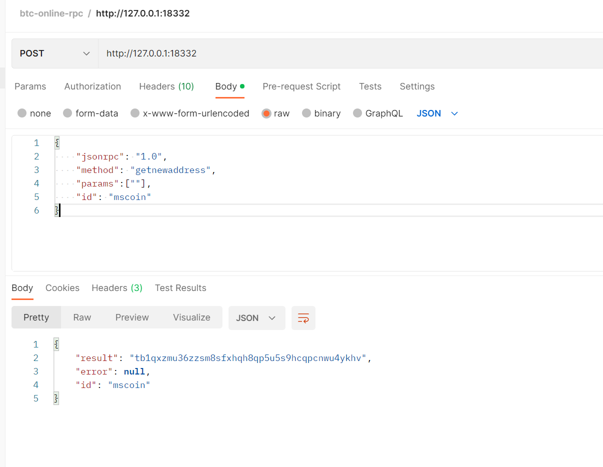
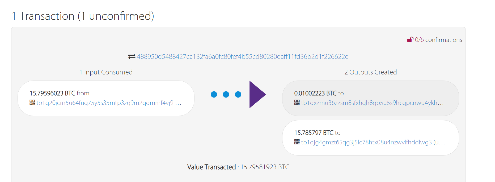

# 10. 提现

## 1. 用户的安全设置

提现需要先检查用户的安全设置，以便判断是否符合提现要求。

请求uri: `uc/approve/security/setting`

请求参数：

参数：

| 参数         | 类型   | 描述   |
| ------------ | ------ | ------ |
| x-auth-token | string | header |

返回值：

~~~json
type MemberSecurity struct {
	Username             string `json:"username"`
	Id                   int64  `json:"id"`
	CreateTime           string `json:"createTime"`
	RealVerified         string `json:"realVerified"`  //是否实名认证
	EmailVerified        string `json:"emailVerified"` //是否有邮箱
	PhoneVerified        string `json:"phoneVerified"` //是否有手机号
	LoginVerified        string `json:"loginVerified"`
	FundsVerified        string `json:"fundsVerified"` //是否有交易密码
	RealAuditing         string `json:"realAuditing"`
	MobilePhone          string `json:"mobilePhone"`
	Email                string `json:"email"`
	RealName             string `json:"realName"`
	RealNameRejectReason string `json:"realNameRejectReason"`
	IdCard               string `json:"idCard"`
	Avatar               string `json:"avatar"`
	AccountVerified      string `json:"accountVerified"`
}
~~~

### 1.1 实现

~~~go
	approveGroup := r.Group()
	approve := NewApproveHandler(serverCtx)
	approveGroup.Use(midd.Auth(serverCtx.Config.JWT.AccessSecret))
	approveGroup.Post("/uc/approve/security/setting", approve.SecuritySetting)
~~~

~~~go
package handler

import (
	"github.com/zeromicro/go-zero/rest/httpx"
	common "github.com/LCY2013/blockchain/exchange/ff-coin/ffcoin-common"
	"net/http"
	"ucenterapi/internal/logic"
	"ucenterapi/internal/svc"
	"ucenterapi/internal/types"
)

type ApproveHandler struct {
	svcCtx *svc.ServiceContext
}

func (h *ApproveHandler) SecuritySetting(w http.ResponseWriter, r *http.Request) {
	var req types.ApproveReq
	l := logic.NewApproveLogic(r.Context(), h.svcCtx)
	resp, err := l.FindSecuritySetting(&req)
	result := common.NewResult().Deal(resp, err)
	httpx.OkJsonCtx(r.Context(), w, result)
}

func NewApproveHandler(svcCtx *svc.ServiceContext) *ApproveHandler {
	return &ApproveHandler{svcCtx}
}

~~~

~~~go
type ApproveReq struct {
}

~~~

~~~go
package logic

import (
	"context"
	"github.com/LCY2013/blockchain/exchange/ff-coin/ffcoin-common/tools"
	"ffcoin/grpc-common/ucenter/ucclient"
	"time"
	"ucenterapi/internal/svc"
	"ucenterapi/internal/types"

	"github.com/zeromicro/go-zero/core/logx"
)

type Approve struct {
	logx.Logger
	ctx    context.Context
	svcCtx *svc.ServiceContext
}

func NewApproveLogic(ctx context.Context, svcCtx *svc.ServiceContext) *Approve {
	return &Approve{
		Logger: logx.WithContext(ctx),
		ctx:    ctx,
		svcCtx: svcCtx,
	}
}

func (l *Approve) FindSecuritySetting(req *types.ApproveReq) (*types.MemberSecurity, error) {
	ctx, cancel := context.WithTimeout(context.Background(), 5*time.Second)
	defer cancel()
	value := l.ctx.Value("userId").(int64)
	memberRes, err := l.svcCtx.UMemberRpc.FindMemberById(ctx, &ucclient.MemberReq{
		MemberId: value,
	})
	if err != nil {
		return nil, err
	}
	ms := &types.MemberSecurity{}
	ms.Username = memberRes.Username
	ms.CreateTime = tools.ToTimeString(memberRes.RegistrationTime)
	ms.Id = memberRes.Id
	if memberRes.Email != "" {
		ms.EmailVerified = "true"
		ms.Email = memberRes.Email
	} else {
		ms.EmailVerified = "false"
	}
	if memberRes.JyPassword != "" {
		ms.FundsVerified = "true"
	} else {
		ms.FundsVerified = "false"
	}
	ms.LoginVerified = "true"
	if memberRes.MobilePhone != "" {
		ms.PhoneVerified = "true"
		ms.MobilePhone = memberRes.MobilePhone
	} else {
		ms.PhoneVerified = "false"
	}
	if memberRes.RealName != "" {
		ms.RealVerified = "true"
		ms.RealName = memberRes.RealName
	} else {
		ms.RealVerified = "false"
	}
	ms.IdCard = memberRes.IdNumber
	if memberRes.IdNumber != "" {
		ms.IdCard = memberRes.IdNumber[:2] + "********"
	}
	//0 未认证 1 审核中 2 已认证
	if memberRes.RealNameStatus == 1 {
		ms.RealAuditing = "true"
	} else {
		ms.RealAuditing = "false"
	}
	ms.Avatar = memberRes.Avatar
	if memberRes.Bank == "" && memberRes.AliNo == "" && memberRes.Wechat == "" {
		ms.AccountVerified = "false"
	} else {
		ms.AccountVerified = "true"
	}
	return ms, nil
}

~~~

提现要进行实名认证，所以可以在数据库设一个假数据，将用户设为已实名。

## 2. 提现币种详细信息

需要展示出提现的币种信息，这样通过下拉选择要提现哪个币种。

请求uri： `uc/withdraw/support/coin/info`

参数：

| 参数         | 类型   | 描述   |
| ------------ | ------ | ------ |
| x-auth-token | string | header |

返回值：

~~~go

type WithdrawWalletInfo struct {
	Unit            string          `json:"unit"`
	Threshold       float64         `json:"threshold"` //阈值
	MinAmount       float64         `json:"minAmount"` //最小提币数量
	MaxAmount       float64         `json:"maxAmount"` //最大提币数量
	MinTxFee        float64         `json:"minTxFee"`  //最小交易手续费
	MaxTxFee        float64         `json:"maxTxFee"`
	NameCn          string          `json:"nameCn"`
	Name            string          `json:"name"`
	Balance         float64         `json:"balance"`
	CanAutoWithdraw string          `json:"canAutoWithdraw"` //true false
	WithdrawScale   int             `json:"withdrawScale"`
	AccountType     int             `json:"accountType"`
	Addresses       []AddressSimple `json:"addresses"`
}

type AddressSimple struct {
	Remark  string `json:"remark"`
	Address string `json:"address"`
}
~~~

### 2.1 实现

~~~go
withdrawGroup := r.Group()
	withdraw := NewWithdrawHandler(serverCtx)
	withdrawGroup.Use(midd.Auth(serverCtx.Config.JWT.AccessSecret))
	withdrawGroup.Post("/uc/withdraw/support/coin/info", withdraw.QueryWithdrawCoin)
~~~

~~~go
package handler

import (
	"github.com/zeromicro/go-zero/rest/httpx"
	common "github.com/LCY2013/blockchain/exchange/ff-coin/ffcoin-common"
	"net/http"
	"ucenterapi/internal/logic"
	"ucenterapi/internal/svc"
	"ucenterapi/internal/types"
)

type WithdrawHandler struct {
	svcCtx *svc.ServiceContext
}

func (h *WithdrawHandler) QueryWithdrawCoin(w http.ResponseWriter, r *http.Request) {
	var req types.WithdrawReq
	l := logic.NewWithdrawLogic(r.Context(), h.svcCtx)
	resp, err := l.QueryWithdrawCoin(&req)
	result := common.NewResult().Deal(resp, err)
	httpx.OkJsonCtx(r.Context(), w, result)
}

func NewWithdrawHandler(svcCtx *svc.ServiceContext) *WithdrawHandler {
	return &WithdrawHandler{svcCtx}
}

~~~

~~~go
type WithdrawReq struct {
}

~~~

~~~go
package logic

import (
	"context"
	"github.com/zeromicro/go-zero/core/logx"
	"ffcoin/grpc-common/market/market"
	"ffcoin/grpc-common/ucenter/asset"
	"ucenterapi/internal/svc"
	"ucenterapi/internal/types"
)

type Withdraw struct {
	logx.Logger
	ctx    context.Context
	svcCtx *svc.ServiceContext
}

func (w *Withdraw) QueryWithdrawCoin(req *types.WithdrawReq) ([]*types.WithdrawWalletInfo, error) {
	value := w.ctx.Value("userId").(int64)
	coinList, err := w.svcCtx.MarketRpc.FindAllCoin(w.ctx, &market.MarketReq{})
	if err != nil {
		return nil, err
	}
	coinMap := make(map[string]*market.Coin)
	for _, v := range coinList.List {
		coinMap[v.Unit] = v
	}
	//查询用户钱包
	walletList, err := w.svcCtx.UAssetRpc.FindWallet(w.ctx, &asset.AssetReq{
		UserId: value,
	})
	if err != nil {
		return nil, err
	}
	var list = make([]*types.WithdrawWalletInfo, len(walletList.List))
	for i, wallet := range walletList.List {
		ww := &types.WithdrawWalletInfo{}
		coin := coinMap[wallet.Coin.Unit]
		ww.Balance = wallet.Balance
		ww.WithdrawScale = int(coin.WithdrawScale)
		ww.MaxTxFee = coin.MaxTxFee
		ww.MinTxFee = coin.MinTxFee
		ww.MaxAmount = coin.MaxWithdrawAmount
		ww.MinAmount = coin.MinWithdrawAmount
		ww.Name = coin.GetName()
		ww.NameCn = coin.NameCn
		ww.Threshold = coin.WithdrawThreshold
		ww.Unit = coin.Unit
		ww.AccountType = int(coin.AccountType)
		if coin.CanAutoWithdraw == 0 {
			ww.CanAutoWithdraw = "true"
		} else {
			ww.CanAutoWithdraw = "false"
		}
		list[i] = ww
	}
	return list, nil
}

func NewWithdrawLogic(ctx context.Context, svcCtx *svc.ServiceContext) *Withdraw {
	return &Withdraw{
		Logger: logx.WithContext(ctx),
		ctx:    ctx,
		svcCtx: svcCtx,
	}
}

~~~

~~~go
func (l *MarketLogic) FindAllCoin(req *market.MarketReq) (*market.CoinList, error) {
	ctx, cancel := context.WithTimeout(l.ctx, 5*time.Second)
	defer cancel()
	coinList, err := l.coinDomain.FindAllCoin(ctx)
	if err != nil {
		return nil, err
	}
	var list []*market.Coin
	copier.Copy(&list, coinList)
	return &market.CoinList{
		List: list,
	}, nil
}

~~~

~~~go
func (d *CoinDao) FindAll(ctx context.Context) (list []*model.Coin, err error) {
	session := d.conn.Session(ctx)
	err = session.Model(&model.Coin{}).Find(&list).Error
	return
}

~~~

### 2.2 提币地址

表结构：

~~~sql
CREATE TABLE `member_address`  (
  `id` bigint(0) NOT NULL AUTO_INCREMENT,
  `member_id` bigint(0) NOT NULL,
  `coin_id` bigint(0) NOT NULL,
  `address` varchar(255) CHARACTER SET utf8mb4 COLLATE utf8mb4_unicode_ci NOT NULL,
  `remark` varchar(255) CHARACTER SET utf8mb4 COLLATE utf8mb4_unicode_ci NOT NULL,
  `status` tinyint(0) NOT NULL COMMENT '0 正常 1 非法',
  `create_time` bigint(0) NOT NULL,
  `delete_time` bigint(0) NOT NULL,
  PRIMARY KEY (`id`) USING BTREE
) ENGINE = InnoDB CHARACTER SET = utf8mb4 COLLATE = utf8mb4_unicode_ci ROW_FORMAT = Dynamic;
~~~

模型：

~~~go
package model

type MemberAddress struct {
	Id         int64  `gorm:"column:id"`
	MemberId   int64  `gorm:"column:member_id"`
	CoinId     int64  `gorm:"column:coin_id"`
	Address    string `gorm:"column:address"`
	Remark     string `gorm:"column:remark"`
	Status     int    `gorm:"column:status"` // 0正常 1 非法
	CreateTime int64  `gorm:"column:create_time"`
	DeleteTime int64  `gorm:"column:delete_time"`
}

func (MemberAddress) TableName() string {
	return "member_address"
}

~~~

~~~go
package repo

import (
	"context"
	"ffcoin/ucenter/internal/model"
)

type MemberAddressRepo interface {
	Save(ctx context.Context, address *model.MemberAddress) error
	FindByCoinId(ctx context.Context, memberId int64, coinId int64) (list []*model.MemberAddress, err error)
	FindByMemberId(ctx context.Context, memberId int64) (list []*model.MemberAddress, err error)
}

~~~

~~~go
package dao

import (
	"context"
	"github.com/LCY2013/blockchain/exchange/ff-coin/ffcoin-common/msdb"
	"github.com/LCY2013/blockchain/exchange/ff-coin/ffcoin-common/msdb/gorms"
	"ffcoin/ucenter/internal/model"
)

type MemberAddressDao struct {
	conn *gorms.GormConn
}

func (m *MemberAddressDao) Save(ctx context.Context, address *model.MemberAddress) error {
	session := m.conn.Session(ctx)
	err := session.Create(&address).Error
	return err
}

func (m *MemberAddressDao) FindByCoinId(ctx context.Context, memberId int64, coinId int64) (list []*model.MemberAddress, err error) {
	session := m.conn.Session(ctx)
	err = session.Model(&model.MemberAddress{}).
		Where("member_id=? and coin_id=? and status = ?", memberId, coinId, 0).
		Find(&list).Error
	return
}

func (m *MemberAddressDao) FindByMemberId(ctx context.Context, memberId int64) (list []*model.MemberAddress, err error) {
	session := m.conn.Session(ctx)
	err = session.Model(&model.MemberAddress{}).
		Where("member_id=? and status = ?", memberId, 0).
		Find(&list).Error
	return
}

func NewMemberAddressDao(db *msdb.MsDB) *MemberAddressDao {
	return &MemberAddressDao{
		conn: gorms.New(db.DB),
	}
}

~~~

withdraw.proto:

~~~protobuf
syntax = "proto3";

package withdraw;

// protoc-gen-go 版本大于1.4.0, proto文件需要加上go_package,否则无法生成
option go_package = "./withdraw";

message WithdrawReq {
  int64 coinId = 1;
  string ip = 2;
  int64 userId = 3;
}
message AddressSimple{
  string remark = 1;
  string address = 2;
}
message AddressSimpleList {
  repeated AddressSimple list = 1;
}
service Withdraw {
  rpc findAddressByCoinId(WithdrawReq) returns(AddressSimpleList);
}
~~~

~~~go
package domain

import (
	"context"
	"github.com/LCY2013/blockchain/exchange/ff-coin/ffcoin-common/msdb"
	"ffcoin/ucenter/internal/dao"
	"ffcoin/ucenter/internal/model"
	"ffcoin/ucenter/internal/repo"
)

type MemberAddressDomain struct {
	memberAddressRepo repo.MemberAddressRepo
}

func (d *MemberAddressDomain) FindAddressByCoinId(ctx context.Context, memId int64, coinId int64) ([]*model.MemberAddress, error) {
	return d.memberAddressRepo.FindByCoinId(ctx, memId, coinId)
}

func NewMemberAddressDomain(db *msdb.MsDB) *MemberAddressDomain {
	return &MemberAddressDomain{
		memberAddressRepo: dao.NewMemberAddressDao(db),
	}
}

~~~

~~~go
package logic

import (
	"context"
	"github.com/jinzhu/copier"
	"github.com/zeromicro/go-zero/core/logx"
	"ffcoin/grpc-common/ucenter/withdraw"
	"ffcoin/ucenter/internal/domain"
	"ffcoin/ucenter/internal/svc"
)

type WithdrawLogic struct {
	ctx    context.Context
	svcCtx *svc.ServiceContext
	logx.Logger
	memberAddressDomain *domain.MemberAddressDomain
}

func (l *WithdrawLogic) FindAddressByCoinId(req *withdraw.WithdrawReq) (*withdraw.AddressSimpleList, error) {
	ctx := context.Background()
	userId := req.UserId
	coinId := req.CoinId
	memberAddresses, err := l.memberAddressDomain.FindAddressByCoinId(ctx, userId, coinId)
	if err != nil {
		return nil, err
	}
	var list []*withdraw.AddressSimple
	copier.Copy(&list, memberAddresses)
	return &withdraw.AddressSimpleList{
		List: list,
	}, nil
}

func NewWithdrawLogic(ctx context.Context, svcCtx *svc.ServiceContext) *WithdrawLogic {
	return &WithdrawLogic{
		ctx:                 ctx,
		svcCtx:              svcCtx,
		Logger:              logx.WithContext(ctx),
		memberAddressDomain: domain.NewMemberAddressDomain(svcCtx.Db),
	}
}

~~~

~~~go
addressSimpleList, err := w.svcCtx.UWithdrawRpc.FindAddressByCoinId(w.ctx, &withdraw.WithdrawReq{
			UserId: value,
			CoinId: int64(coin.Id),
		})
		if err != nil {
			return nil, err
		}
		var addresses []types.AddressSimple
		copier.Copy(&addresses, addressSimpleList.List)
		ww.Addresses = addresses
~~~

## 3. 提现

### 3.1 发送验证码

提币时，需要先向手机发送验证码，确保安全。

请求uri: `/uc/mobile/withdraw/code`

参数：

| 参数         | 类型   | 描述   |
| ------------ | ------ | ------ |
| x-auth-token | string | header |

返回值：

~~~json
{
    "code":0,
    "message":"success"
}
{
    "code":500,
    "message":"fail"
}
~~~

~~~go
const WithdrawRedisKey = "WITHDRAW::"

func (l *WithdrawLogic) SendCode(in *withdraw.WithdrawReq) (*withdraw.NoRes, error) {
	code := "1234"
	logx.Infof("验证码为: %s", code)
	//通过短信平台发送验证码
	err := l.svcCtx.Cache.SetWithExpireCtx(context.Background(), WithdrawRedisKey+in.Phone, code, 5*time.Minute)
	return &withdraw.NoRes{}, err
}

~~~

~~~go

func (w *Withdraw) SendCode(req *types.WithdrawReq) (string, error) {
	value := w.ctx.Value("userId").(int64)
	memberRes, err := w.svcCtx.UMemberRpc.FindMemberById(w.ctx, &member.MemberReq{
		MemberId: value,
	})
	if err != nil {
		return "fail", err
	}
	phone := memberRes.MobilePhone
	_, err = w.svcCtx.UWithdrawRpc.SendCode(w.ctx, &withdraw.WithdrawReq{
		Phone: phone,
	})
	if err != nil {
		return "fail", err
	}
	return "success", nil
}

~~~

~~~protobuf
syntax = "proto3";

package withdraw;

// protoc-gen-go 版本大于1.4.0, proto文件需要加上go_package,否则无法生成
option go_package = "./withdraw";

message WithdrawReq {
  int64 coinId = 1;
  string ip = 2;
  int64 userId = 3;
  string phone = 4;
}
message AddressSimple{
  string remark = 1;
  string address = 2;
}
message AddressSimpleList {
  repeated AddressSimple list = 1;
}
message NoRes{
}
service Withdraw {
  rpc findAddressByCoinId(WithdrawReq) returns(AddressSimpleList);
  rpc SendCode(WithdrawReq) returns(NoRes);
}
~~~

### 3.2 提现

请求uri: `/uc/withdraw/apply/code`

参数：

| 参数         | 类型   | 描述     |
| ------------ | ------ | -------- |
| x-auth-token | string | header   |
| unit         | string | 币种     |
| address      | string | 提现地址 |
| amount       | float  | 提现数量 |
| fee          | float  | 手续费   |
| jyPassword   | string | 交易密码 |
| code         | string | 验证码   |

返回值：

~~~json
{
    "code":0,
    "message":"success"
}
{
    "code":500,
    "message":"fail"
}
~~~

#### 3.2.1 涉及到的表

~~~sql
CREATE TABLE `withdraw_record`  (
  `id` bigint(0) NOT NULL AUTO_INCREMENT,
  `member_id` bigint(0) NOT NULL,
  `coin_id` bigint(0) NOT NULL,
  `total_amount` decimal(18, 8) NOT NULL COMMENT '申请总数量',
  `fee` decimal(18, 8) NOT NULL COMMENT '手续费',
  `arrived_amount` decimal(18, 8) NOT NULL COMMENT '预计到账数量',
  `address` varchar(255) CHARACTER SET utf8mb4 COLLATE utf8mb4_unicode_ci NOT NULL COMMENT '提现地址',
  `remark` varchar(255) CHARACTER SET utf8mb4 COLLATE utf8mb4_unicode_ci NOT NULL COMMENT '备注',
  `transaction_number` varchar(255) CHARACTER SET utf8mb4 COLLATE utf8mb4_unicode_ci NOT NULL COMMENT '交易编号',
  `can_auto_withdraw` tinyint(0) NOT NULL COMMENT '是否能自动提币 0 false 1 true',
  `isAuto` tinyint(0) NOT NULL COMMENT '是否是自动提现的 0 false 1 true',
  `status` tinyint(0) NOT NULL COMMENT '状态 0 审核中 1 等待放币 2 失败 3 成功',
  `create_time` bigint(0) NOT NULL COMMENT '创建时间',
  `deal_time` bigint(0) NOT NULL COMMENT '处理时间',
  PRIMARY KEY (`id`) USING BTREE
) ENGINE = InnoDB CHARACTER SET = utf8mb4 COLLATE = utf8mb4_unicode_ci ROW_FORMAT = Dynamic;
~~~

~~~go
package model

type WithdrawRecord struct {
	Id                int64   `gorm:"column:id"`
	MemberId          int64   `gorm:"column:member_id"`
	CoinId            int64   `gorm:"column:coin_id"`
	TotalAmount       float64 `gorm:"column:total_amount"`
	Fee               float64 `gorm:"column:fee"`
	ArrivedAmount     float64 `gorm:"column:arrived_amount"`
	Address           string  `gorm:"column:address"`
	Remark            string  `gorm:"column:remark"`
	TransactionNumber string  `gorm:"column:transaction_number"`
	CanAutoWithdraw   int     `gorm:"column:can_auto_withdraw"`
	IsAuto            int     `gorm:"column:isAuto"`
	Status            int     `gorm:"column:status"`
	CreateTime        int64   `gorm:"column:create_time"`
	DealTime          int64   `gorm:"column:deal_time"`
}

func (*WithdrawRecord) TableName() string {
	return "withdraw_record"
}

~~~

#### 3.2.2 api

~~~go
withdrawGroup.Post("/uc/withdraw/apply/code", withdraw.WithdrawCode)
~~~

~~~go

func (h *WithdrawHandler) WithdrawCode(w http.ResponseWriter, r *http.Request) {
	var req types.WithdrawReq
	if err := httpx.ParseForm(r, &req); err != nil {
		httpx.ErrorCtx(r.Context(), w, err)
		return
	}
	l := logic.NewWithdrawLogic(r.Context(), h.svcCtx)
	resp, err := l.WithdrawCode(&req)
	result := common.NewResult().Deal(resp, err)
	httpx.OkJsonCtx(r.Context(), w, result)
}

~~~

~~~go
type WithdrawReq struct {
	Unit       string  `json:"unit,optional" form:"unit,optional"`
	Address    string  `json:"address,optional" form:"address,optional"`
	Amount     float64 `json:"amount,optional" form:"amount,optional"`
	Fee        float64 `json:"fee,optional" form:"fee,optional"`
	JyPassword string  `json:"jyPassword,optional" form:"jyPassword,optional"`
	Code       string  `json:"code,optional" form:"code,optional"`
}
~~~

~~~go

func (w *Withdraw) WithdrawCode(req *types.WithdrawReq) (string, error) {
	value := w.ctx.Value("userId").(int64)
	_, err := w.svcCtx.UWithdrawRpc.WithdrawCode(w.ctx, &withdraw.WithdrawReq{
		UserId:     value,
		Unit:       req.Unit,
		JyPassword: req.JyPassword,
		Code:       req.Code,
		Address:    req.Address,
		Amount:     req.Amount,
		Fee:        req.Fee,
	})
	if err != nil {
		return "fail", err
	}
	return "success", nil
}
~~~

#### 3.2.3 rpc

~~~protobuf
syntax = "proto3";

package withdraw;

// protoc-gen-go 版本大于1.4.0, proto文件需要加上go_package,否则无法生成
option go_package = "./withdraw";

message WithdrawReq {
  int64 coinId = 1;
  string ip = 2;
  int64 userId = 3;
  string phone = 4;
  string unit = 5;
  string  address = 6;
  double amount = 7;
  double  fee = 8;
  string jyPassword = 9;
  string code = 10;
}
message AddressSimple{
  string remark = 1;
  string address = 2;
}
message AddressSimpleList {
  repeated AddressSimple list = 1;
}
message NoRes{
}
service Withdraw {
  rpc findAddressByCoinId(WithdrawReq) returns(AddressSimpleList);
  rpc SendCode(WithdrawReq) returns(NoRes);
  rpc WithdrawCode(WithdrawReq) returns(NoRes);
}
~~~

~~~go

func (l *WithdrawLogic) WithdrawCode(req *withdraw.WithdrawReq) (*withdraw.NoRes, error) {
	//1. 先判断code是否合法
	member, err := l.memberDomain.FindMemberById(l.ctx, req.UserId)
	if err != nil {
		return nil, err
	}
	var redisCode string
	err = l.svcCtx.Cache.GetCtx(l.ctx, WithdrawRedisKey+member.MobilePhone, &redisCode)
	if err != nil {
		return nil, err
	}
	if req.Code != redisCode {
		if err != nil {
			return nil, errors.New("验证码不正确")
		}
	}
	//2. 检查交易密码是否正确'
	if req.JyPassword != member.JyPassword {
		return nil, errors.New("交易密码错误")
	}
	//3. 检查钱包余额是否足够
	wallet, err := l.memberWalletDomain.FindWalletByMemIdAndCoinName(l.ctx, req.UserId, req.Unit)
	if err != nil {
		return nil, err
	}
	if wallet == nil {
		return nil, errors.New("钱包不存在")
	}
	if wallet.Balance < req.Amount {
		return nil, errors.New("余额不足")
	}
	//4.冻结
	err = l.transaction.Action(func(conn msdb.DbConn) error {
		err := l.memberWalletDomain.Freeze(l.ctx, conn, req.UserId, req.Amount, req.Unit)
		if err != nil {
			return err
		}
		//5.提现记录 状态设为正在审核中...
		wr := &model.WithdrawRecord{}
		wr.CoinId = req.CoinId
		wr.Address = req.Address
		wr.Fee = req.Fee
		wr.TotalAmount = req.Amount
		wr.ArrivedAmount = op.SubFloor(req.Amount, req.Fee, 10)
		wr.Remark = ""
		wr.CanAutoWithdraw = 0
		wr.IsAuto = 0
		wr.Status = 0 //审核中
		wr.CreateTime = time.Now().UnixMilli()
		wr.DealTime = 0
		wr.MemberId = req.UserId
		wr.TransactionNumber = "" //目前还没有交易编号
		err = l.withdrawDomain.SaveRecord(l.ctx, conn, wr)
		if err != nil {
			return err
		}
		marshal, _ := json.Marshal(wr)
		//6. 发送MQ 处理提现事宜
		kafkaData := database.KafkaData{
			Topic: "withdraw",
			Key:   []byte(fmt.Sprintf("%d", req.UserId)),
			Data:  marshal,
		}
        //记得 wr.AllowAutoTopicCreation = true
		ok := l.kafkaCli.SendSync(kafkaData)
		if !ok {
			return errors.New("MQ发送失败")
		}
		return nil
	})
	if err != nil {
		return nil, err
	}
	return &withdraw.NoRes{}, nil
}
~~~

~~~go
package repo

import (
	"context"
	"ffcoin/ucenter/internal/model"
)

type WithdrawRecordRepo interface {
	Save(ctx context.Context, conn msdb.DbConn,record *model.WithdrawRecord) error
}

~~~

~~~go
package dao

import (
	"context"
	"github.com/LCY2013/blockchain/exchange/ff-coin/ffcoin-common/msdb"
	"github.com/LCY2013/blockchain/exchange/ff-coin/ffcoin-common/msdb/gorms"
	"ffcoin/ucenter/internal/model"
)

type WithdrawDao struct {
	conn *gorms.GormConn
}

func (m *WithdrawDao) Save(ctx context.Context, conn msdb.DbConn, record *model.WithdrawRecord) error {
	gormConn := conn.(*gorms.GormConn)
	tx := gormConn.Tx(ctx)
	err := tx.Create(&record).Error
	return err
}

func NewWithdrawDao(db *msdb.MsDB) *WithdrawDao {
	return &WithdrawDao{
		conn: gorms.New(db.DB),
	}
}

~~~

~~~go
package domain

import (
	"context"
	"github.com/LCY2013/blockchain/exchange/ff-coin/ffcoin-common/msdb"
	"ffcoin/ucenter/internal/dao"
	"ffcoin/ucenter/internal/model"
	"ffcoin/ucenter/internal/repo"
)

type WithdrawDomain struct {
	withdrawRecordRepo repo.WithdrawRecordRepo
}

func NewWithdrawDomain(db *msdb.MsDB) *WithdrawDomain {
	return &WithdrawDomain{
		withdrawRecordRepo: dao.NewWithdrawDao(db),
	}
}
func (d *WithdrawDomain) SaveRecord(ctx context.Context, wr *model.WithdrawRecord) error {
	return d.withdrawRecordRepo.Save(ctx, wr)
}

~~~

### 3.3 调用BTC-RPC转账

转账其实属于BTC钱包的范畴，所以这里需要用到btc wallet rpc。

也就是说我没之前生成的地址，在做交易所的地址就不合适了，对于交易所的账号分配的地址，需要通过btc wallet的rpc接口来去生成。

api地址： `https://developer.bitcoin.org/reference/rpc/getnewaddress.html`

通过这样的api，我没创建了对应的钱包地址（注册的时候 或者第一次访问BTC钱包的时候 就应该触发生成）。

`https://live.blockcypher.com/btc-testnet/address/tb1qxzmu36zzsm8sfxhqh8qp5u5s9hcqpcnwu4ykhv/`

我往这个地址中申请了一些测试币用于测试。

所以转账的逻辑是什么呢？

* 选择要转账的地址，转账金额，转账手续费
* 调用`listunspent`，查询账户地址的UTXO，拿到txid以及相关的信息
* 判断UTXO中的金额是否足够进行交易
* 可以交易，调用`createrawtransaction `创建交易，得到新的txid
* 调用`signrawtransactionwithwallet ` ，将txid进行签名
* 调用`sendrawtransaction ` 发送到BTC网络，进行交易

需要在bticoin.conf中设置的几个参数：

* mintxfee=0.00000002 ： 最小的交易手续费
* maxtxfee=0.01: 最大的交易手续费
* paytxfee=0.00002: 每次发送比特币时的交易费
* fallbackfee=0.00002：当交易估算交易费率的数据不足时，将采用fallbackfee的值作为交易费率的默认值

> 要记住：fee = input - ouput 所以创建交易的时候 一定加上自己的账户

#### 3.3.1 BTC-RPC工具类

~~~go
package btc

import (
	"encoding/json"
	"errors"
	"log"
	"github.com/LCY2013/blockchain/exchange/ff-coin/ffcoin-common/tools"
)

var apiUrl = "http://127.0.0.1:18332"
var auth = "Basic Yml0Y29pbjoxMjM0NTY="

type ListUnspentInfo struct {
	Id     string              `json:"id"`
	Error  string              `json:"error"`
	Result []ListUnspentResult `json:"result"`
}

type ListUnspentResult struct {
	Txid          string  `json:"txid"`
	Vout          int     `json:"vout"`
	Address       string  `json:"address"`
	Amount        float64 `json:"amount"`
	Confirmations int     `json:"confirmations"`
}

func ListUnspent(min, max int, addresses []string) ([]ListUnspentResult, error) {
	params := make(map[string]any)
	params["id"] = "ffcoin"
	params["method"] = "listunspent"
	params["jsonrpc"] = "1.0"
	params["params"] = []any{min, max, addresses}
	headers := make(map[string]string)
	headers["Authorization"] = auth
	bytes, err := tools.PostWithHeader(apiUrl, params, headers, "")
	if err != nil {
		log.Println(err)
		return nil, err
	}
	var result ListUnspentInfo
	json.Unmarshal(bytes, &result)
	if result.Error == "" {
		return result.Result, nil
	}
	return nil, errors.New(result.Error)
}

type Input struct {
	Txid string `json:"txid"`
	Vout int    `json:"vout"`
}
type CreateRawTransactionInfo struct {
	Id     string `json:"id"`
	Error  string `json:"error"`
	Result string `json:"result"`
}

// CreateRawTransaction values=[{"address":amount},{"address":amount}]
func CreateRawTransaction(inputs []Input, values []map[string]any) (string, error) {
	params := make(map[string]any)
	params["id"] = "ffcoin"
	params["method"] = "createrawtransaction"
	params["jsonrpc"] = "1.0"
	params["params"] = []any{inputs, values}
	headers := make(map[string]string)
	headers["Authorization"] = auth
	bytes, err := tools.PostWithHeader(apiUrl, params, headers, "")
	if err != nil {
		log.Println(err)
		return "", err
	}
	var result CreateRawTransactionInfo
	json.Unmarshal(bytes, &result)
	if result.Error == "" {
		return result.Result, nil
	}
	return "", errors.New(result.Error)
}

type SignRawTransactionWithWalletInfo struct {
	Id     string                             `json:"id"`
	Error  string                             `json:"error"`
	Result SignRawTransactionWithWalletResult `json:"result"`
}
type SignRawTransactionWithWalletResult struct {
	Hex      string `json:"hex"`
	Complete bool   `json:"complete"`
}

// SignRawTransactionWithWallet values=[{"address":amount}]
func SignRawTransactionWithWallet(hexTxid string) (*SignRawTransactionWithWalletResult, error) {
	params := make(map[string]any)
	params["id"] = "ffcoin"
	params["method"] = "signrawtransactionwithwallet"
	params["jsonrpc"] = "1.0"
	params["params"] = []any{hexTxid}
	headers := make(map[string]string)
	headers["Authorization"] = auth
	bytes, err := tools.PostWithHeader(apiUrl, params, headers, "")
	if err != nil {
		log.Println(err)
		return nil, err
	}
	var result SignRawTransactionWithWalletInfo
	json.Unmarshal(bytes, &result)
	if result.Error == "" {
		return &result.Result, nil
	}
	return nil, errors.New(result.Error)
}

type SendRawTransactionInfo struct {
	Id     string `json:"id"`
	Error  string `json:"error"`
	Result string `json:"result"`
}

// SendRawTransaction 将交易广播到网络中 返回txid
func SendRawTransaction(signHex string) (string, error) {
	params := make(map[string]any)
	params["id"] = "ffcoin"
	params["method"] = "sendrawtransaction"
	params["jsonrpc"] = "1.0"
	params["params"] = []any{signHex, 0} //0代表任意手续费 前面创建交易的时候 一定要算好手续费
	headers := make(map[string]string)
	headers["Authorization"] = auth
	bytes, err := tools.PostWithHeader(apiUrl, params, headers, "")
	if err != nil {
		log.Println(err)
		return "", err
	}
	var result SendRawTransactionInfo
	json.Unmarshal(bytes, &result)
	if result.Error == "" {
		return result.Result, nil
	}
	return "", errors.New(result.Error)
}

~~~

#### 3.3.2 实现

~~~go
withdrawClient := client.StartRead(c.WithdrawTopic)
	go consumer.WithdrawConsumer(withdrawClient, db)
~~~

~~~go
package consumer

import (
	"encoding/json"
	"log"
	"github.com/LCY2013/blockchain/exchange/ff-coin/ffcoin-common/msdb"
	"ffcoin/ucenter/internal/database"
	"ffcoin/ucenter/internal/domain"
	"ffcoin/ucenter/internal/model"
)

func WithdrawConsumer(kafkaCli *database.KafkaClient, db *msdb.MsDB) {
	withdrawDomain := domain.NewWithdrawDomain(db)
	for {
		kafkaData, err := kafkaCli.Read()
		if err != nil {
			log.Println(err)
			continue
		}
		var wr model.WithdrawRecord
		json.Unmarshal(kafkaData.Data, &wr)
		//调用btc rpc进行转账
		err = withdrawDomain.Withdraw(wr)
		if err != nil {
			log.Println(err)
		} else {
			log.Println("提现成功")
		}
	}
}

~~~

~~~go
package domain

import (
	"context"
	"errors"
	"log"
	"github.com/LCY2013/blockchain/exchange/ff-coin/ffcoin-common/btc"
	"github.com/LCY2013/blockchain/exchange/ff-coin/ffcoin-common/msdb"
	"github.com/LCY2013/blockchain/exchange/ff-coin/ffcoin-common/op"
	"ffcoin/ucenter/internal/dao"
	"ffcoin/ucenter/internal/model"
	"ffcoin/ucenter/internal/repo"
)

type WithdrawDomain struct {
	withdrawRecordRepo repo.WithdrawRecordRepo
	memberWalletDomain *MemberWalletDomain
}

func NewWithdrawDomain(db *msdb.MsDB) *WithdrawDomain {
	return &WithdrawDomain{
		withdrawRecordRepo: dao.NewWithdrawDao(db),
		memberWalletDomain: NewMemberWalletDomain(db, nil),
	}
}
func (d *WithdrawDomain) SaveRecord(ctx context.Context, conn msdb.DbConn, wr *model.WithdrawRecord) error {
	return d.withdrawRecordRepo.Save(ctx, conn, wr)
}

func (d *WithdrawDomain) Withdraw(wr model.WithdrawRecord) error {
	//1. 获取到当前用户的address
	ctx := context.Background()
	wallet, err := d.memberWalletDomain.FindWalletByMemIdAndCoinId(ctx, wr.MemberId, wr.CoinId)
	if err != nil {
		return err
	}
	address := wallet.Address
	//2. 根据地址 获取到UTXO
	listUnspent, err := btc.ListUnspent(0, 999, []string{address})
	if err != nil {
		return err
	}
	//3. 判断UTXO中是否符合 提现金额 以及需要使用几个input
	totalAmount := wr.TotalAmount
	var inputs []btc.Input
	var utxoAmount float64
	for _, v := range listUnspent {
		utxoAmount += v.Amount
		input := btc.Input{Txid: v.Txid, Vout: v.Vout}
		inputs = append(inputs, input)
		if utxoAmount >= totalAmount {
			break
		}
	}
	if utxoAmount < totalAmount {
		return errors.New("账户余额不足")
	}
	//4. 创建交易
	//计算output  两个output 假设 utxo = 0.1 totalAmount = 0.002 arrivedAmount = 0.00185000 fee =0.00015000
	//fee = allinput - alloutput = utxoAmount（0.1） - 0.00185000 - (0.1-0.002)
	var outputs []map[string]any
	oneOutput := make(map[string]any)
	oneOutput[wr.Address] = wr.ArrivedAmount
	twoOutput := make(map[string]any)
	twoOutput[address] = op.SubFloor(utxoAmount, totalAmount, 8)
	outputs = append(outputs, oneOutput, twoOutput)
	hexTxid, err := btc.CreateRawTransaction(inputs, outputs)
	if err != nil {
		return err
	}
	//5. 签名
	sign, err := btc.SignRawTransactionWithWallet(hexTxid)
	if err != nil {
		return err
	}
	//6. 广播交易
	txid, err := btc.SendRawTransaction(sign.Hex)
	if err != nil {
		return err
	}
	wr.TransactionNumber = txid
    wr.Status = 3 //提现成功
	err = d.withdrawRecordRepo.UpdateTransactionNumber(ctx, wr)
	if err != nil {
		log.Println(err)
	}
	return nil
}

~~~

~~~go
package dao

import (
	"context"
	"github.com/LCY2013/blockchain/exchange/ff-coin/ffcoin-common/msdb"
	"github.com/LCY2013/blockchain/exchange/ff-coin/ffcoin-common/msdb/gorms"
	"ffcoin/ucenter/internal/model"
)

type WithdrawDao struct {
	conn *gorms.GormConn
}

func (m *WithdrawDao) UpdateTransactionNumber(ctx context.Context, wr model.WithdrawRecord) error {
	session := m.conn.Session(ctx)
	err := session.Model(&model.WithdrawRecord{}).
		Where("id=?", wr.Id).
		Updates(map[string]any{"transaction_number": wr.TransactionNumber, "status": wr.Status}).Error
	return err
}

func (m *WithdrawDao) Save(ctx context.Context, conn msdb.DbConn, record *model.WithdrawRecord) error {
	gormConn := conn.(*gorms.GormConn)
	tx := gormConn.Tx(ctx)
	err := tx.Create(&record).Error
	return err
}

func NewWithdrawDao(db *msdb.MsDB) *WithdrawDao {
	return &WithdrawDao{
		conn: gorms.New(db.DB),
	}
}

~~~

## 4. 提现记录

提币时，需要先向手机发送验证码，确保安全。

请求uri: `/uc/withdraw/record`

参数：

| 参数         | 类型   | 描述                  |
| ------------ | ------ | --------------------- |
| x-auth-token | string | header                |
| page         | int    | 当前页 form表单       |
| pageSize     | int    | 每页请求数量 form表单 |

返回值：

~~~json
~~~

### 4.1 实现

~~~go
	withdrawGroup.Post("/uc/withdraw/record", withdraw.Record)
~~~

~~~go

func (h *WithdrawHandler) Record(w http.ResponseWriter, r *http.Request) {
	var req types.WithdrawReq
	if err := httpx.ParseForm(r, &req); err != nil {
		httpx.ErrorCtx(r.Context(), w, err)
		return
	}
	if req.Page == 0 {
		req.Page = 1
	}
	l := logic.NewWithdrawLogic(r.Context(), h.svcCtx)
	resp, err := l.Record(&req)
	result := common.NewResult().Deal(resp, err)
	httpx.OkJsonCtx(r.Context(), w, result)
}
~~~

~~~go
type WithdrawReq struct {
	Unit       string  `json:"unit,optional" form:"unit,optional"`
	Address    string  `json:"address,optional" form:"address,optional"`
	Amount     float64 `json:"amount,optional" form:"amount,optional"`
	Fee        float64 `json:"fee,optional" form:"fee,optional"`
	JyPassword string  `json:"jyPassword,optional" form:"jyPassword,optional"`
	Code       string  `json:"code,optional" form:"code,optional"`
	Page       int     `json:"page,optional" form:"page,optional"`
	PageSize   int     `json:"pageSize,optional" form:"pageSize,optional"`
}
~~~

~~~go

func (w *Withdraw) Record(req *types.WithdrawReq) (*pages.PageResult, error) {
	value := w.ctx.Value("userId").(int64)
	records, err := w.svcCtx.UWithdrawRpc.WithdrawRecord(w.ctx, &withdraw.WithdrawReq{
		UserId:   value,
		Page:     req.Page,
		PageSize: req.PageSize,
	})
	if err != nil {
		return nil, err
	}
	list := records.List
	b := make([]any, len(list))
	for i := range list {
		b[i] = list[i]
	}
	return pages.New(b, req.Page, req.PageSize, records.Total), nil
}
~~~

rpc：

~~~protobuf
syntax = "proto3";

package withdraw;

// protoc-gen-go 版本大于1.4.0, proto文件需要加上go_package,否则无法生成
option go_package = "./withdraw";

message WithdrawReq {
  int64 coinId = 1;
  string ip = 2;
  int64 userId = 3;
  string phone = 4;
  string unit = 5;
  string  address = 6;
  double amount = 7;
  double  fee = 8;
  string jyPassword = 9;
  string code = 10;
  int32 page = 11;
  int32 pageSize = 12;
}
message AddressSimple{
  string remark = 1;
  string address = 2;
}
message AddressSimpleList {
  repeated AddressSimple list = 1;
}
message NoRes{
}

message Coin{
  int32 id  = 1;
  string name  = 2;
  int32 canAutoWithdraw  = 3;
  int32 canRecharge  = 4;
  int32 canTransfer  = 5;
  int32 canWithdraw  = 6;
  double cnyRate  = 7;
  int32 enableRpc  = 8;
  int32 isPlatformCoin  = 9;
  double maxTxFee  = 10;
  double maxWithdrawAmount  = 11;
  double minTxFee  = 12;
  double minWithdrawAmount  = 13;
  string nameCn  = 14;
  int32 sort  = 15;
  int32 status  = 16;
  string unit  = 17;
  double usdRate  = 18;
  double withdrawThreshold  = 19;
  int32 hasLegal  = 20;
  string coldWalletAddress  = 21;
  double minerFee  = 22;
  int32 withdrawScale  = 23;
  int32 accountType  = 24;
  string depositAddress  = 25;
  string infolink  = 26;
  string information  = 27;
  double minRechargeAmount  = 28;
}

message WithdrawRecord{
  int64 id  = 1;
  int64 memberId  = 2;
  Coin coin  = 3;
  double totalAmount  = 4;
  double fee  = 5;
  double arrivedAmount  = 6;
  string address  = 7;
  string remark  = 8;
  string transactionNumber  = 9;
  int32 canAutoWithdraw  = 10;
  int32 isAuto  = 11;
  int32 status  = 12;
  string createTime  = 13;
  string dealTime  = 14;
}

message RecordList{
  repeated WithdrawRecord list = 1;
  int64 total = 2;
}
service Withdraw {
  rpc findAddressByCoinId(WithdrawReq) returns(AddressSimpleList);
  rpc SendCode(WithdrawReq) returns(NoRes);
  rpc WithdrawCode(WithdrawReq) returns(NoRes);
  rpc WithdrawRecord(WithdrawReq) returns(RecordList);
}
~~~

~~~go
package model

import (
	"github.com/jinzhu/copier"
	"github.com/LCY2013/blockchain/exchange/ff-coin/ffcoin-common/enums"
	"github.com/LCY2013/blockchain/exchange/ff-coin/ffcoin-common/tools"
	"ffcoin/grpc-common/market/market"
)

type WithdrawRecord struct {
	Id                int64   `gorm:"column:id"`
	MemberId          int64   `gorm:"column:member_id"`
	CoinId            int64   `gorm:"column:coin_id"`
	TotalAmount       float64 `gorm:"column:total_amount"`
	Fee               float64 `gorm:"column:fee"`
	ArrivedAmount     float64 `gorm:"column:arrived_amount"`
	Address           string  `gorm:"column:address"`
	Remark            string  `gorm:"column:remark"`
	TransactionNumber string  `gorm:"column:transaction_number"`
	CanAutoWithdraw   int     `gorm:"column:can_auto_withdraw"`
	IsAuto            int     `gorm:"column:isAuto"`
	Status            int     `gorm:"column:status"`
	CreateTime        int64   `gorm:"column:create_time"`
	DealTime          int64   `gorm:"column:deal_time"`
}

func (*WithdrawRecord) TableName() string {
	return "withdraw_record"
}

const (
	Processing = iota
	Waiting
	Fail
	Success
)

var StatusMap = enums.Enum{
	Processing: "PROCESSING",
	Waiting:    "WAITING",
	Fail:       "FAIL",
	Success:    "SUCCESS",
}

type WithdrawRecordVo struct {
	Id                int64        `json:"id" from:"id"`
	MemberId          int64        `json:"memberId" from:"memberId"`
	Coin              *market.Coin `json:"coinId" from:"coinId"`
	TotalAmount       float64      `json:"totalAmount" from:"totalAmount"`
	Fee               float64      `json:"fee" from:"fee"`
	ArrivedAmount     float64      `json:"arrivedAmount" from:"arrivedAmount"`
	Address           string       `json:"address" from:"address"`
	Remark            string       `json:"remark" from:"remark"`
	TransactionNumber string       `json:"transactionNumber" from:"transactionNumber"`
	CanAutoWithdraw   int          `json:"canAutoWithdraw" from:"canAutoWithdraw"`
	IsAuto            int          `json:"isAuto" from:"isAuto"`
	Status            int          `json:"status" from:"status"`
	CreateTime        string       `json:"createTime" from:"createTime"`
	DealTime          string       `json:"dealTime" from:"dealTime"`
}

func (wr *WithdrawRecord) ToVo(coin *market.Coin) *WithdrawRecordVo {
	var vo WithdrawRecordVo
	copier.Copy(&vo, wr)
	vo.Coin = coin
	vo.CreateTime = tools.ToTimeString(wr.CreateTime)
	vo.DealTime = tools.ToTimeString(wr.DealTime)
	return &vo
}

~~~

~~~go

func (l *WithdrawLogic) WithdrawRecord(req *withdraw.WithdrawReq) (*withdraw.RecordList, error) {
	list, total, err := l.withdrawDomain.RecordList(l.ctx, req.UserId, req.Page, req.PageSize)
	if err != nil {
		return nil, err
	}
	var rList []*withdraw.WithdrawRecord
	copier.Copy(&rList, list)
	return &withdraw.RecordList{
		List:  rList,
		Total: total,
	}, nil
}

~~~

~~~go

func (d *WithdrawDomain) RecordList(
	ctx context.Context,
	userId int64,
	page int32,
	pageSize int32) ([]*model.WithdrawRecordVo, int64, error) {

	list, total, err := d.withdrawRecordRepo.FindByUserId(ctx, userId, page, pageSize)
	if err != nil {
		return nil, 0, err
	}
	var voList = make([]*model.WithdrawRecordVo, len(list))
	for i, v := range list {
		coin, err := d.marketRpc.FindCoinById(ctx, &market.MarketReq{
			Id: v.CoinId,
		})
		if err != nil {
			return nil, 0, err
		}
		voList[i] = v.ToVo(coin)
	}
	return voList, total, err
}

~~~

