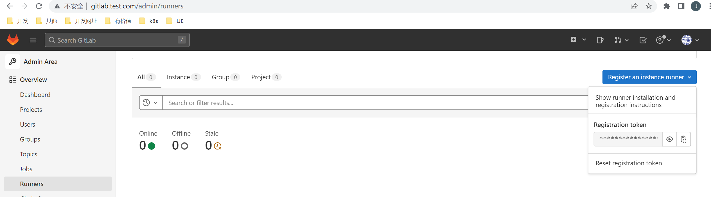
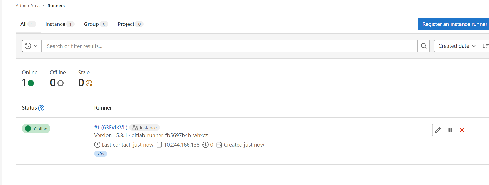
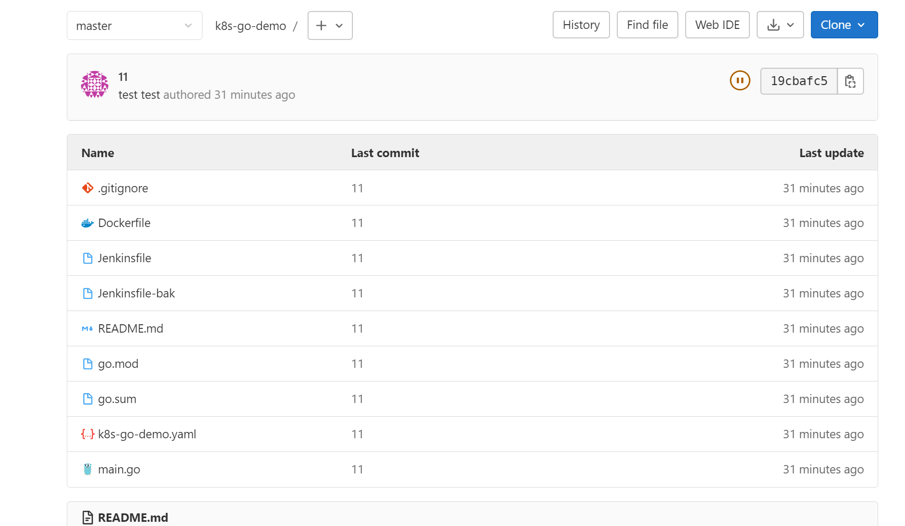

# Gitlab CI/CD

CI（持续集成）是指持续地集成代码到主干。持续集成的目的，就是让产品可以快速迭代，同时还能保持高质量。它的核心措施是，代码集成到主干之前，必须通过自动化测试。

CD (持续交付) 是指持续地将软件的新版本，交付给质量团队或者用户，以供评审。如果评审通过，代码就可以部署到生产环境。

云原生环境，交付镜像即可。

有了 CI/CD，我们可以获得以下收益：

1. 解放了重复性劳动。 自动化部署工作可以解放集成、测试、部署等重复性劳动，而机器集成的频率明显比手工高很多。
2. 更快地修复问题。 持续集成更早的获取变更，更早的进入测试，更早的发现问题，解决问题的成本显著下降。
3. 更快的交付成果。 更早发现错误减少解决错误所需的工作量。集成服务器在构建环节发现错误可以及时通知开发人员修复。集成服务器在部署环节发现错误可以回退到上一版本，服务器始终有一个可用的版本。
4. 减少手工的错误。 在重复性动作上，人容易犯错，而机器犯错的几率几乎为零。
5. 减少了等待时间。 缩短了从开发、集成、测试、部署各个环节的时间，从而也就缩短了中间可以出现的等待时机。持续集成，意味着开发、集成、测试、部署也得以持续。
6. 更高的产品质量。 集成服务器往往提供代码质量检测等功能，对不规范或有错误的地方会进行标致，也可以设置邮件和短信等进行警告。

## 1. 介绍

GitLab-CI 是GitLab提供的CI工具。它可以通过指定通过如push/merge代码、打tag等行为触发CI流程；同时也可以指定不同场景要触发的不同的构建脚本。

GitLab-CI是一个轻量级的工具，只要在项目中添加一个 .gitlab-ci.yml文件，然后添加一个 Runner，即可进行持续集成。

### 1.1 Pipeline

一次 Pipeline 其实相当于一次构建任务，里面可以包含很多个流程，如安装依赖、运行测试、编译、部署测试服务器、部署生产服务器等流程。任何提交或者 Merge Request 的合并都可以触发 Pipeline 构建，如下图所示：

~~~shell
+------------------+           +----------------+
|                  |  trigger  |                |
|   Commit / MR    +---------->+    Pipeline    |
|                  |           |                |
+------------------+           +----------------+
~~~

### 1.2 Stages 

Stages 表示一个构建阶段，也就是上面提到的一个流程。我们可以在一次 Pipeline 中定义多个 Stages，这些 Stages 会有以下特点：

- 所有 Stages 会按照顺序运行，即当一个 Stage 完成后，下一个 Stage 才会开始
- 只有当所有 Stages 完成后，该构建任务 (Pipeline) 才会成功
- 如果任何一个 Stage 失败，那么后面的 Stages 不会执行，该构建任务 (Pipeline) 失败

Stages 和 Pipeline 的关系如下所示：

```shell
|                                                        |
|  Pipeline                                              |
|                                                        |
|  +-----------+     +------------+      +------------+  |
|  |  Stage 1  |---->|   Stage 2  |----->|   Stage 3  |  |
|  +-----------+     +------------+      +------------+  |
|                                                        |
+--------------------------------------------------------+
```

### 1.3 Jobs

Jobs 表示构建工作，表示某个 Stage 里面执行的工作。我们可以在 Stages 里面定义多个 Jobs，这些 Jobs 会有以下特点：

- 相同 Stage 中的 Jobs 会并行执行
- 相同 Stage 中的 Jobs 都执行成功时，该 Stage 才会成功
- 如果任何一个 Job 失败，那么该 Stage 失败，即该构建任务 (Pipeline) 失败

Jobs 和 Stage 的关系如下所示：

~~~shell
|                                          |
|  Stage 1                                 |
|                                          |
|  +---------+  +---------+  +---------+   |
|  |  Job 1  |  |  Job 2  |  |  Job 3  |   |
|  +---------+  +---------+  +---------+   |
|                                          |
+------------------------------------------+
~~~

## 2. Gitlab Runner

在使用Jenkins的时候，我们可以使用slave来执行构建任务，Gitlab如果在本身的节点执行构建任务，会极大影响其性能，所以Gitlab提供了Gitlab Runner来执行CI，Gitlab Runner可以部署在不同的节点上，不会对Gitlab本身造成影响。

### 2.1 安装

安装地址：https://docs.gitlab.com/runner/install/

这里我们使用k8s来进行安装。

#### 2.1.1 获取 Gitlab CI Register Token



获取到token：6r_vrZ3jeisxo4Yaa8aN

#### 2.1.2 使用Helm部署

在文档中，k8s部署方式使用的是Helm

##### 2.1.2.1 部署MinIO

我们需要使用minio做为gitlab runner的共享缓存，所以需要先部署一个minio

同样我们使用helm部署

~~~shell
[root@master minio]# helm repo add minio https://helm.min.io/
[root@master minio]# helm search repo minio/minio
NAME            CHART VERSION   APP VERSION     DESCRIPTION                                       
minio/minio     8.0.10          master          High Performance, Kubernetes Native Object Storage
~~~

~~~shell
helm show values minio/minio > values.yaml
~~~


生成 values.yaml 文件

~~~shell
accessKey: 'minio'
secretKey: 'minio123'
persistence:
  enabled: true
  storageCalss: 'minio-nfs-client'
  VolumeName: ''
  accessMode: ReadWriteOnce
  size: 5Gi

service:
  type: ClusterIP
  clusterIP: ~
  port: 9000
  # nodePort: 32000

resources:
  requests:
    memory: 128Mi
~~~

配置一个基于nfs的storageclass

nfs-client.yaml

~~~yaml
apiVersion: storage.k8s.io/v1 ## 创建了一个存储类
kind: StorageClass
metadata:
  name: minio-nfs-client
  annotations:
    storageclass.kubernetes.io/is-default-class: "true"
  namespace: gitlab
provisioner: minio-data  #Deployment中spec.template.spec.containers.env.name.PROVISIONER_NAME 保持一致
parameters:
  archiveOnDelete: "true"  ## 删除pv的时候，pv的内容是否要备份
---
apiVersion: apps/v1
kind: Deployment
metadata:
  name: minio-nfs-client-provisioner
  labels:
    app: minio-nfs-client-provisioner
  namespace: gitlab
spec:
  replicas: 1
  strategy:
    type: Recreate
  selector:
    matchLabels:
      app: minio-nfs-client-provisioner
  template:
    metadata:
      labels:
        app: minio-nfs-client-provisioner
    spec:
      serviceAccountName: minio-nfs-client-provisioner
      containers:
        - name: minio-nfs-client-provisioner
          image: registry.cn-hangzhou.aliyuncs.com/lfy_k8s_images/nfs-subdir-external-provisioner:v4.0.2
          volumeMounts:
            - name: nfs-client-root
              mountPath: /persistentvolumes
          env:
            - name: PROVISIONER_NAME
              value: minio-data
            - name: NFS_SERVER
              value: 192.168.200.101 ## 指定自己nfs服务器地址
            - name: NFS_PATH  
              value: /data/minio  ## nfs服务器共享的目录
      volumes:
        - name: nfs-client-root
          nfs:
            server: 192.168.200.101
            path: /data/minio
---
apiVersion: v1
kind: ServiceAccount
metadata:
  name: minio-nfs-client-provisioner
  namespace: gitlab
---
kind: ClusterRole
apiVersion: rbac.authorization.k8s.io/v1
metadata:
  name: minio-nfs-client-provisioner-runner
rules:
  - apiGroups: [""]
    resources: ["nodes"]
    verbs: ["get", "list", "watch"]
  - apiGroups: [""]
    resources: ["persistentvolumes"]
    verbs: ["get", "list", "watch", "create", "delete"]
  - apiGroups: [""]
    resources: ["persistentvolumeclaims"]
    verbs: ["get", "list", "watch", "update"]
  - apiGroups: ["storage.k8s.io"]
    resources: ["storageclasses"]
    verbs: ["get", "list", "watch"]
  - apiGroups: [""]
    resources: ["events"]
    verbs: ["create", "update", "patch"]
---
kind: ClusterRoleBinding
apiVersion: rbac.authorization.k8s.io/v1
metadata:
  name: minio-run-nfs-client-provisioner
subjects:
  - kind: ServiceAccount
    name: minio-nfs-client-provisioner
    namespace: gitlab
roleRef:
  kind: ClusterRole
  name: minio-nfs-client-provisioner-runner
  apiGroup: rbac.authorization.k8s.io
---
kind: Role
apiVersion: rbac.authorization.k8s.io/v1
metadata:
  name: minio-leader-locking-nfs-client-provisioner
  namespace: gitlab
rules:
  - apiGroups: [""]
    resources: ["endpoints"]
    verbs: ["get", "list", "watch", "create", "update", "patch"]
---
kind: RoleBinding
apiVersion: rbac.authorization.k8s.io/v1
metadata:
  name: minio-leader-locking-nfs-client-provisioner
  namespace: gitlab
subjects:
  - kind: ServiceAccount
    name: minio-nfs-client-provisioner
    namespace:  gitlab
roleRef:
  kind: Role
  name: minio-leader-locking-nfs-client-provisioner
  apiGroup: rbac.authorization.k8s.io

~~~

~~~shell
kubectl apply -f nfs-client.yml
~~~


部署：

~~~shell
[root@master minio]# helm install -f values.yaml minio  minio/minio -n gitlab
NAME: minio
LAST DEPLOYED: Fri Feb 10 06:24:00 2023
NAMESPACE: gitlab
STATUS: deployed
REVISION: 1
TEST SUITE: None
NOTES:
Minio can be accessed via port 9000 on the following DNS name from within your cluster:
minio.gitlab.svc.cluster.local

To access Minio from localhost, run the below commands:

  1. export POD_NAME=$(kubectl get pods --namespace gitlab -l "release=minio" -o jsonpath="{.items[0].metadata.name}")

  2. kubectl port-forward $POD_NAME 9000 --namespace gitlab

Read more about port forwarding here: http://kubernetes.io/docs/user-guide/kubectl/kubectl_port-forward/

You can now access Minio server on http://localhost:9000. Follow the below steps to connect to Minio server with mc client:

  1. Download the Minio mc client - https://docs.minio.io/docs/minio-client-quickstart-guide

  2. Get the ACCESS_KEY=$(kubectl get secret minio -o jsonpath="{.data.accesskey}" | base64 --decode) and the SECRET_KEY=$(kubectl get secret minio -o jsonpath="{.data.secretkey}" | base64 --decode)

  3. mc alias set minio-local http://localhost:9000 "$ACCESS_KEY" "$SECRET_KEY" --api s3v4

  4. mc ls minio-local

Alternately, you can use your browser or the Minio SDK to access the server - https://docs.minio.io/categories/17
~~~

如果想外部访问，配置ingress

ingress.yaml

~~~yaml
apiVersion: networking.k8s.io/v1
kind: Ingress
metadata:
  name: minio
  namespace: gitlab
  annotations:
    cert-manager.io/cluster-issuer: letsencrypt-dns01 # 配置自动生成 https 证书
    kubernetes.io/ingress.class: nginx
    nginx.ingress.kubernetes.io/rewrite-target: /
spec:
  tls:
    - hosts:
        - 'minio.test.com'
      secretName: minio-letsencrypt-tls
  rules:
    - host: minio.test.com
      http:
        paths:
          - path: /
            pathType: Prefix
            backend:
              service:
                name: minio
                port:
                  number: 9000
~~~

配置hosts文件

~~~shell
192.168.200.101 minio.test.com
~~~


##### 2.1.2.2 部署Gitlab Runner

添加仓库：

~~~shell
[root@master runner]# helm repo add gitlab https://charts.gitlab.io

"gitlab" has been added to your repositories
[root@master runner]# 
[root@master runner]# helm search repo gitlab/gitlab-runner
NAME                    CHART VERSION   APP VERSION     DESCRIPTION  
gitlab/gitlab-runner    0.49.1          15.8.1          GitLab Runner
~~~

生成 values.yaml 文件

~~~shell
[root@master runner]# helm show values gitlab/gitlab-runner > values.yaml
~~~

修改values.yaml

~~~yaml
gitlabUrl: "http://gitlab.gitlab.svc.cluster.local"
runnerRegistrationToken: "6r_vrZ3jeisxo4Yaa8aN" 
unregisterRunners: true
concurrent: 2
checkInterval: 5

rbac:
  create: true
  rules:
    - apiGroups: [""] #"" indicates the core API group
      resources: ["*"]
      verbs: ["*"]
    - apiGroups: ["networking.k8s.io"]
      resources: ["ingresses"]
      verbs: ["*"]
    - apiGroups: ["apps"]
      resources: ["deployments"]
      verbs: ["*"]
  clusterWideAccess: true
  serviceAccountName: gitlab-runner

runners: # 下面配置 minio 作为 GitLab Runner 共享缓存的 s3 替换方案
  config: |
    [[runners]]
      executor = "kubernetes"
      [runners.kubernetes]
        namespace = "{{.Release.Namespace}}"
        image = "ubuntu:18.04"
      [runners.cache]
        Type = "s3"
        Shared = true
        [runners.cache.s3]
          AccessKey = "minio"
          SecretKey = "minio123"
          BucketName = "gitlab"
          ServerAddress = "minio.gitlab.svc.cluster.local"
  tags: "k8s"
  helpers: {}
  serviceAccountName: gitlab-runner
~~~

~~~shell
[root@master runner]# helm upgrade --install -f ./values.yaml gitlab-runner gitlab/gitlab-runner -n gitlab
~~~



## 3. Gitlab CI

我们利用gitlab CI 来完成一个流水线：

* 跑测试用例
* 生成镜像上传到harbor


准备一个工程



编写.gitlab-ci.yml

语法参考：https://docs.gitlab.com/ee/ci/yaml/

这里是一些案例：https://gitlab.com/gitlab-org/gitlab/-/blob/master/lib/gitlab/ci/templates/Go.gitlab-ci.yml


~~~yaml
stages:
  - test
  - build
########################### lint阶段 ###########################
#代码检测job

########################### test阶段 ###########################

#单元测试、检查数据竞争job
# format:
#   image: golang:1.18
#   stage: test
#   tags: 
#     - k8s
#   script:
#     - export GOPROXY="https://goproxy.io"
#     - go test -race $(go list ./...)
########################### build阶段 ###########################

#打包镜像的job模板
build_image:
  image:  mszlu/kaniko-project-executor:v1.9.0-debug
  stage: build
  tags: 
    - k8s
  script:
    - mkdir -p /kaniko/.docker
    - echo "{\"auths\":{\"https://testharbor.com\":{\"auth\":\"YWRtaW46SGFyYm9yMTIzNDU=\"}}}" > /kaniko/.docker/config.json
    - /kaniko/executor --context "${CI_PROJECT_DIR}" --dockerfile "${CI_PROJECT_DIR}/Dockerfile" --destination "testharbor.com/devops/k8s-go-demo:1.0" --skip-tls-verify 
    - echo "docker push 上传harbor"

~~~


这里面涉及到一个在k8s的pod中打包上传镜像的过程，需要用到一个工具

https://github.com/GoogleContainerTools/kaniko

push docker hub：

~~~shell
echo -n USER:PASSWORD | base64
~~~

配置config.json

~~~json
{
  "auths": {
    "https://index.docker.io/v1/": {
      "auth": "xxxxxxxxxxxxxxx"
    }
  }
}
~~~


